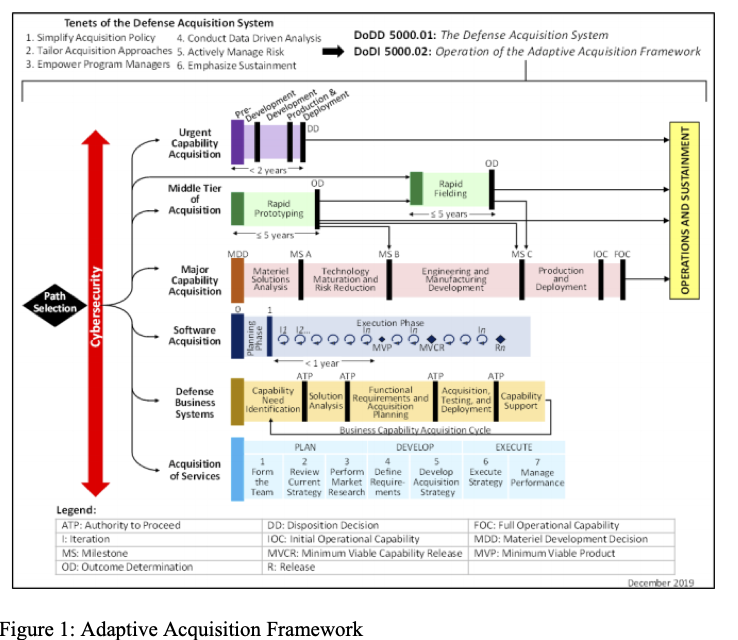

# 改进软件过程管理的分析能力

原文《ANALYTIC CAPABILITIES FOR IMPROVED SOFTWARE PROGRAM MANAGEMENT》，卡耐基梅隆大学SEI实验室，发表于2020年10月。赵星汉翻译于2020年12月13日。

## 问题

软件与关键系统能力的联系不断扩大，这促使软件工程组织不得不采用更有效的技术来管理他们的系统和软件交付。国防部（DOD）系统和软件采购和开发正在进行转变。国防部软件适应性采购框架中的软件获取途径（下图）阐述了冲刺和交付是如何产生软件迭代并最终生成可用的基线产品。该项为国防部系统软件设计的方法大体上使用了DevSecOps管道（pipeline）的理论。

改革和创新的结果是，DOD社区中基本没有历史于经验来建立使用AAF提供的另一套原理来计划和管理系统和软件的量化基础。缺乏数据和经验的情况会对估计造成负面影响，但是在新的软件获取策略（DoDI.5000.87)下，依据DoDI5000.73花费估计依旧是需要的。尽管如此，为了估计、计划、和管理的目的，从DevSecOps的管道中自动收集和处理数据依旧是巨大的隐性需求。关键是收集正确的数据并正确的分析它。但是收集正确的数据仅仅是挑战的一部分。估计、计划和管理的新的方法和模型也是很大的需求。

随着软件工程实践和技术朝着更加频繁的发布节奏发展，管理还必须与时俱进，并具有及时，高效和有影响力的程序分析和评估形式的能力。软件工程组织将需要高度自动化和仪器化的工程环境，以提供计划和管理所需的数据。尽管当今的DevSecOps管道可产生大量数据，但很少用于计划和管理目的。

拥有正确的数据并不意味着拥有可操作的信息。现在大部分的软件工程的计划和控制指南都是基于传统的硬件为中心的采购生命周期，且基于相关性分析、历史事件和经验的启发性方法。随着项目的动态变化，计划和控制也应该随着变化。依靠基于相关性的指导，无法确定缓解措施是否会影响问题的实际原因，例如成本超支，进度延迟和技术性能下降。新的估计、计划和管理程序的方法是急需的，以满足使用AAF的程序的需求。

## 一种新的软件项目估计和管理方法：概率因果模型

在早期生命周期成本中的量化不确定性估算（Quantifying Uncertainty in Early LifeCycle Cost Estimation）是SEI开发的成本估算方法，该方法基于将项目建模为贝叶斯致信网络（BBN）。该方法有很多有点，但是最重要的有以下几个方面：

1. 在输入中引入不确定度，以及一些和项目执行和成功相关参数的假设
2. 利用蒙特卡洛方法来设计一个成本预测的经验衍生分布

此外，BBN还能在数据不足或丢失时利用主题专家的判断。最近，SEI一直在使用一种称为因果学习（CL）的AI进行研究。CL方法发现了在观察数据（与经验数据相对应）中类似的因果关系，比如项目数据库中的数据或DevSecOps管道中的数据。与BBN类似，CL方法生成图形。当用于分析项目时，这些图形呈现了从工程数据得出的因果关系和动态。因果学习可以帮助组织从通常被认为反映因果关系的基于关联的模型转变为以经验为基础的因果模型来指导行动和决策。

综合BBN和CL这两种方法，就得出了一种独特的基于概率因果模型的成本估计方法，该模型将不确定度和因果关系结合起来。另外，这个方法还衍生了一个可执行模型，这个模型可以用于探索和评估购置策略方案，以及降低风险和开发过程的纠正措施。

支持该方法的是越来越多的研究结果，这些研究结果确定并验证了对计划和管理软件项目至关重要的因素和关系。聚焦到这些参数可以增加该项方法的成本估算、计划、以及管理的有效性和准确性。它还揭示了实际项目数据不支持的启发式和信念。在实践中，如果未经验证的假设是错误的，则成本估算可能会超出预期范围，且计划经理采取的纠正措施可能会不足，甚至会适得其反。理解和应用因果关系会提供更坚实的决策基础。

## 总结

在DoD系统里软件的重要性在不断增加，这就驱使软件组织去采用更强大的分析技术，来计划和管理软件交付、质量和综合软件能力。如今，人们朝着软件获取途径和DevSecOps迈进，这些模型具有很高的价值和实用性。BBN是一个很好的方法，在众多领域有很大的影响。他们的优势是能采纳主题专家的判断。因果学习相对较新，但是也已经用于癌症研究，基因科学和经济学；在需要对项目估算，计划和管理进行量化改进时，因果学习算法的最前沿的改进为当下的软件工程带来了许多相同的功能。但是，建模和分析都需要数据。

工具的自动化和集成的增长是未来的趋势。从工具链中收集和分析数据的能力是一个相对尚未开发的机会，具有巨大的潜力来深入了解软件开发程序。但是，并非所有影响因素和性能驱动因素都包含在工具链中。一些外部来源的依赖因素和主题专家的判断还不能通过工具链获取。日子久了，随着正确的数据收集，对判断的依赖会减少。BBN和因果学习的组合提供了一个实用的方法，该方法从以下方面学习：

1. 现代的工程环境生成的所有数据
2. 必要时补充其他来源的数据

这产生了强大的分析能力，并具有针对软件开发项目的高质量和高置信度的计划和管理指南。

