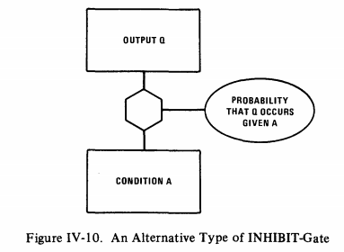
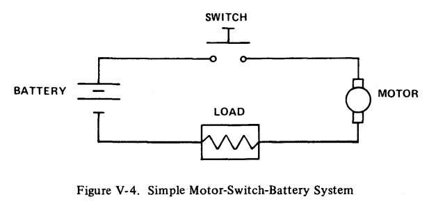

# 故障树手册

美国核管理委员会（NUREG-0492)

[toc]

## 前言

1975年以来，一个题为“系统安全和可靠性分析”的短期课程向200多名核管制委员会人员和承包商开展。本课程由系统科学研究所的David F. Haasl教授、华盛顿大学的Norman H. Roberts教授和美国核管理委员会概率分析人员负责讲授，是概率分析职员组织（Probabilistic Analysis Staff）资助的风险评估培训计划的一部分。
本手册不仅可以作为系统安全可靠性课程的教材，而且还是一份关于故障树构建和评估的文档。这本书的出版是按照风险评估审查小组报告(NUREG/CR-0400)的建议，其中指出，故障/事件树方法应在核管理委员会内外得到更广泛地使用。希望该文件有助于系统分析中故障树方法的制度化和系统化。

> （赵星汉同学：在本书中，使用了Fault和Failure两个概念，为了便于区分，在翻译中，我们将Fault翻译为“故障”，将Failure翻译为“失效”。)

## 第一章 系统分析的基础概念

### 1.1 系统分析的目的

这本书的主要关注是故障树的相关技术，这是一种获取系统信息的系统化方法。按照该方法获取的信息可以用于决策。因此，在定义系统分析之前，我们应该对决策的过程做一个简要的检查。决策是一个非常复杂的过程，我们将重点介绍有助于系统分析的方面。

大体上来说，我们所做的任何决策都基于我们对目前情况的了解。这种知识部分来自我们对相关情况的直接经验，或来自类似情况的相关经验。通过适当的实验和对结果的分析，我们的知识能得到一定的提升。从某种程度上来讲，我们的知识基于推测，而推测则与我们对事务的看法是乐观的还是悲观的有很大的关系。例如，我们可能会相信，“在这个最好的世界里，一切都是为了最好的”；或者，反过来，我们可能相信墨菲定律:“如果任何事情都能变糟，那它就会变糟。”因此，知识可以通过几种方式获得，但在绝大多数情况下，不可能获得所有相关的信息，因此也几乎不可能消除所有的不确定性因素。

当所有相关信息都收集起来之后再做出决定，这本身就是一个没有意义的假设，这与我们日常生活中被迫做出决定的时机相差甚远，我们一般不可能有十分完备的信息，我们都要面临最后的期限要求。此外，由于在必须作出决定时通常不可能获得所有相关的数据，所以我们根本很难完全弄清楚该决策所导致的全部后续影响。模型I-1 给出了该思想的原理。 

由于决策过程往往伴随着时间的限制，因此我们需要区分“好的决策(good decision)”与“正确的决策(correct decision)”。当我们对一件事情进行总结时，我们能判断决策是“好的决策（good decision）”或者“坏的决策（bad decision）”。例如，我买了1000股XYZ公司的股票。六个月后，我发现股票涨了20点，则我之前的决策就是“好的决策（good decision）”。但是，如果股票在这段时间下跌了20点，那么之前的决策就是个“坏的决策（bad decision）”。尽管如此，如果在我做决策时，当时所有可用的信息都表明XYZ公司有一个美好的未来，那么即使后续股票下跌，当初买入股票的的决定依然是一个“正确的决策(correct decision)”。

做出正确的决策（correct decision），需要以下几个方面：

>1. 识别所有与决策有关的信息。
>2. 建立能获取相关信息的系统流程。
>3. 对按流程所获得的信息进行合理的评估和分析。

人们对系统分析有很多种定义。本书的作者们进行过长时间的思考和讨论，选择了如下的定义：

> 系统分析是指为了制定决策，对特定系统信息进行有序、及时的收集和调查的过程。
> (System analysis is a directed process for the orderly and timely aquisition and investigation of specific system information pertinent to a given decision.)

根据上边的定义，系统分析的主要功能是对信息的收集，而不是生成系统模型。这本书的重点（至少在开始阶段）将放在过程（信息的获取）上，而不是产品（系统模型的生成）上。该重点的划分是十分必要的，因为缺乏科学有序的信息收集过程，对应的系统模型往往并不准确和完备。

在信息收集开始前，我们必须确定哪些信息是与决策有关系的。什么信息是必须（essential）的？什么信息是需要（desirable）的？这一点看起来十分简单和自然，但是令人惊讶的是，很多情况下人们并没有遵循这条基本原理。图I-2描述了可能发生的情况。

我们假设图中的大圆表示做出正确的决策所必须的信息。现实中的情况往往是：乔恩斯教授是一个该领域中的一个子领域A的资深专家，并且资金充足。当他开始他的调研后，他的调研发现了一些未知的有意思的问题，这些问题位于A子领域的A1分支上。对A1的调研又导致了A2，如此往复。注意，乔恩斯教授的调研工作使他得到的信息距离实际的决策需要越来越远。阿尔法实验室在一个子领域B的科研中具有重要的位置，调研工作往往从B1导致B2，同样的事情一直在不断发生。当需要决策的时候，必要的决策支持信息并不完备，然而如果有适当的引导，他们的工作本应该是可以获得充足的决策所需的信息的。

一个自然的决策过程如同图I-3所示，A模块表示一个确定的实体。初始阶段，一个实体就像一本“闭合的书”，但是通过实验和调查，我们将会建立对该实体的感知。这时我们会得到代表这个实体的模型B。下一步，通过分析该模型，我们能得到一些结论，这些结论将作为我们决策的基础。因此，我们的决策实际上是我们所建立的模型的衍生物，如果模型建立的不正确，则决策也将是错误的。很明显，决策过程的核心应该是保证所建立的模型应尽可能的与实体相一致。

### 1.2 系统的定义

在前文中，我们定义了“系统分析”，但什么是“系统”呢？我们常常会说到“太阳能系统”，“政府系统”，“通信系统”等，在这种语境下，系统指的是多个不同种类元素通过某种组织形式存在于一起，它们以某种方式相互作用，这种方式可能是定义好的，也可能是没有完善的定义的。于是，我们可以对系统做出如下的定义：

> 系统是由相互作用的离散元素集合所构成的确定性实体。（A system is a deterministric entity comprising an interacting collection of discrete elements.)

从实践的角度来看，这个定义并不是很有用，在一些特定的情况下，我们必须指定系统执行的哪些方面是需要着重关注的。系统执行某功能，而对特定执行的状态的选择将决定进行何种分析。例如:我们是否对系统是否成功完成某些任务感兴趣;我们感兴趣的是系统是否会以某种危险的方式失效;或者我们感兴趣的是，该系统是否会比最初预期的成本更高?在这三种情况下，正确的系统分析很可能基于不同的系统定义。

“确定性”一词在定义中意味着所讨论的系统是可定义的，试图对无法明确定义的事物进行分析是完全徒劳的。诗人但丁将地狱看作一个系统，并将它分成了很多令人痛苦的层次，但是，从实践的角度来看，这种系统是很难像家里的管道系统那样被准确的定义。此外，一个系统应该有一些目标——它必须实现某种功能。例如运输系统，热水管道循环系统，地方学校系统等，它们都有自己明确的目标，而不是简单的存在于虚构中。

定义中的离散元素同样也必须是可定义的。例如，太平洋潜艇舰队中的独立潜艇就是其中的可定义元素。需要注意的是，离散元素本身也可以被看成系统。比如说，潜艇由推进系统，导航系统，船体系统，管道系统等组成，它们又可以再向下进一步的划分。

从系统定义中可以看出，系统是由相互作用的若干部件和子系统组成。这些元素间的相互作用可能会非常复杂，这就决定了一个系统的复杂程度不仅仅是这些部件元素相叠加这么简单，这是本书将不断强调的重点。此外，如果系统任何部件的物理特性发生变化（例如，是故障导致的），系统本身也会产生变化。这是一个重要的观点，在某些设计中，假设引入的故障会导致系统的原先的设计发生变化，那么则应针对变化后的新系统开展进一步的分析。以一架四翼飞机为例。假设一个引擎失灵。我们现在有了一个与原来大不相同的新系统，新系统的着陆特性与原系统相比发生了巨大的变化。假设有两个引擎失灵，则会出现六个不同的可能的系统，这取决于哪两个引擎出了故障。

也许在系统定义中必须做出的最重要的决定是如何在系统上设置外部边界。想象一下放在桌子上的电话，简单地将系统定义为仪器本身(耳机、线和支架)就足够了吗？还是应该包括连接墙上插孔的线路？电线杆的外线呢？电线杆上的接线盒呢？那么，由本地、全国乃至全世界的电话系统所组成的庞大而复杂的线路、交换设备等又该怎么办呢？很显然，必须建立系统的外部边界，并且应该根据系统性能的所关注的方面进行决策。如果当前的面临的问题是电话声音太小，那么分析所建立的系统外部系统边界将比较小。如果该问题涉及到线路上的射频传输，则外边界范围将变得很大。

系统定义中的另一个重心是建立分辨极限（limit of resolution)。在电话的例子中，是否应该延申我的分析范围到每个组成设备的独立的部件（螺丝，信号发射器等）？或者是否必要进一步延申到分子层面，或者原子层面或者更低的层面？总而言之，系统分析应该细化到何种程度，与我们需要决策的内容相关。

我们目前所讨论的内容可以用图I-4表示，图中的外部的虚线将系统与它所处的环境分隔开来，这条虚线构成了一条系统的外部边界。我们将系统划分成A，B，C等几个子系统，这样做的目的将在适当的时候讨论。还要注意，为了便于分析，其中一个子系统F已经被分解为更小的“子—子系统”。这就构成了对系统内部边界的选择。F中各个子子系统，以及a、b、c等子系统，就是系统的定义中所指的“离散元素”。

在某些特定的情况下选择适当的系统边界是一件至关重要的事情，因为外部边界的选择决定了分析的全面性，而分辨极限的选择则限制了分析的细节。该问题的几个方面将在这里简要的说明，并将在整本书中进行强调，特别是在各类应用。

到目前为止，我们讨论的系统边界都是物理边界。在许多情况下，在系统上设置时间或类时间的边界也是可能且必要的。比如说一个男人，他习惯每两年换一辆新车。在本例中，系统是车，我们感兴趣的方面是车的保养策略。很明显，在两年时限的时间的边界内，他的维护策略就是有一件事，它将与一个习惯于将车开到报废的男人所采取的策略有很大的区别。在某些应用中，系统的物理边界实际上可能是时间的函数。这方面的一个例子是，系统的时间边界表示不同的操作阶段或不同的设计修改，在每一阶段的变化或设计修改后，物理边界将被重新审查并可能发生变化。

系统分析人员还必须问这样一个问题:“所选择的系统边界是否可行？从分析的目标来看，它们是否有效？”要对一个系统得出某些结论，可能需要在外部边界中包含一个大的系统“容量”。这可能需要广泛而耗时的分析。如果没有足够的资金、时间和工作人员来完成这项工作，也就不可能有更有效的分析方法，那么就必须把外部边界向内收，减少预期从分析中得到的信息量。好比我担心我的电视接收情况，我可能希望在我的分析中包括电离层的状态，但这肯定是不可行的，行之有效的办法应该是尝试电视天线最佳的接收姿态。

分辨极限（内部边界）也可以从可行性和分析的目标来确定。建立一个针对电视机总体可靠性的有价值的研究，而不去关心微观和亚微观层面上发生的事情，是具备相当的可能性的。如果要计算系统总体故障概率，则分辨极限影包括可获取的各类组件故障。不管怎样，一旦选择了分辨极限，就定义了“离散元素”，我们所关心的也就成了这个层面上的相互作用，更低层面上的交互将被忽略。

我们现在可以看出来，系统的外部边界用于描述系统的外部输出（系统对环境的影响）和输入（环境对系统的影响）；分辨极限则用来定义系统的“离散元素”，以建立系统内部的基本交互作用。

具有相关技术背景的读者或许会发现我们的系统及其边界的定义类似于一个经典热力学过程，其中有一个实际的物理边界或一个虚构的边界，该边界用于隔离一定质量的物质（质量控制）或者一定体积的物质（体积控制），系统的输入和输出由进出有界区域的能量或质量来确定。我们把不与环境交换质量的系统叫做“封闭系统”，而在封闭系统中，不予环境交换能量的系统称为“绝热系统”或者“孤立系统”。一个曾研究过热力学问题，尤其是流体问题的学生，会对在尝试解决问题之前建立适当的系统边界的重要性留下深刻的印象。

充分的思考来正确分配系统的边界和分辨极限是十分必要的。一种最合适的说法是，系统的外部边界和分辨极限应该在系统分析前进行定义，并在分析的执行过程中同步修正。在实际情况下，由于在分析过程中信息的不断获取，系统的边界和分辨极限常常需要修改。例如，可能会发现系统结构图不像最初设想的那样详细。在任何分析中，系统边界和决议的限制，以及任何修改，都必须明确定义，并且应该体现在发布的报告中。

为了阐述内边界和外边界的其他方面，我们绘制了图I-5。内部的实线绘制的圆表示我们的系统边界，我们考察该边界以内的事件发生概率，我们假设发生概率为$10^{-3}$阶或更高。如果系统边界扩大到图中的虚线位置，事件发生的概率为$10^{-4}$阶或更高。假设需要给图中实线部分的系统设计一个双重冗余，我们需要将事件发生的概率限制在$10^{-3}\times 10^{-3}=10^{-6}$阶，但是，假设边界设计的不正确（例如本来应该考虑虚线边界却只考虑实线边界内），我们忽视的事件发生的概率就会产生致命后果，我们就会产生错觉，认为我们的系统比实际情况要安全或可靠两个数量级。缺乏细致思考的可靠性计算往往会产生这样荒谬的数字，如$10^{-16}$或$10^{-18}$。较低的数字只是表明，系统不会以预先考虑的方式失败，而是以一种未被考虑的方式，以高得多的概率失败。

*赵星汉同学：原文章里写的很难懂，这一段其实是说如果外边界划分的不正确，可能会把一些需要考虑的故障事件排除在设计之外，以至于在完成可靠性设计后，在我们考虑到的失效模式上是满足设计指标的，但系统却可能会以我们没有考虑的模式发生失效*

### 1.3 分析方法

本书中，我们所关注的是某些正式的过程和模型。这些模型应该可以按照人类常规思维那样进行分类。人类常用的思维方式有归纳法和演绎法两种。这里有必要对两种方式各自的特点进行讨论。

#### 1.3.1 归纳法(Inductive Approaches)

归纳法是从单独的个案中推导出通用性结论的方法。以一个特定的系统为例，我们假设在启动条件上有一个特定的故障，并试图确定该故障或条件对系统运行的影响，我们就构建了一个归纳的系统分析。因此，我们可以探讨某些特定的控制面损失如何影响飞机的飞行，或探讨预算中某些项目的取消如何影响学区的整体运作。我们也可以询问不插入给定的控制棒如何影响紧急停堆系统的性能，或者给定的初始事件(如管道破裂)如何影响工厂安全。

归纳系统分析的方法很多，我们将在第二章专门讨论其中最重要的方法。该方法的实例有:初步危害分析(PHA)、失效模式与后果分析(FMEA)、失效模式效应与临界性分析(FMECA)、故障危害分析(FHA)和事件树分析。

再次强调——在归纳方法中，我们假设一些可能的组成条件或初始事件，并试图确定其对整个系统的相应影响。

#### 1.3.2 演绎法(Deductive Approaches)

演绎法是从一般原理推导至具体事件的方法。在演绎法中，我们假设一个系统以某种形式失效，我们试图找出是系统或者组件的什么行为模式导致了导致了这次失败。按照通俗的讲法，我们把这种方法叫做“夏洛克福尔摩斯”原理。福尔摩斯面对证据，需要重新再现引发犯罪的各类事件。事实上，所有成功的侦探都是演绎法的专家。

生活中常见的演绎法使用场景是事故调查。是什么事件链导致了“不沉之船”泰坦尼克号在首航的沉没？是仪器故障还是人为故障导致了一架商业客机坠毁在山腰上？

这本书的主题——故障树分析，也是演绎系统分析的一个例子。在这种技术中，假定了某些特定的系统状态(通常是故障状态)，并以系统的方式建立了导致这种不希望发生的事件的更基本的故障链。故障树分析的基本原理，以及与故障树的应用和评估相关的细节将在后面的章节中给出。

总之，使用归纳方法来确定哪些系统状态(通常是失败状态)是可能的;演绎方法用于确定给予者系统状态(通常是失败状态)是如何发生的。

### 1.4  风险与陷阱

在对系统的研究中，有一些危险的暗礁，这些暗礁限定了分析员必须航行的航线。大多数问题集中在界面的角色：子系统接口与规程接口。

#### 1.4.1 子系统接口

大体说来，系统是一个子系统的综合体，这些子系统由一些不同的分包商和组织进行制造。每个分包商或组织都采取适当的步骤来确保其产品的质量。问题是，当把子系统放在一起形成整个系统时，从单独的组成部分来看，失效模式可能根本不明显。重要的是，在要集成的分析中使用相同的故障定义，另一个非常重要的方面是，系统边界和分辨极限必须清楚说明，以便识别任何潜在的隐藏故障或不一致之处。如果要对集成系统进行评估或量化，则应使用相同的事件标识符，以避免出现歧义。接口问题通常存在于控制系统中，最好不要将任何控制系统分割成“块”。具有控制系统接口的系统(例如，喷淋系统具有喷淋信号输入)可以用适当的“位置”进行分析，以便作为一个整体进行控制分析。这些“位置”或转移将在稍后的故障树分析讨论中进行描述。

#### 1.4.2 规程接口

由于不同学科或不同工作领域的人持有不同的观点，所以经常会出现困难。这位电路设计师认为他设计的电路是完美的，是艺术与科学的结合，应该受到温和的操作和科学的维护。另一方面，用户可能不会这样。他把它扔在地上，踢它，粗暴的对待它。

一位作者年轻时曾被雇用为海洋制图员。原车间项目正在制订扫雷计划。绘图员被分成几组。有船体部分、线路部分、管道部分等等，每个部分都在自己的技术领域内愉快地工作。但是当一个制图员试图制定一个复合的隔间(陀螺的房间,在这种情况下),发现船体特性和管道设备是经常不相容,与通风管道线路和管道经常矛盾,事实上,船员不能正常打开房间门,因为下水道的位置在上层甲板。这个实践证明了对系统集成的明确需求。

其他的冲突很容易想到:工程主管期望从他的数学部分得到定量的结果，但却只得到了完善的存在证明;安全协调员在系统中安装了太多的安全设备，以至于可靠性人员根本无法让系统正常工作等等。

以操作人员和维护人员之间的接口为例，考虑每月进行5分钟的在线维护检查而停机的系统，假设由硬件故障导致的系统故障概率为每月$10^{-6}$。然后，按月计算，系统不可用的总概率是由于硬件故障而不可用和由于维护策略或
$$ 10^{-6}+\frac{1/12}{720} \approx 10^{-6}+10^{-4}$$
其中

+ $ 10^{-6} = 系统每个月因为硬件故障导致的失效 $
+ $ 720 \ \ = 一个月的小时数 $
+ $ 1/12  = 每个月维护检查的小时数$

请注意，由于我们的维护策略(每个月只有5分钟停机时间)导致的系统可用性的概率比由于硬件故障导致系统宕机的概率大两个数量级。在这种情况下，最好的维护政策就是根本不维护。系统分析者(系统集成者)必须有足够的知识积累，以便在已出现和将要出现接口问题时能够识别它们。

## 第二章 归纳法概论

### 2.1 概述

上一章我们定义了两种系统分析的方法——归纳法和演绎法。演绎法就是本书的主要讲述的故障树分析法。本章将主要讨论归纳法。

我们用一整章的内容对归纳法进行讨论，主要有两方面的原因，首先，这个方法提供了对故障树分析非常有用和有启发性的比较。其次，很多系统（可能是绝大多数），故障树分析方法的费效比（投入与最终改进）是没有保证的，归纳方法提供了一种有效的、系统的方法来识别和纠正不需要的或危险的情况。因此，故障树分析人员熟悉归纳法是非常有必要的。

在日常应用中，归纳法提供了对于“如果……会发生什么”这类问题的解答方式，更正式地说，这个过程包括假设一个或多个组件的特定存在状态，并进行分析以确定该条件对系统的影响。在可靠性研究中，“存在的状态”是一种故障。在其他领域，情况未必如此。

对于表现出任何程度复杂性的系统(即对于大多数系统)，试图验证所有可能的系统危害或所有可能的组件故障模式(单独或组合)变得完全不可能。由于这个原因，我们将要讨论的归纳方法通常是受时间、金钱和人力的限制。将所有情况都分析到是负担不起的。

### 2.2 部件计数方法

一种可能是最简单和最保守(悲观的)的看法是，我们可以对一个系统做出假设，任何单个组件的故障都会导致整个系统的故障。在这个假设下，得到系统失效概率的上界特别简单。我们简单地列出所有组件及其估计的故障概率。然后将各个部分的概率相加，得出系统失效概率的上限。这个过程如下所示：

在这里，F代表系统的故障概率，等于$f_A+f_B+....$。根据特定的应用，故障概率可以是故障率、不可靠性或不可用性(这些更具体的术语将在后面介绍)。

对于特定的系统，部件计数技术可以提供对系统故障概率的非常悲观的估计，而悲观的程度通常是无法量化的。对于特定的系统，部件计数技术可以提供对系统故障概率的非常悲观的估计，而悲观的程度通常是无法量化的。“部件计数”技术是保守的，因为如果存在关键组件，它们通常会出现冗余，因此没有单个故障对系统来说是灾难性的。此外，组件通常会以几种不同的方式偏离其正常工作模式，而这些故障模式通常不会对系统运行产生同样有害的影响。然而，让我们看看在图II-1中所示的两个放大器的简单并行配置下，零件计数方法会产生什么结果。

设放大器A的故障概率$f_A$是$10^{-3}$，放大器B的故障概率$f_B$是$10^{-3}$。因为并行配置意味着系统故障只发生在两个放大器同时失效的条件下，并且假设这两个放大器彼此独立，那么该系统故障的概率就为$10^{-3}\times 10^{-3} = 10^{-6}$。根据部件计数方法，组件概率等于简单的概率相加，因此“部件计数系统故障概率”为$10^{-3}+10^{-3}=2 \times 10^{-3}$，比$10^{-6}$要高的多。

因此，如果系统是冗余的，部件计数法可以得到保守数量级的结果。当系统确实存在单次故障时，采用部件计数法可以得到较为准确的结果。因为所有组件都被视为单个故障(任何单个组件故障都会导致系统故障)，所以故障之间的任何依赖关系都被覆盖，即，零件计数方法涵盖了由于共同原因造成的多个组件故障。最后，零件计数法也可用于敏感性研究;如果系统或子系统的故障概率没有影响或没有使用部件计数方法，那么它将不会影响或没有使用更精确的分析方法。

### 2.3 故障模式和效果分析（Failure Mode and Effect Analysis, FMEA）

虽然部件计数法非常简单，但是其分析结果往往过于保守，所以人们设计了很多更具体的技术方法。我们首先介绍故障模式和效果分析方法，我们先回头看上次的图II-1。

我们认识到该放大器系统会以若干种不同的方式失效，所以我们的首要任务是对各类失效模式进行定义。除了传统意义上的“开路”和“短路”失效之外，在我们的分析中还存在28种另外的模式。任何放大器的短路都是相对严重的故障模式，它经常会造成系统故障。我们现在拟制一个表格，它具备如下的信息：

1. 部件设计（component desination)
2. 故障的概率(Failure Probablity)（失效和故障的几率是一些使用上的特性）
3. 部件故障模式（Failure Mode）
4. 每种故障模式的比例（% Failures by Mode)
5. 针对对系统总体的作用进行分类(Effects on over system)（最简单的分类是“关键”和“非关键”）

针对该冗余放大系统的结果如表II-1所示。

根据我们之前对于该放大器的使用经验，我们估计90%的放大器失效是因为“开路”模式，5%是因为“短路”模式，“其他”模式5%。我们知道不论何时放大器中的任何一个发生短路，则都会引起系统故障，所以我们把该故障的关键等级定义为“关键”，这表示该故障会导致总系统失效。另一方面，任何一个放大器发生“开路”故障，因为系统的并行设计，系统总体运行并不会受到影响。那么其他28种模式的关键程度是什么？在这个例子中，我们是保守的，我们认为他们都是关键的，它们任何一个发生都会导致系统出现故障。表中“Critical”那一列的数字是由第四列中合适的百分比乘以第二列中的$10^{-3}$得到的。

根据这个表格，我们能更精确的计算单一故障原因下的系统失效概率，现在只考虑那些关键的故障模式。将表示关键的列（第五列）相加，我们能获得系统故障概率为$5 \times 10^{-5}+ 5 \times 10^{-5}+ 5 \times 10^{-5}+ 5 \times 10^{-5}=2 \times 10^{-4}$。这个结果与部件计数方法得到的$10^{-3}$相比不是那么保守了，部件计数的方法没有区分这些关键失效模式。这两种方法得到的结果差距会非常大，如同我们的例子一样，如果关键的故障模式在总的失效模式中占比较小，或许会有数量级的差距。

在FMEA（以及它的变量）中，我们能定义和合理的确认那些具备“非关键”作用的部件故障，但是我们可以分析考虑的的部件状态也是很有限的。方法的保守性要求未定的故障模式和不确定的效果都被看作是“关键”的。分析的目标是去定义单独的故障模式，以及去量化这些模式；不需要为这些目的做更多不必要的分析。

### 2.4 故障模式效果和关键性分析（Failure Mode Effect and Criticality Analysis, FMECA）

故障模式效果和关键性分析（FMECA），本质上类似于FMEA分析，但对失效的关键性进行更详细的分析，并描述了限制此类失效可能性的保证和控制。虽然FMECA分析不是发现危害的最理想的手段，但是却常常用来系统安全性分析的案例中。该方法有四个基本原则：

1. 故障定义(Fault Identification)
2. 故障的潜在作用(Potential Effects of the Fault)
3. 现有的或计划的补偿和/或控制(Existing or Projected Compensation and/or Control)
4. 探索结果的摘要(Summary of Findings)

这四个方面基本体现了FMECA方法的四列内容。第一列定义了可能的危害情况。第二列解释了为什么该情况是一个问题。第三列描述了为了补偿或控制该情况我们需要做什么。第四列表明了这个情况是否可控或者未来需要采取什么步骤。

在本章的内容中，读者应该注意到在所有这些归纳技巧中或多或少存在的一个最危险的陷阱——表格中的潜在错误。如果项目只是简单地填写表格，而不是进行适当的分析，那么这种做法将完全是徒劳的。因为这个原因。对分析师来说，最好不要把自己限制在任何事先准备好的形式主义中。另一点:如果系统非常复杂，那么一个分析师认为只有他本人才能对所有的系统故障及其对系统的影响进行正确和全面的调查，这是非常鲁莽的。这些技术需要一个良好协调的团队方法。

### 2.5 预先危险性分析（Preliminary Hazard Analysis, PHA）

到目前为止描述的技术大多是针对系统的，例如系统操作中的故障影响。这一章的主题是预先危险性分析，这是一个将工作环境中的“人”作用于系统，对潜在危害进行分析方法。

本节的主题是预先危险性分析(PHA)，这是一种评估系统对工厂人员和其他人造成的潜在危害的方法。PHA的目标是确认系统内部固有的潜在危险条件，并确定可能出现的潜在事故的重要性或关键性。应尽早在产品开发阶段进行PHA研究。这将允许设计和程序相关的安全需求在早期进行考虑和开发，以对这些危险的情形进行控制，从而消除昂贵的后期设计变更。

PHA的第一步是定义潜在的危险元素或系统中的部件。该过程能借助于工程经验、工程判断的实践以及多次使用和改进后的大量的检查表来促进。PHA的第二步是对那些有可能从特殊的危险转化成潜在事故的事件进行定义。然后评估潜在事故的严重性以决定是否采用预防措施。

人们也已经开发出各列内容的格式，以帮助PHA的执行过程，我们列出了或许是最简单的一种：

1. 第一列 —— 部件/子系统以及危险模式（Component/subsystem and hazard modes）
2. 第二列 —— 可能的效果（Possible effects）
3. 第三列 —— 补偿和控制（Compensation and control）
4. 第四列 —— 调查结果和备注（Findings and remarks）

### 2.6 故障危害分析（Fault Hazard Analysis，FHA）

另一个方法，故障危害分析（FHA），它的使用场景比较特殊，它用于包含多个组织的工程，其中一个组织用于整合。该技术用于跨组织之间的界面衔接的故障有特别的作用。它最初在Minuteman III项目中起到积极作用。

一个标准的FHA表格如下所示：

1. 第一列 —— 部件定义
2. 第二列 —— 故障概率
3. 第三列 —— 故障模式（所有可能的模式的定义）
4. 第四列 —— 模式中故障的百分比
5. 第五列 —— 故障的效果（跟踪到一些相关的接口）
6. 第六列 —— 上有部件的定义，这些部件可以命令或初始化故障问题
7. 第七列 —— 能导致次要故障的因素（包括临界等级）。该列应该包含一个有关针对敏感部件的运作的或环境的变量清单。
8. 第八列 —— 附注。

FHA答题上和FMEA和FMECA接近，但是多了第六列和第七列的额外信息。

在后边的章节我们可以看到，第六列和第七列在故障树分析上有重要的作用。

### 2.7 双故障矩阵（DFM）

以前的技术关注的是单个故障的影响。考虑双失效影响的一种归纳方法是双失效矩阵(DFM);它只适用于相对不复杂的系统。为了说明它的用途，我们必须首先讨论错误分类的各种方法。以MIL STD 882 标准的基本分类如下表所示：

这样对系统做出了更完整的定义：

1. 可忽略不计（Negligible）—— 对系统没有影响的功能损失。
2. 边际(Marginal) —— 该故障会在一定程度上降低系统的性能，但不会导致系统不可用;例如，丢失两个冗余泵中的一个，其中任何一个都可以执行所需的功能。
3. 临界(Critical) —— 此故障将完全降低系统性能;例如，使安全系统不可用的组件的丢失。
4. 灾难性（Catastrophic）—— 这一断层将产生严重后果，可能造成伤害或死亡;例如，灾难性的压力容器故障。

分类将取决于先前假定存在的条件，并且可以随着假定条件的变化而变化。例如，假设一个泵发生故障，那么第二个冗余泵的故障就是临界故障。

上述粗略的分类可以通过多种方式进行细化。例如，在NERYA项目中，定义了六个故障类别，如表II-3所示。

**Table II-3 NERVA项目的故障分类**

|  故障分类 | 系统方面的表现 |
|----------|--------------|
| I         | 可忽略的  |
| IIA   |   第二个错误事件导致过度到分类III（关键的）|
| IIB   |   第二个错误事件导致过度到分类IV（灾难的）|
|IIC    |  一个系统安全问题，它的效果取决于它所处的状况（例如备用现场电源故障，只要保持主要的非现场电源服务是开启的就不会出现问题 |
|III | 关键的故障，会导致任务取消 |
|IV | 灾难性的故障 |

为了描述DFM的概念，参考图II-2的的简单的子系统。在该模型中，阀门模块只能进行全开或全闭两种操作，然而可控的比例阀门还可以进行部分的开发或关闭。

让我们定义两种故障状态，并对它们进行分类：

| 故障状态 | 分类 |
| ----- | ------ |
| 需要时没有流动 | 4 |
| 流动无法关闭 | 3 |

我们开始考虑所有可能的部件故障和它们的分类。举个例子，如果阀门模块A（BVA）无法打开，我们将其归类为分类IIA，因为如果控制阀门A（CVA）也同样无法打开，我们将级联进入分类III。如果BVA无法闭合我们将分类IIB，因为如果BVB或CVB也无法闭合，我们将级联进入分类IV。这种类型的分析在表II-4所示的双故障矩阵中很方便地进行了系统化。

为了便于说明，我们填写了整个矩阵；对于一阶分析，我们只关注主对角线项，即单次失效状态。请注意，如果BVA打开失败，那么只有一种方法可以让第二次失败将我们级联到第三类；也就是说，CVA也必须失败才能打开。相反，如果BVA关闭失败，如果BVB或CVB也关闭失败，我们可以级联到IV类，这就是为什么表II-4给出了“两种方法”的原因。类似的考虑也适用于CVA、BVB和CVB的单次故障，这些重要的附加信息已经显示在矩阵的主对角线单元格中。

现在只关注单个故障，我们可以进行如下表所示的危险类别计数：

| 危险分类 | 发生的方式数 |
| ---- | -------|
| IIA | 4 |
| IIB | 8 |

如何使用这些信息？一个办法是对如何控制或防范这些危险类别的描述和随后的审查。另一个应用是比较图II-2中显示的阀门配置和另一种设计，例如图II-3中显示的配置：

为了叙述简单我们用配置I指代图II-2的系统，用配置II指代图II-3的系统。在配置II中，我们定义了和配置I同样的系统故障状态；换句话说，“当需要时没有流动”是分类IV，“当关闭时流动了”是分类III。我们现在能提出这样的问题：“就我们所定义的各种危险类别的相对数量而言，哪种配置更可取?”配置II的双故障矩阵如表II-5所示。 

通过比较这两种配置，我们可以看到，从级联到第III类的角度来看，它们是相同的，但是第II类配置有大约一半的方法可以级联到第IV类。所以，根据这种标准，配置II是更好的设计。如果差异不是很明显，也可以使用更正式的分析方法来获取更多信息(这些方法将在后面的部分中讨论)。

### 2.8 成功路径模式

虽然我们一直在研究“失效”，我们也可以等效的讨论“成功”来替代“失效”。我们给出了一个简单的等效案例，而后继续我们的失效理论。

考虑在图II-4中两个并联的阀门配置。该系统的分析可以通过单一故障（多因素故障概率被认为是可以忽略的）或考虑“成功路径”。让我们先从前者开始。

系统需求如下所示：

1. 操作包含两个阶段
2. 每个阶段中至少一个阀门必须打开
3. 每个阶段最后两个阀门必须关闭

两个相关的部件故障模式是：在需要时阀门无法打开，以及在需要时阀门无法关闭。为了分析目的，让我们做如下的假设：

$P(阀门没打开) = 1 \times 10^{-4}（每阶段）$
$P(阀门没关闭) = 2 \times 10^{-4}（每阶段）$

其中$P$表示概率，阀门被假设是完全相同的。

系统单故障分析可以用表II-6表示。

该系统故障概率为$8 \times 10^{-4}$。

现在让我们看看是否可以通过考虑可能的成功来复制这个结果。现在有三个已经定义的成功路径，这些路径我们可以通过口头或图表的方法详细说明。如果$R^{i}_{O}$表示“阀门i成功开启”，$R^i_C$表示“阀门i成功关闭”，并且$P(Path \ i)$表示第i个成功路径对应的成功概率，我们就有了

路径1：两个阀门在两个循环中都能正常工作。

路径2：一个阀门在第一个循环打开失败但另一个阀门在两个循环中功能正常

路径3：第一个阀门在第二个循环打开错误但是其他阀门两个循环功能正常。

用数字表示，系统可靠性可以由如下方式得出

$$
\begin{align}
R_{SYSTEM} &=(R_O R_C)^4+2(1-R_O)(R_O R_C)^2+2(1-R_O)(R_O R_C)^3 \\
&=0.99880027+0.00019988+0.00019982  \\
&=0.99919997
\approx 1-8 \times 10^{-4}
\end{align}
$$

这和以前的结果一样，但是能看出来，这种故障方法非常简便易行。

### 2.9 结论

虽然我们讨论的各类归纳法可以详细到任何想要的程度，但在实际工作中，它们大多扮演一个“概览”的方法。在很多应用中，这就是我们需要的。对于任何适度的复杂系统，所有部件失效模式的定义都是十分费力的，而且或许并不是必须做的过程。更糟糕的是，关于部件失效模式的可能的组合的定义是个更加苦难的任务。大体来说，对于没有明显功能影响的故障和发生概率可以忽略的故障进行分析是纯粹的浪费时间，在所有这些分析中，某一事件的后果必须与其发生的可能性进行综合评定。

## 第三章 故障树分析——基本概念

### 3.1 定位

在第一章中，我们介绍了两种系统分析方法：归纳法和演绎法。在第二章中，我们介绍了归纳法。第三章描述了演绎的基本概念和必要的定义，这是余下的文章的主题。

### 3.2 失效 vs 成功模式

系统的操作可以从两个方面考虑：我们可以列举不同形式的系统正常的功能，或者我们可以列举各种系统的失效。我们已经从第二章第八节的例子了解到这一点，图III-1描述了失效/成功的空间概念。

值得注意的是，成功空间（Success space)中的某些可识别点与失效空间(Failure space)中的某些类似点重合。因此，例如，可以认为成功空间中的“最大预期成功”与失效空间中的“最小预期失效”是一致的。尽管我们的第一个倾向可能是选择系统成功的乐观观点，而不是悲观的系统失败的观点，但是我们将看到这并不一定是最有利的。

从分析的角度来看，失败空间有几个主要的优点。首先，就什么是失败达成共识通常比就什么是成功达成共识更容易。我们可能想要一架飞得高、不用加油就能飞得远、速度快、载重量大的飞机。当这架飞机的最终版本下了生产线，其中一些功能可能已经妥协了，在进行通常的权衡。这种交通工具是否“成功”很可能是一个有争议的问题。另一方面，如果飞机在火焰中坠毁，毫无疑问这一事件构成了系统故障。

“成功”趋向于于系统效能相联系，许多输出，可用的角度，产品和市场元素。这些特质被通过许多连续的变量被描述，这些变量很难依据离散的事件建模，例如“阀门无法开启”，这个事件都描绘了失效空间的特性。（部分失效，例如阀门部分开启，因为其连续的可能性而应该看作一个不同的事件模型）。因此，失效事件，尤其是完全失效，其定义是相对容易的，然而，成功事件设立约束却相对困难。

另一个有利于使用失效空间的观点是，虽然从理论上讲，一个系统失效的方式和一个系统成功的方式都是无限的，从实践的角度来看，成功的方式通常比失效的方式多。因此，单纯从实践的角度来看，失效空间的总量规模小于成功空间的总量规模。因此，在分析中，根据失效空间进行计算通常更有效。

我们已经讨论了为什么分析人员在失效空间工作比在成功空间工作更有利。实际上，所有需要做的就是证明考虑失效空间可以让分析师完成他的工作，这一点在过去已经被证明过很多次了。为一个复杂的系统绘制树形图是一个昂贵且耗时的操作。当考虑到失效时，可能只需要构建一个或两个系统模型，如故障树，它涵盖所有重要的失效模式。当考虑到成功时，可能需要构建数百个系统模型来涵盖成功的各种定义。以失效空间为特征的事件简约性的一个很好的例子是民兵导弹分析。只有三个故障树被绘制对应于三个不希望的事件:意外的程序启动，意外的发动机点火，和故障启动。人们发现，仅对这三件事的仔细分析就涉及对整个复杂系统的全面概述。

为了帮助修正我们的想法，在失效空间中对一些日常事件(一个人开车去他的办公室)进行分析可能是有帮助的(参见图III-2)。

图III-2所指的“任务”是用汽车把X先生从他的家送到他的办公室。预期的到达时间是8:30，但如果X先生9点前到达办公室，任务将被认为是略微成功的。在“最低预期失效”下面是一些可能发生的小问题，但并不妨碍X先生在预期时间到达。9点到达标记为“最大预期失效”。在这一点和“最小预期失效”之间发生了许多事件，导致X先生的到达时间延迟半个小时或更少。让“最大可容忍失败”这一点与某些事故同时发生也许是合理的，这些事故对汽车造成了一些损害，造成了相当大的延误，但没有造成人身伤害。在这一点之上是越来越严重的事件，最终以死亡的灾难告终。

注意，像“雨刷不工作”这样的事件应该根据当时的自然环境来定位到对应等级。

像图III-2这样的图表也可以用来确定事件，例如，一架商业客机的生产。“最小预期失效”这一点将对应于所有规范的实现，而下面的这一点将表明某些规范已经超出了满足的要求。“最大预期失效”对应的是一个折衷点，在这个点上所有的规格都没有被满足，但这些差异还没有严重到以物质的方式降低飞机的销售能力。“最大可容忍失效”点对应于建造该飞机的公司的生存点。超过这一点，只有无法忍受的灾难才会发生。一般来说，故障树分析致力于识别和评估此类灾难性事件和完全失效。

### 3.3 非期望事件的概念

故障树分析是一种演绎式失效分析，它关注于一个特定的不希望发生的事件，并提供了一种确定该事件原因的方法。不希望发生的事件构成了为系统构造的故障树图中的*顶层事件*，并且通常由如上所述的完整的或灾难性的故障组成。仔细选择最重要的事件对分析的成功非常重要。如果太笼统，分析就变得难以处理;如果它太具体，分析就不能提供足够广泛的系统视图。故障树分析可能是一项昂贵且耗时的工作，其成本必须与与相关不期望发生的事件相关的成本进行比较。

现在我们给出一些顶层事件的例子，这些事件或许对于故障树分析的初学者很适合：

1. 当一个潜艇在水下时发生灾难性事件。在这个分析中，我们或许要区分“恶意攻击导致的失效”和“常规功能性失效”。
2. 商用客机的坠毁导致数百人死亡。
3. 和反应堆在需要遏制喷淋系统工作时没有喷淋。
4. 非合理的使用核武器。
5. 在宇宙探索程序中造成航天器或宇航员的损失。
6. 当拧开关钥匙后汽车不启动。

### 3.4 总结

在这一章，我们讨论了“失效空间”和“非期望事件”的概念，这些概念是故障树方法的基础。在下一章中，我们将定义故障树分析并开始详细介绍入口和故障事件，这些是组成故障树的重要部分。

## 第四章 故障树的基本元素

### 4.1 故障树的模式

故障树分析可以简单的描述为一项分析技术，凭借一个特定系统的非期望状态（通常是一个安全方面的关键状态），该系统会根据环境和操作的上下文信息来找到非期望事件发生的所有可信途径。故障树本身是一种图形描述方式，这种图形方式描述了各类导致预定义的非期望事件发生的故障的并行和串行组合。（The fault tree itself is a graphic model of the various parallel and sequential combinations of faults that will result in the occurrence of the predefined undesired event.）这些故障可以是和部件硬件故障相关联的事件，人为的错误，或者任何其他可导致非期望事件的相关事件。因此故障树描述了基础事件的内部逻辑关系，这些基础事件导致了非期望事件，而这些非期望事件就是故障树的顶层事件。

很重要的一点是，故障树并不是一个系统所有故障或者导致系统失效的所有可能原因的模型。一个故障树由它的顶层事件所决定，这些顶层事件与一些系统的特定故障模式相对应。因此故障树仅包含导致顶层事件的那些故障。此外，这些故障并不是完备的——它们仅包含分析员评估的最可信的状态。

另一个需要指出的重点是故障树本身并不是一个量化的模型。它是一个定性的模型，但是大部分情况下可以被量化评估。当然这一特点几乎所有的定性模型都具备。故障树是一个特别方便进行量化的模型，这一事实并没有改变模型本身的定性性质。

故障树是一种被看作“门”的复杂实体，它们允许或禁止故障逻辑通过树。这些门表明了一个高级别事件发生所需要的事件间的关系。高等级事件是门的输出；而低等级事件是门的输入。门的符号表明了输出事件所需的输入事件的关系种类。因此，门有点类似于电路中的开关或在一个管道中的两个阀门。图IV-1是一个典型的故障树。

### 4.2 符号 —— 故障树的组成模块

一个典型的故障树由许多符号组成，这些符号在本章节中被详细的讲解，并总结在表IV-1中以便于读者查阅。

#### 4.2.1 主要事件（PRIMARY EVENTS）

故障树的主要事件是由于这样或那样的原因没有被进一步开发的事件。如果计算顶层事件的概率，则需要提供这些主要事件的概率。主要事件主要分成四种，分别是：

##### 4.2.1.1 基础事件(basic events)

这个圆表示一个基本的初始故障事件，该事件不需要未来的开发。换句话说，这个圆表明已经到达的分辨极限。

<b> Table IV-1 Fault Tree Symbols</b>

<b>主要事件标识（PRIMARY EVENT SYMBOLS）</b>

| 标识 | 名称 | 含义 |
|------|------|-----|
| | 基本事件 | 不被进一步开发的基础初始故障 |
| | 条件事件 | 应用在任何逻辑门上的特定的条件或限制（大部分应用于优先与门（PRIORITY AND）和禁止门（INHIBIT））
| | 非开发事件 | 一个不被后续开发的事件，因为信息不足或后果不可用 |
| | 外部事件 | 一个通常情况下被认为会发生的事件 |

<b> 门标识（GATE SYMBOLS）</b>

| 标识 | 名称 | 含义 |
|------|------|-----|
|| 与 | 如果所有输入是“故障发生”则输出也是“故障发生” |
||或|如果至少一个输入是“故障发生”则输出也为“故障发生”|
|| 异或 | 如果输入中**恰好一个**故障发生，则输出故障发生
|| 优先与 | 如果所有输入故障以某种已定义的顺序发生则输出故障发生（序列由绘制在门右边的条件事件表示）|
|| 禁止| 如果（单一）输入故障出现在使能条件下，则输出故障（使能条件通过绘制在门右边的条件事件表示）|

<b> 交换标识（TRANSFER SYMBOLS）</b>

| 标识 | 名称 | 含义 |
|------|------|-----|
||转入|指示在相应的转出发生时(例如，在另一个页面上)，树将进一步开发|
||转出|指示在树的这部分必须链接对应的转入|

##### 4.2.2.2 未开发事件

该图形描述了未进一步开发的特定故障事件，原因可能是该事件的后果不足，也可能是与该事件相关的信息不可用。

##### 4.2.2.3 条件事件

椭圆用来记录应用于任何逻辑门的任何条件或限制。它主要用于禁止和优先与门。

##### 4.2.2.4 外部事件

房子用于表示一个事件，通常预期会发生。例如，一个动态系统的相位变化。因此，房子符号本身不表示错误。

#### 4.2.3 中间事件

中间事件是由一个或多个前因通过逻辑门起作用而发生的故障事件。所有中间事件都用矩形表示。

#### 4.2.4 门

门有两种形式：与门和或门。所有其他的门都是这两种形式的变种。有一个例外(禁止门），门用一个盾牌和一个平的或弯曲的底座。

##### 4.2.4.1 或门

或门用于显示仅当一个或多个输入事件发生时才会发生输出事件。一个或门可以有任意数量的输入事件。图IV-2显示了一个典型的双输入或门，其中包含输入事件A和B，输出事件Q。当事件A发生，事件B发生，或A、B都发生时，事件Q就发生。

重要的是因果关系从来不会穿越或门。这句话的意思是，对于一个或门，输入故障绝对不会是输出故障的原因。或门的输入与输出相同，但是更为明确的定义是导致的原因。图IV-3能更好的帮助理解这一观点。

图IV-3的子事件可以在后续进行开发，例如图IV-4所示：

但是，如下事件

是第一个或门的输出事件（下图）的对于一个特殊原因的再次声明。

检测绘制错误的故障树的一种方法是寻找因果关系通过或门的情况。这是一个缺失与门的迹象(参见下面的定义)，也是在进行分析时使用不适当逻辑的迹象

##### 与门

与门被用于表示只有所有输入故障发生，输出故障才发生。一个与门可以有任意数量的输入。图IV-5描绘了一个典型的A，B两个输入事件，Q输出事件的两输入与门。事件Q仅在A、B两事件都发生的情况下发生。

对比或门，与门指定了输入与输出的因果关系，例如，输入故障共同表明了输出故障的原因。与门对于输入故障的前因没有任何作用。图IV-6显示了一个与门的示例。柴油发电机和电池的故障将导致所有现场直流电源的故障。

在描述与门的事件输入时，如果依赖关系影响系统逻辑，则必须将任何依赖关系合并到事件定义中。依赖项通常在故障“更改”系统时存在。例如，当第一次故障发生时(例如，图IV-5中的输入A)，系统可能会自动切换到备用单元。第二次故障，图IV-5的输入B，和假设已经就位的备用单元一起分析。在这种情况下，输入B（图IV-5）将被更精确的定义为“输入B导致A的发生”。

图IV-7中所示的与门的变体显式地显示了依赖关系，当其中一个故障的发生改变了系统的工作模式和/或压力水平，从而影响了另一个故障的发生机制时，这种变体非常有用。

也就是说，描述事件机制或前因的子树(//TODO:The translation is not clearly here)

与描述事件机制的子树不同。

对于一个与门，这个与门有多个输入，还具备影响输入事件间的系统逻辑的依赖关系，这些“被给与的”必须合并所有前边的事件。

##### 禁止门

用六边形表示的禁止门，是与门的一个特例。该模型输出取决于输入，但是在输入产生输出之前，系统必须满足某些预设条件。预设条件以条件输入的形式存在。条件输入用描绘于门的右边的椭圆形表示。图IV-8展示了一个典型的禁止门，该门具有输入A，条件输入B，以及输出Q。仅当预设输入满足条件B，输入A的事件发生时，输出事件Q发生。

为了更好的说明这个概念，我们利用两个例子进行阐述，参见图IV-9。

1. 许多化学反应只有在催化剂的存在下才能完成。催化剂不参与反应，但它的存在是必要的。
2. 如果一条冷冻汽油管线构成一个事件，这个事件仅在温度$T$小于$T_{critical}$时发生，其中$T_{critical}$是汽油的冰点。在该案例中，输出事件是“冷冻石油管线”，输入事件是“低温的存在”，条件输入是$T<T_{critical}$。

有时，特别是在二次失效的研究中(见第五章)，会使用图IV-10中所示的另一种类型的禁止门。

在图IV-10中，单一的条件A对于输出Q是必要的，但是并不是充分的；例如，针对Q的发生，必须具备条件A，但是条件A的发生并不意味着Q一定发生。当右边椭圆形中的A条件发生时，只有部分情况下Q会发生。

我们上面描述的门是最常用的，现在是故障树分析领域的标准。然而，有时也会遇到一些其他特殊用途的门。

##### 异或门

异或门是或门的一种特殊应用，该门仅在其中一个输入事件发生时，输出事件发生。图IV-11体现了两个不同的的方式来描述一个两输入的异或门。

在两个输入事件都发生被抑制的情况下，异或不同于常规的或门或者同或。因此，输出事件Q在A发生或B发生的情况下发生。正如我们将在第六章看到的，同或和异或的量化区分是如此的微不足道，所以区分它们是不必要的。在一些区别较为明显的特殊例子里，它可以在量化阶段解释。

##### 优先与门（the PRIORITY AND-Gate）

优先与门是一个与门的特例，它仅在所有输入以一个特定顺序发生的条件下输出才发生。顺序经常在门的右边以一个椭圆表示。在实际使用中，定义一个序列并不是经常遇到。图IV-12展示了两个互相替换的方式来描述一个典型的优先与门。

在图IV-12中，输出事件Q仅在输入A和B都发生且A在B之前发生的时候发生。

#### 转移符号（TRANSFER SYMBOLS）

引入三角形作为传输符号，是为了方便避免故障树中的大量重复。从三角形顶端引出的一条线表示“转进”，边上的线表示“转出”。一个门上的“转进”将链接它对应的“转出”。这个“转出”或许在另一张图纸上，将包含故障树描述门的输入的部分。

## 第五章 故障树构建基础

第四章定义和讨论了构成故障树的符号。在本章中，我们将介绍正确选择和定义故障树事件以及构造故障树所需的概念。

### 5.1 故障（Faults）和失效（Failures)

我们首先要区分“故障（Faults）”这个相对具体的词语和另一个比较通用的词语“失效（Failures）”。想象一个继电器，如果继电器在它端子外加电压时正常闭合，我们称之为“成功”。否则，如果闭合失败，我们叫这个继电器“失效”。另一种可能是继电器因为控制端的不正确的驱动导致继电器在错误的时间闭合。这明显不是继电器的故障；但是，继电器的非按时触发会导致整个电路系统进入到一个不合要求的状态。我们将把类似现象叫做一个“错误”，大体上来说，所有的故障都是错误，但是并不是所有的错误都是故障。故障是一种基本的非正常现象，然而错误是一个“高阶”的事件。

我们在考虑一个桥，这个桥可以偶尔打开来允许渡轮的通过。忽然，毫无征兆的，桥的其中一部分向上翻了几英尺。这不是桥的故障因为桥被下达了开启指令，而它确实打开了。但是，这个事件是一个错误因为桥接机制响应了桥接人员发出的不及时的命令。因此，这个桥接人员也是系统的一部分，是他的不按时的动作导致了这个错误。

在美国内战最早的一场战役中，包瑞德将军通过信使1号向他的一位军官发了一个信息。过了一段时间，情况发生了变化，他通过2号信使发送了一条修改过的消息。稍后，通过信使3号发送了进一步修改的消息。所有的信使都到了，但顺序不对。没有失败，但这样的事件很可能对战斗进程产生有害的影响——在这种情况下，确实如此。同样，我们有一个错误事件，但不是一个失败事件。

“错误”的正确定义不仅需要指定组件的非期望状态是什么，还需要指定它发生的时间。这些“是什么”和“什么时间”应该是输入到故障树中的事件描述的一部分。

### 5.2 故障发生与故障存在

在我们讨论几种不同的故障树门时，我们已经谈到了一组故障中的一个或多个故障的发生，或者一组故障中的所有故障的发生。根据系统的性质，故障可能是可修复的，也可能是不可修复的。在无法修复的情况下，发生的故障将继续存在。在可修系统中，必须区分故障的发生和存在。实际上，这种区别只在故障树量化中才重要(将在后面的章节中讨论)。从构造故障树的角度来看，我们只需要关注发生的现象。这相当于认为所有系统都是不可修复的。

### 5.3 被动部件与主动部件

在大多数情况下，我们能简单的把部件分成两种：被动的和主动的（也可以叫做准静态的和动态的）。被动部件或多或少地以静态方式对系统的功能作出贡献。这些部件相当于一个能量转移器的角色，将能量从一个地点转移到另一个地点（例如，一根传输电流的导线或汇流条，或者传输热能的气体管道），或者相当于一个传输负载的角色（例如一个结构成员）为了评估被动元件的运行情况，我们进行了应力分析、传热研究等测试。被动部件的进一步例子有:管道、轴承、轴颈、焊缝等。

主动通过以某种方式修改系统行为，以更动态的方式对其上级系统的功能作出贡献。例如，阀门的开启和关闭改变了系统的流体流动，开关对电路中的电流也有类似的作用。为了评估一个主动部件的操作，我们进行了操作特性的参数化研究和功能相互关系的研究。有源元件的例子有:继电器、电阻、泵等。

被动部件可以看作是“信号”的发送器。这种“信号”的物理性质可能表现出相当大的变化。例如，它可能是电流或力。一个被动成分也可以被认为是一个活动组件的输出成为另一个活动组件的输入的“机制”(如线路)。无源元件的故障将导致其“信号”无法传输(或者，可能是部分传输)。

相反，主动部件会产生或修改信号。通常，这样的部件需要一个输入信号或其输出信号的触发器。在这种情况下，主动部件起着“转移功能”的作用，这是电气和数学研究中广泛使用的术语。如果一个活动组件失败，可能没有输出信号或可能有一个不正确的输出信号。

举个例子，一个邮差（被动部件），它转移一个信号（信件）从一个主动部件（发件人）到另一个（接收人）。接收人之后将以某种方式告诉发件人信息它收到信了。

从数值可靠性来看，被动部件和主动部件的失效几率的区别是非常大的。根据WASH-1400的数据，主动部件的每个请求的失效概率要超过$1 \times 10^{-4}$（还有一种数据形式为超过3 \times 10^{-7}$每小时），而被动部件失效几率远小于该数据。实际上，这两类部件的可靠性一般相差二至三个数量级。

在上文中，主动部件和被动部件的定义适用于部件的主要功能；主动组件的故障(或被动组件的故障)适用于主功能的故障。(例如，如果我们试图根据“主动”或“被动”的定义对特定的失效模式进行分类，我们可能会有主动部件的“被动”失效模式，例如阀门破裂。)

### 5.4 部件故障分类：主要错误，次要错误和命令错误

故障树分析人员还可以将故障分为三类:主要错误、次要错误和命令错误。主要错误是指组件在其正常环境中发生的任何故障。例如：一个用于承压的压力罐，设计最大压力是$P_0$，但是因为焊接缺陷导致压力罐在承压$P<P_0$时破裂。

次要错误是指组件在非正常的环境中发生的任何错误。换句话说，部件在超出设计的正常工作环境中发生错误。例如：一个压力罐，设最大承受压力是$P_0$，结果在承压$P>P_0$时损坏。

因为主要错误和次要错误都是常见的错误形式，它们通常也被称作主要故障和次要故障。相反，命令错误涉及组件的正确操作，但在错误的时间或错误的位置；例如：由于一些上游装置发出的信号不成熟或错误，高速列车上的保险装置过早关闭。

### 5.5 故障机制、故障模式和故障效果

系统、子系统和组件的定义是相对的，并且依赖于分析的上下文。我们可以说，一个“系统”是被考虑的整体结构，它依次由称为“子系统”的从属结构组成，而子系统又由称为“组件”的基本构件组成。

例如，在压水堆(PWR)中，喷淋系统可能由两个冗余的加油喷淋子系统组成，它们将水从加油储水罐输送到容器中。每一个子系统依次由阀门，管道等组成，这些都是部件。在特定的分析中，系统、子系统和组件的定义通常是为了给出问题的层次结构和边界。

在故障树的构建过程中，故障效果，故障模式，以及故障机制在决定事件之间的相互关系时是十分重要的。当我们说起故障效果时，我们在考虑为什么这个特殊的故障是我们会感兴趣，例如，它作用于系统的效果是什么。当我们研究故障模式时，我们确切说明了部件故障的哪些方面值得关注。当我们列出故障机制时，我们考虑的是一种特定的故障模式是如何发生的，以及可能发生的相应可能性是什么。因此，失效机制产生的失效模式反过来又对系统的运行产生一定的影响。

为了说明这些概念，考虑一个控制发动机燃油流量的系统。见表与它们。所述的子系统由阀门和阀门执行机构组成。我们可以从系统、子系统或组件级别对各种可能发生的事件进行分类。有些事件在下表的左列中给出。例如，“阀门打不开”是子系统失效的一种机制，是阀门失效的一种模式，是执行机构失效的一种影响。

Table V-1 油路系统故障分析

| 事件描述 | 系统| 子系统| 阀门 | 执行器 |
|---------|------|------|-------|----|
|当需要时子系统里没有油| 机制 | 模式 | 效果|  |
| 阀门打不开| | 机制| 模式|效果|
|执行器控制杆捆绑 | | | 机制|模式|
|执行器控制杆腐蚀 | | | | 机制 |

为了更清楚地区分机制-模式-效果，考虑一个简单的门铃系统及其相关电路，从系统人员、子系统人员和组件设计人员的角度出发。该系统的示意图如图V-1所示。

从系统人员的角度出发，系统故障模式有：

1. 当按动开关，门铃没响。
2. 没有按动开关，门铃却响了。
3. 松开开关，门铃还在响。

如果系统人员坐下列出由故障模式引起的故障机制清单，他能生成一个清单，这个清单对应子系统人员的故障模式，子系统人员将获得开关，螺线管单元，电池和导线。具体有：

1. 开关：
   - 无法闭合（包括接触不良）
   - 无法断开
   - 断开不完全，产生间或接触
2. 螺线管单元——当驱动后不响（包含通电后不能维持响声）
3. 电池——电量不足
4. 导线——开路或短路

再次强调，最后这个列表构成了系统人的故障机制和子系统人的故障模式。从部件设计人员的角度来看，它也是一个关于故障效果的列表。让我们试着想象一下组件设计人员会列出什么样的列表。参见表V-2

从上表可以看出系统故障模式组成了各种系统故障。在故障树技术中，有很多系统分析人员需要考虑的顶层事件。他将拿出其中之一的顶层事件来分析发生的直接原因是什么。这些直接原因将会是针对所选择的系统故障的直接故障机制。后面这些故障将成为子系统人员的故障模式，并将构成我们的故障树的第二级。我们以这种“直接原因”的方式，一步一步地进行，直到我们遇到部件故障为止。这些部件将是根据故障树的分辨极限所定义的基本原因。

如果我们从组件设计人员的角度考虑问题，那么树中所有较高的子系统和系统故障都代表了故障效果——也就是说，它们代表了特定组件故障的结果。组件设计人员的故障模式也就是组件故障本身。如果组件设计人员要构造一个故障树，这些组件故障中的任何一个都可以构成一个合适的顶层事件。换句话说，设计人员的“系统”就是组件本身。设计人员的故障树的低层级将由该故障的机制或原因组成。它们将包括质量控制效果，环境效果等。而且在很多情况下，利用它们进一步扩展系统人员的故障树的分辨极限是不值得的。

### 5.6 “直接原因”的概念

现在回到一个系统分析人员的视角，最开始，他会去分析系统（例如，考虑外边界），随后，选择一个要分析的特定的系统故障模式。这些故障模式构成了系统分析人员故障树的顶层事件。他第二步确定造成这些顶层事件的直接原因，必要原因和充分原因。这里需要强调一点是对于事件的分析，没有基本原因这一概念，而是使用直接原因或直接机制。这在后续的例子中是十分重要的观点。

顶层事件的直接、必要和充分原因现在被视为次顶层事件，我们继续确定它们的直接、必要和充分原因。这样做，我们将自己放在了子系统人员的位置，对于这一层级的人员，我们的故障机制就是它们的故障模式；也就是说，我们的次顶级事件对应它们的子系统故障树的顶级事件。

通过这种方式，我们沿着树不断地将我们的观点从机制转移到模式，并不断地接近我们的机制和模式中的更细的分辨率，直到最终，我们达到树的分辨率的极限。这个限制由这样或那样的基本组件故障组成。我们的树现在完成了。

为了更好的说明“直接原因”这个概念，我们来分析一下图V-2。

这个系统应该是这样操作的:A的信号触发A的输出，A的输出为B和C提供输入，B和C再将信号传递给D, D再将信号传递给E。A、B、C和D是被动子系统。
此外，子系统D需要一个来自B或C或两者的输入信号来触发它的输出到E。我们因此在系统的这一部分有了冗余。

图V-2可以被演绎成非常常见的系统。例如,它可以表示一个电气系统，其中的子系统是模拟模块(例如:比较器、放大器等);它可以是一个管道系统，其中A，B，C，D是阀门;或者它可以代表公司“指令链”的一部分。

我们选择其中一个关于输出的顶层事件“没有信号到E”，在分析中我们忽略传输器件（被动部件），这种部件将信号从一个子系统传输到其他子系统。这相当于为连接、管道或命令链接分配零故障概率。

我们接下来按步骤分析该顶层事件。事件“没有信号到E”的直接原因是“D没有输出”。分析人员应坚决抵制将事件“D无输入”列为“没有信号到E”的直接原因的诱惑。在决定直接原因时，应该一步一个脚印。“直接原因”的概念有时被称为“Think Small”规则，因为它是有条理的、一步一步来的方法。

我们现在定义次顶级事件，“D没有输出”，并且必须确定它的直接原因。有两种可能性：

1. D有输入但是没有输出
2. D没有输入

因此，我们的次顶级事件，“D没有输出”，应该是由这两个事件（1和2）引起的。读者应该注意到，如果我们没有按照步骤进行，并(不恰当地)确定了“没有向D输入”的原因，那么上面的事件1就会被遗漏。事实上，考虑直接原因的动机现在已经很清楚了:它保证不会忽略序列中的错误事件。

我们现在准备好找出故障的直接原因了。如果我们的分辨极限时子系统层级，那么事件1（该事件可以换个说法“D因为一些内部原因无法执行正常功能”）将不被深入分析，并作为故障树的一个基础输入。对于事件2，它的直接、必要、充分原因是“B没有输出并且C也没有输出”，这是两个事件的交集。表示为：
$$ 2=3 \ and \  4 $$
当

- 3 = “没有B发出的输出”
- 4 = “没有C发出的输出”

就术语而言，如果后续需要对事件进行进一步分析，则可以方便地将其称为“错误”（例如事件2）。但是，像事件1，它表示一个基本的故障树输入，并且后续不会进一步细分，那么就可以成为“故障”。这个术语在“错误”与“故障”的机制定义方面也是一致的。

我们转回头继续分析事件3和4，就3而言，我们有

$$ 3 =5 or 6 $$

当

- 5=“B有输入但是没有输出”
- 6=“B没有输入”

我们很容易的识别出5是一个故障（基本的故障树输入）。事件6是一个错误，它会在后续进一步分析。我们用类似的办法搞定事件4。

该系统后续的分析读者能很轻易的掌握。当确定了所有相关的基本树输入后，分析将终止。在这种情况下，“A无输入”事件也被认为是基本的树输入。

我们对顶部事件(“E没有输入”)的分析结果产生了由“and”和“or”逻辑连接的故障事件的链接。这些连接产生的模型就是故障树。下一章将给出连接错误事件到框架（故障树）的细节。

此时，读者可能会有兴趣自己进行一个简短的分析，参考之前给出的门铃电路图V-1。最常见的情况是“当手指按下按钮时，门铃不响”。分析将从以下陈述开始:

门铃不响 = 电池没电 OR 螺线管没有激励

其中，“电池没电”事件表示故障或基本树输入。

### 5.7 故障树构建的基本规则

故障树构建技术从提出之日起，经历了超过15年的不断完善。起初，它被认为是一种艺术，但很快就认识到，成功的树都是根据一套基本规则绘制的。遵循这些规则有助于确保故障树的正确性，于是故障树开始逐渐脱离艺术而变得越来越科学。我们现在来研究故障树分析的基本规则。

如图V-3所示，这是一个简单的故障树，它也可以是一个大型故障树的一部分。注意没有任何一个故障事件被“写入”；它们被表示为Q，A，B，C，D。

当我们面对一个特定的问题时，清晰的描述事件Q，A，B，C，D就变得十分必要。这样的适当程序构成了基本原则一：

> 将错误以声明的形式写入事件框；描述清楚错误是什么，以及它什么时候发生。（Write the statements that are entered in the event boxes as faults; state precisely what the fault is and when it occurs.）

“what-condition”描述了组件对应的限制（或操作）状态。"when-condition”描述了系统相对于兴趣组件的状态，这使得组件的特定存在状态成为一个错误。

需要注意的是基本原则一可能经常需要很长的声明。那就这样做。分析师被告诫不要害怕冗长的声明。请不要因为你画的事件框不够大而裁剪你的声明。如果有必要，将框画的大一点。使用缩写词是允许的，但是不建议缩略你的陈述。错误声明的一些例子如下所示：

1. 当电动势作用于线圈时，常闭继电器触点不能打开。
2. 加电后马达启动失败。

下一步是检查每个事件框内的声明并问这样的问题：“这个错误能否构成一个部件故障？”这个问题和回答引出了基本原则二：

> “这个错误能否构成一个部件故障”，如果回答为“是”，那么这个事件属于“部件状态错误”。如果回答是“否”，那么这个事件属于“系统状态错误”。（If the answer to the question, "Can this fault consist of a component failure?" is "Yes," classify the event as a "state-of-component fault." If the answer is "No," classify the event as a "state-of-system fault."）

如果错误事件属于“部件状态”，添加一个或门在事件的下方，并查找主要的、次要的和指令模式。如果事件属于“系统状态”，则查找最小必要和充分直接原因。一个“系统状态”错误事件或许需要一个与门、或门、禁止门、或者什么门都不要。一般来说，如果能量来源于部件外的一个点时，这个事件可能属于“系统状态”。

为了阐明基本原则二，考虑图V-4中所示的简单电机开关电池电路。

系统存在两种状态：工作状态和就绪状态。下面的错误可以按照基本规则二进行定义和分类：

**工作状态**

|系统错误|分类|
|----|-----|
|当按下按钮开关闭合失败|部件错误|
|当按下按钮开关不经意的断开|部件错误|
|当端子接电马达却没有开启|部件错误|
|在端子持续供电过程中马达停止运行|部件错误|

**就绪状态**

|系统错误|分类|
|--------|----|
|没按按钮，开关却不经意的闭合|部件错误|
|马达不经意的启动|系统错误|

除了上述基本规则外，多年来还制定了若干其他程序性声明。其中第一条就是“没有奇迹规则（No Miracles Rule):

>如果组件的正常功能传播一个故障序列，则假定该组件正常工作。(If the normal functioning of a component propagates a fault sequence, then it is assumed that the component functions normally.)

在系统分析的过程中，我们可能会发现，一个特定的故障序列的传播可能会被某些组件不可思议的、完全意想不到的故障所阻止。正确的假设是组件正常工作，从而允许故障序列通过。但是，如果一个部件的正常功能阻止了错误序列的传输，如果错误序列继续向故障树的上方移动，那时错误一定会阻碍正常的功能。另一种说法是，如果一个系统中存在“与”的情况，那么模型必须考虑到它。

另外两个程序性声明解决了缺乏条理和试图简化分析过程的危险。第一个是“完整门规则（Complete-the-Gate Rule）”:

> 对特定门的所有输入应该全部在其中任何一个被后续的分析前被定义（All inputs to a particular gate should be completely defined before further analysis of any one of them is undertaken.）

第二个是“没有门对门规则（No Gate-to-Gate Rule)：

>门的输入应该是正确定义的错误事件，并且门不应该直接与其他门连接。（Gate inputs should be properly defined fault events, and gates should not be directly connected to other gates.）

“完整门规则”指明了故障树应该分层级开发，开发完一层，再去考虑下一层。对于“没有门对门规则”，图V-5展示了一个“快捷”的故障树。

“门到门”的联系意味着草率的分析。如果正在执行定量评估并总结故障树，那么“门到门”的捷径可能是正确的。然而，当实际构建树时，门到门的快捷方式可能会导致混乱，并可能表明分析师对系统的理解不完整。只有当分析人员对要建模的系统有清晰和完整的理解时，故障树才能成功。

## 第六章 概率理论：关于事件的数学描述

### 6.1 概述

通过学习前边的内容我们已经奠定了故障树的基础，我么几乎已经可以开始进入一些真实的故障树案例教学。但是，因为我们在第八章和第九章的例子中不仅有故障树的构建，还有故障树的评估，所以我们必须在第六章和第七章先把评估涉及的数学概念讲清楚。

第六章讲解了定量评估故障树所涉及的基础的数学知识：概率理论。概率论是故障树分析的基础，因为它提供了对事件的分析处理，而事件是故障树的基本组成部分。我们将讨论的概率论的主题包括结果集合和相对频率的概念、概率论的代数、组合分析和一些集合论。我们从结果集合的概念开始，它可以方便地用随机实验及其结果来描述。

### 6.2 随机试验和随机试验结果

随机试验被定义为可能获得的结果是不确定的观测活动。如果一个观测总是出现相同的结果，那么这个结果就是确定性的。如果结果是许多可能性中的一种，那么这个结果就是非确定的。因此，如果我们抛一个硬币来猜是“人头”还是“国徽”，我们就在进行一个抛硬币的随机试验。如果我们的硬币“有猫腻”，我们知道它两面都是“国徽”，我们就不是在进行随机试验，因为结果肯定是“国徽”。类似的，掷骰子是一个随机的实验，除非骰子在每次试验中都给出完全相同的结果。“随机试验”这个术语十分常见，读者可以举出大量的例子。测量某个弹簧的刚度、电机的故障时间、测量陨石中的铁含量等。很明显，我们周边许多观测都是随机试验。

随机试验的特点是把所有可能的结果一一列出。当结果不是很多时，列出所有结果相对容易，但是如果结果的数量非常大，清单或许将是大到无法实现。随机实验结果的项目化在数学上被称为结果空间，但我们认为“结果集合”这个术语更具有描述性。符号${E_1,E_2,...E_n}$将被用于表示事件$E_1,E,2,...En$的结果集合。结果空间的概念将用几个例子进行说明。

|名称|内容|
|--|------|
|随机试验|一次抛硬币|
|目标| 判定是正面还是反面|
|结果集合|$\{T，H\}$|
注意，如果当前存在有硬币掉进附近的缝隙中找不到的情况，则应该把这种情况加入到结果集合中。

|名称|内容|
|--|------|
|随机试验|把硬币抛向一个有标尺的平面|
|目标| 判定硬币不动后的坐标|
|结果集合| $\{\{x_1,y_1\},\{x_2,y_2\},...\}$,$\{x,y\}$是硬币的笛卡尔坐标。|
注意，这个结果集合有无穷多的元素。

|名称|内容|
|--|------|
|随机试验|启动柴油机|
|目标| 判定柴油机能否正常启动|
|结果集合|$\{S,F\}$|

|名称|内容|
|---|-----|
|随机试验| 掷色子|
|目标| 色子静止后的数字是多少 |
|结果集合| $\{1,2,3,4,5,6\}$|

|名称|内容|
|--|------|
|随机试验| 一次关闭阀门的尝试|
|目标| 判定阀门关闭(C)还是保持开启(O)|
|结果集合| $\{C,O\}$|

此外，如果我们考虑到部分故障模式，那么结果集合可能包含例如“阀门打开不到一半”，“阀门关闭后又自己打开了”之类的事件。

|名称|内容|
|--|------|
|随机试验| 系统运行规定长度的时间。系统中存在两个关键部件A和B，如果A和B之中任何一个有问题，系统就会发生故障。（因此A和B是单一故障）|
|目标| 判定在时间$t$内系统会如何出问题|
|结果集合| {系统没出问题，A故障导致系统故障，B故障导致系统故障，A和B都故障了导致系统故障}|
注意，我们在结果集合中没有包含故障发生的时间，因为我们只关心系统在规定的时间内有没有发生故障。

|名称|内容|
|--|------|
|随机试验| 两个并行系统的运行，如果两个系统分别被指定为A和B，我们定义$F_i=$ 系统i故障的事件，$O_i=$ 系统i没有失效的事件$(i=A,B)$。|
|目标| 判定在规定的时间区间系统是否失效|
|结果集合| $\{(F_A,O_B),(O_A,F_B)(O_A,O_B)(F_A,F_B)\}$|
在本例中，系统总体故障只存在事件$(F_A,F_B)$。

### 6.3 概率的相对频率定义

假设一些随机试验，其结果集合是$E_1,E_2,E_3...E_n$。假设我们重复N次试验，观察结果$E_1$出现的次数。在重复N次后，$E_1$出现了$N_1$次，我们就可以设定该结果出现的几率为
$$\frac{N_1}{N}$$
这个结果表示在进行该项随机试验N次，结果$E_1$出现的频率。现在我们进一步探索这个问题：如果试验重复的次数N变成无穷大（$N\to \infty$），那么这个几率是否会趋近于一个极限值？如果这个极限值存在，我们将这个极限值叫做事件$E_1$相关的概率，用符号$P(E_1)$表示。因此
$$P(E_1)=\lim_{N \to \infty}(\frac{N_1}{N}) \tag{VI-1}$$

从这个定义中我们可以轻松得到如下的性质：

- $$0<P(E_1)<1$$
- 如果$P(E_1)=1$, $E_1$一定会发生。
- 如果$P(E_1)=0$，则$E_1$一定不会发生。

概率更正式的定义涉及到集合的原理，在这里不多做叙述，公式VI-1作为实用中使用的定义已经足够了。

### 6.4 概率的数学运算

我们从一个随机试验中选择A与B两个可能出现的结果，假设A与B是互斥的。这就意味着在试验的一次操作中A和B不会同时发生。举个例子，我们抛硬币只能得到“正面”或“反面”两个结果中的一个。我们不可能在一次抛硬币中同时获得正面和反面。如果A和B是互斥的，我们可以列出A与B概率间的数学表达：
$$P(A\ or \ B)=P(A)+P(B) \tag{VI-2}$$

这种关系有时被称为“概率的加法规则”,适用于互斥的事件。这个公式可以很容易的扩展到任意数量的互斥事件A，B，C，D，E，……
$$P(A\ or\ B \ or \ C \ or\ D\ or \ E)=P(A)+P(B)+P(C)+P(D)+P(E) \tag{VI-3}$$

而对于那些不是完全互斥的事件，我们就需要一个更加通用的公式。例如，假设一个掷色子的随机试验，我们定义如下两个事件：

- A——“数字是2”
- B——“数字是偶数”

很明显这两个事件不是完全互斥的，因为如果结果是2，那么A和B都符合。则现在$P(A\ or\ B)$的通用表达为
$$ P(A\ or \ B)=P(A)+P(B)-P(A \ and \ B) \tag{VI-4}$$

如果A和B是完全互斥的，那么$P(A \ and \ B)=0$，公式VI-4就变成了公式VI-2, 读者还应该注意到当事件并不互斥的情况下，公式VI-2总是对真实概率VI-4的一个上边界。现在让我们回到刚才的抛色子问题，我们通过数学方法计算$P(A\ or\ B)$：
$$P(A \ or \ B)=1/6+1/2-1/6=1/2$$

公式IV-4能被扩展到任意数量的事件。举个例子，对于A，B，C三个事件：
$$P(A \ or \ B \ or \ C)=P(A)+P(B)+P(C)-P(A \ and \ B) - P(A \ and \ C) - P(B \ and \ C)+P(A \ and \ B \ and \ C) \tag{VI-5}$$

对于n个事件$E_1,E_2,....,E_n$，通用的公式可以表示为：
$$
\begin{aligned}
P(E_1 \ or \ E_2 \ or ...E_n)= & \sum_{i=1}^{n}P(E_i)-\sum_{i=1}^{n-1}\sum_{j=i+1}^{n}P(E_i \ and \ E_j)  \\ 
& + \sum_{i=1}^{n-2}\sum_{j=i+1}^{n-1}\sum_{k=j+1}^{n}P(E_i \ and \ E_j \ and \ E_k)... \\ 
& + (-1)^n P(E_1 \ and \ E_2 and \ ...\ and \ E_n)
\end{aligned}\tag{VI-6}
$$

如果我们忽略两个或以上事件$E_i$同时发生的可能性概率，公式VI-6可以化简成
$$P(E_1 \ or \ E_2 \ or \ ... \ E_n) = \sum_{i=1}^{n}P(E_i) \tag{VI-7}$$

公式VI-7被称为“稀有事件近似法则（rare event approximation)”，当$P(E_i)<0.1$时，它与真实概率之间的误差将小于10%。进一步说，任何误差都是保守的，因为真实概率会比公式VI-7的结果略低一些。稀有事件近似法则在故障树的量化中具有十分重要的作用，它将在第十一章中进一步论述。

现在有两个事件A和B，它们互相独立。这意味着实验中的几次重复期间，A的发生（不发生）对于随后B的发生没有任何影响，反之亦然。如果一个平衡性很好的钱币被随机抛起，第一次出现正面并不会对第二次出现反面的概率有任何影响，都是1/2。所以连续的抛硬币的结果是被看成是互相独立的。同样的，如果两个部件并行运行，它们互相间是隔离的，其中一个的故障并不会对另外一个造成影响。在这种情况下，部件的故障就是独立事件。如果A和B是互相独立的两个事件，我们可以写成
$$P(A \ and \ B)=P(A)P(B) \tag{VI-8}$$
这经常被称作“概率的乘法原理”，我们也可以轻易的得到多个事件的扩展。
$$P(A \ and \ B \ and \  C \ and \ D)=P(A)P(B)P(C)P(D) \tag{VI-9}$$

我们经常会遇到事件间并不是互相独立的，换句话说，它们是互相依赖的。举个例子，电路中过热的电阻会影响边上电感或其他电路的故障概率。星期二下雨的概率很大程度上受到星期一天气整体情况的影响。为了更好的探讨这一概念，我们将介绍条件概率的概念，我们引入条件概率的符号：$P(B|A)$，它表示A事件已经发生的条件下，B事件发生的概率。A和B都发生的概率会变成如下形式
$$P(A \ and \ B)=P(A)P(B|A) = P(B)P(A|B) \tag{VI-10}$$
如果A和B是互相独立的，那么$P(A|B)=P(A) \ and P(B|A) = P(B)$，公式VI-10就简化成了公式VI-8。公式VI-10构成了事件A和B联合发生的概率通用表示形式。

对于A、B、C三个事件，我们有
$$P(A \ and \ B \ and \ C) = P(A)P(B|A)P(C|A \ and \ B) \tag{VI-11}$$
其中$P(C|A \ and \ B)$是A和B已经发生时C发生的概率。对于n个事件$E_1,E_2,E_3...E_n$，
$$
\begin{aligned}
P(E_1 \ and \ E_2 \ and \ E_3 \ ...E_n) = & P(E_1)P(E_2|E_1)P(E_3|E_1 \ and \ E_2) \\
& ... P(E_n|E_1 \  and \ E_2 ... \ and E_{n-1})
\end{aligned}
\tag{VI-12}
$$

我们举一个非常有用的例子，考虑如下的随机试验：我们从52张打乱规则的牌中选择一张。我们记下牌面（如7或者Q等等），并把它放在一边（我们并不把它放进牌堆里——这就是“不重复抽样”）。然后我们从余下的51张牌中再抽取一张并记录牌面。现在我们计算在这两次抽牌中，我们抽中A的概率是多少。这有三个互相独立的概率数据

- 第一张抽到A然后第二张不是A
- 第一张不是A然后第二张抽到A
- 第一张和第二张都抽到了A

我们用数学进行表达，这样看起来更加简洁：

$$
\begin{aligned}
P(两次&抽牌至少有一张A) = P(A) \\
&= P(A_1 \ and \ \overline{A}_2)+P(\overline{A}_1 \ and \ A_2)+P(A_1 and A_2) \\
&= P(A_1)P(\overline{A}_2|A_1)+P(\overline{A_1})P(A_2|\overline{A_1})+P(A_1)P(A_2|A_1)
\end{aligned}
$$

在这里字母的下标指的是第几次抽牌，$A$用于指代“抽到A”，$\overline{A}$用于指代“没有抽到A”。我们能求出这个表达式的值为
$$
P(A) = (\frac{4}{52})(\frac{48}{51})+(\frac{48}{52})(\frac{4}{51})+(\frac{4}{52})(\frac{3}{51})=\frac{396}{52\times 51}=\frac{33}{221}=0.149
$$
现在让我们计算得到一张A和一张K的概率：
$$
\begin{aligned}
P(A \ and \ K) &=P(A_1)P(K_2|A_1)+P(K_1)P(A_2|K_1) \\
&=(\frac{4}{52})(\frac{4}{51})+(\frac{4}{52})(\frac{4}{51}) \\
&=0.012
\end{aligned}
$$
 我们现在指出一个很重要的观点。如果事件“抽到一张A”和事件“抽到一张K”是互相独立的，那么
$
P(A \ and\ K)=P(A)P(K)=(0.149)^2 = 0.022$
但是我们刚算出$P(A \ and \ K)=0.012 \neq 0.022$。这是因为该问题涉及的两件事并不互相独立。在这一点上，读者应该能够提出一个论点，即如果抽到的第一张牌后放回排堆里，并且在第二次抽之前洗牌，那么所讨论的事件将是独立的。

故障树分析中的一个重要应用就是，计算在一个互相独立的事件集合中的一个及以上事件的发生概率。

假设一个互相独立的事件$${E_1,E_2,E_3,...E_n}$$，我们定义$\overline{E_1}$表示$E_1$的未发生事件，同样方法表示$E_2$到$E_n$。因为任何一个事件的结果都可能是发生或未发生。我们可以得到
$$P(\overline{E_i})+P(E_i)=1 \tag{VI-13}$$
$$P(\overline{E_i}) = 1- P(E_i)  \tag{VI-14}$$

现在关于事件$E_i$我们可以得到两个概率，事件$E_i$至少发生一次，或这$E_i$一次也没发生。因此

$$
\begin{aligned}
P(E_i至少发生一次) &=1-P(E_i一次都没发生) \\
&=1-P(\overline{E_1} \ and \overline{E_2} \ and \ ... \ \overline{E_n})
\end{aligned}
$$

我们知道E是互相独立的，根据这一点，我们其实也能直观的得到$\overline{E}$也是互相独立的。事实上，这一点也能轻易的证明。因此
$$
P(\overline{E_1} \ and \ \overline{E_2} \ and \overline{E_3} ... \ \overline{E_n})=P(\overline{E_1})P(\overline{E_2})P(\overline{E_3})...P(\overline{E_n}) \tag{VI-15}
$$

但是从公式VI-14可以得出，它等同于
$$[1-P(E_1)][1-P(E_2)]...[1-P(E_n)] \tag{VI-16}$$
于是最终的结果是
$$
P(E_1 \ or \  E_2 \ or \ E_3 \ or ... \ E_n) = 1-\{[1-P(E_1)][1-P(E_2)][1-P(E_3)]...[1-P(E_n)]\} \tag{VI-17}
$$

在这个简答的例子里，$E_i$发生的概率都等于$p$，公式VI-17右边部分可以化简为$1-(1-p)^n$。

公式VI-17常用于故障树计算。例如，一个系统如果在事件$E_1,E_2,...E_n$发生时会故障，假设这些事件之间是互相独立的，系统的故障概率就能从公式VI-17得出。举例来说，事件$E_1,E_2...E_n$是系统关键部件的故障，任何一个关键部件故障都会导致系统故障。如果部件故障之间是互相独立的，公式VI-17就是适用的。在通常情况下，事件$E_1,E_2...$表示系统故障（故障树的顶层事件）可能发生的模式。如果它们是独立的，这些模式被称为故障树的最小切割集（minimal cut sets of the fault tree），例如，没有最小切割集具有普通部件故障，然后公式VI-17适用。我们将在后续章节的适合之处继续讨论最小切割集。

在本节中，我们回归到了结果集合的概念，因为我们需要将它定义的更细致些。结果集合的元素具有一些重要的特点：

1. 结果集合之间的元素都是互相独立的。
2. 结果集合是总体上详尽的。这就意味着我们包含了实验中所有可以想象到的结果。
3. 结果空间的元素可以是连续的，也可以是离散的;例如，某些系统的故障时间是连续事件，当一张牌被抽出时，52张可能的牌面就是离散事件。

### 6.5 组合分析

组合分析可以用于评估许多种类的不同事件组合在一起的概率，比如冗余系统的概率。作为一个简单的介绍，我们回顾下“组合”和“排列”的区别。假设一个集合有四个实体：$\{A,B,C,D\}$。我们从四个当中随机选出三个，例如我们选择了ABD三个元素。这三个元素可以排列为六种不同的方式：ABD，ADB，BAD，BDA，DAB，DBA。因此，根据单一的组合ABD，我们有六种排列方式。

简要来说，当我们谈论“排列”时，我们关注次序；当我们谈论“组合”时，我们并不关注次序。我们是否关注次序取决于问题的特性。对于一个指定的冗余系统故障，我们或许只需要特定数量的部件故障，而不需要关注它们发生的次序。举个例子，在一个“三取二逻辑系统”里，我们需要任何“三取二”部件的故障来推测系统故障。在这个例子里我们关注事件的组合。但是，当一个事件的特定序列确定会发生，我们通常会关注排列。例如，安全壳喷淋的失败必然意味着安全壳喷淋再循环的失败，因此这里我们关心的是顺序，即注射，然后再循环。

现在我们寻找一个可以计算排列或组合的数量的简单方法。假设我们需要从数量n中抽样数量为r的样本集合。这个过程可以通过两种方式进行:(a)在放回的条件下，(b)在不放回的条件下。如果样本被放回，我们就在记录完所需特征之后将元素放回总体中去。如果样本不放回，我们将在记录后将其放在总体之外的其他地方。读者应该还记得，在我们的例子中曾经简单地提到过这个概念，其中包括从一张桌子中抽出两张卡片。

如果我们选择将样本放回，那么每次抽样的时候样本总量有什么变化？我们在第一次时有n种选择，第二次有n种选择，数量一直到我们抽完r次都不变。因此，在样本放回的规则下，我们有$n^r$种可能的抽样。注意，在样本放回的策略下，复制抽样中的物体是可行的。

如果我们抽样不放回，我们第一个物体有n种选择，第二个物体有n-1个选额，第三个物体有n-2种选择，第r个物体有(n-r+1)种选择。因此，在抽样不放回的策略下，从总量为n里进行数量r的不同抽样的数量是
$$(n)(n-1)(n-2)...(n-r+1)\equiv (n)_r \tag{VI-18}$$

在公式VI-18中，用到一个特殊的标记$(n)_r$(中国国内一般用$P_n^r$表示)。这个符号可以用更熟悉的方式写成:
$$(n)_r = \frac{(n)(n-1)(n-2)...(n-r+1)(n-r)(n-r-1)...3\times 2\times 1}{(n-r)(n-r-1)...3\times 2\times 1} = \frac{n!}{(n-r)!} \tag{VI-19} $$
这里用到的阶乘的定义。

公式VI-19构成了我们探索的一种基本关系。它能算出从n个物体中一次拿出r个的排列的数量。当$r=n$，我们得到$(n)_n=\frac{n!}{0!}=n!$因为$0!\equiv 1$。因此在它们中重新排列n个物体的所有方式的总数是$n!$。

如果我们对组合而不是排列有兴趣，那么我们就不需要的“$r!种方式$”，它表示抽样中的r个物体可以自己重新排列。因此从n个物体中一次选择r个的组合数量为
$$
\frac{n!}{(n-r)!r!}
\equiv
\begin{pmatrix}
n \\ r \\
\end{pmatrix}
\tag{VI-20}
$$

这里$\begin{pmatrix} n\\r\\ \end{pmatrix}$代表该量（中国常用$C_n^r$）。如果我们从集合${A,B,C,D}$中随机选择三个元素，我们有$\frac{4!}{3!}=4$个可能的组合，它们是ABC,ABD,ACD和BCD。它们每一个都有6种排列，所以它们应该有24种排列，这和
$$
\frac{n!}{(n-r)!}=24$$
也是一致的。

假设有一个总体里有n个物体，其中里边分成三种，每种的数量分别是$p,q,r$，且$(p+q+r)=n$。例如，我们需要从三个供应商那里采购电阻，从供应商A那里采购了p个，供应商B那里采购了q个，供应商C那里采购了r个。因为品牌关系，我们能轻易的区分电阻是哪个供应商生产的，但是同一个供应商生产的电阻我们无法区分。因此，在$n!$种可能的排列中，有一些排列我们是无法区分它们的不同的。供应商A的电阻自身的重新排列是无法区分的，供应商B和供应商C也面临同样的情况。因此，不同排列的总数为
$$
\frac{n!}{p!q!r!}
\tag{VI-21}
$$

总的来说，对于$n$个物体的集合，其中有$k$种完全一样的物品，数量分别是$n_1$,$n_2,n_3,...n_k$，且$(n_1+n_2+n_3+...+n_k=n)$，则可区分的排列的数量为
$$
\frac{n!}{n_1!n_2!n_3!...n_k!} \tag{VI-22}
$$

我们用个例子来说明这个公式如何解决实际问题。我们来算一下在传统五张扑克中获得一个FULL HOUSE（对子和一个三张）的概率是多少。

拿到一手牌（该例子中的一手牌为五张扑克）的所有可能组合，是简单的“52选5”的问题。

$$
\begin{pmatrix} 52 \\ 5 \\ \end{pmatrix} = \frac{52!}{47!5!}=N_{PH}
$$

这里，PH是“poker hands”的缩写，表示一手牌。如果我们能找出一手牌的中FULL HOUSE的数量，那么$\frac{N_{FH}}{N_{PH}}$的比率就是得到FULL HOUSE的概率。首先我们要确定$N_{FH}$的数量。我们把它记作XXXYY，其中X和Y是13个牌面（2，3，4，5，...J，Q，K，A）中的两种。那么X和Y到底有多少种选择？很明显，我们若先选X有13种选择，那么之后Y就有12种选择，于是$13\times 12$就表示X和Y的所有选择数量。现在对于XXX我们有四种花色可以选择，这个数量是$C_4^1=4$(原谅我选择这样的写法吧，用Latex写矩阵麻烦死了)。类似的，一个对子YY也是同样的方式$C_4^2=6$。最终结果$N_FH=13\times12\times4\times6$，则
$$
P(Full \ House)=\frac{N_{FH}}{N_{PH}}=\frac{13\times 12\times 4\times 6}{C_{52}^5}=\frac{6}{4168} \approx \frac{1}{700}
$$

举个和可靠性分析更相关的例子，假设一个系统包含n个相似的部件，系统会在其中m个部件故障后失效。比如系统有三个传感器，其中两个或以上传感器故障，系统就发生故障（3选2逻辑）。系统故障的形式的数量为$C_m^n$，也就是n个物品中一次拿走m个的组合的数量。如果其中任何一个部件的失效概率都是$p$，那么任何一个组合导致系统故障的概率是
$$p^m(1-p)^{n-m}$$
因此，从m个部件中引发系统故障的概率是
$$C_m^n\times p^m(1-p)^{n-m}$$
除了m个部件失效外，系统失效还会发生在m+1个部件失效，或者更多部件失效，直到所有n个部件失效。k个部件导致系统失效的形式数量可以表示为$C_n^k$，其中$k=m+1,m+2,...,k$。k个失效的组合的概率是
$$p^k(1-p)^{n-k} \ \ \ \ \ \ \ k=m+1,m+2,...n$$
因此，k个部件失效引发的系统失效的概率是
$$C_n^k \times p^k(1-p)^{n-k} \ \ \ \ \ \ \ k=m+1,m+2,...n$$

为了获得总的系统失效概率，我们把m个部件失效概率，m+1个部件失效概率等都加起来，于是总的系统失效概率是
$$
C_n^mP^m(1-p)^{n-m}+C_n^{m+1}p^{m+1}(1-p)^{n-m-1}+...+C_n^nP^n(1-p)^0
$$
它也能写成
$$\sum_{k=m}^nC_n^kp^k(1-p)^{n-k}$$
这个概率是个二项分布的例子，这一知识点我们将在后边详细介绍。

### 6.6 集合的理论：事件的数学处理应用

如前一节所示，组合分析允许我们确定与感兴趣的事件相关的组合的数量。集合理论是一种更一般的方法，它允许我们“组织”实验的结果事件来确定适当的概率。从最一般的意义上说，集合是一组物品的集合，这些物品具有一些可识别的共同特征，因此它们可以从不同物种的其他事物中区分出来。例如:质数、继电器、紧急停堆系统、贝塞尔方程的解等。我们对集合论的应用涉及到相当大的特殊化。我们感兴趣的是随机实验的结果事件，我们对集合论基本概念的发展将局限于事件概念。

我们可以把事件看作是元素的集合。例如，考虑与掷骰子相关的下列可能事件:

- A-结果是2
- B-结果是偶数
- C-结果小于4
- D-某个数字出现了
- E-结果能被7整除

每个事件都可以被看成是一个集合，这些集合的元素取材于试验的基本结果集合${1,2,3,4,5,6}$。

我们可以得到：

- A={2}
- B={2，4，6}
- C={1，2，3}
- D = {1，2，3，4，5，6}
- E = $\phi$(空集)

其中，“{}”用来表示集合，括号里边内容表示集合中的元素。

事件A表示有一个元素（数字2）的集合，B和C表示有3个元素的集合。事件D含有实验所有的元素，因此它与试验的结果集合相一致。任何这样包含试验所有结果的集合，被认为是全局集合（universal set），一般用符号 $\Omega $或者$I$表示（一些不正式的场合也有用数字1表示的）。E是一个不可能发生的事件，它的集合里没有任何元素，所以我们把它叫做空集，用拉丁字母$\phi$表示。

回到我们的掷色子例子，我们说元素“1”属于C和D，但是不属于A或B。这个情况用符号可以表示为：
$1\in C,\ 1 \in D, \ 1\notin A , \ 1 \notin B$
其中符号$\in$表示“属于”，符号$\notin$表示“不属于”。

我们还需要说明的是D集合中包含A，B，C三个集合的所有元素，这种情况我们称之为A，B，C是D集合的子集，写作$A \in D$，$B \in D$,$C \in D$。还需要注意到A是B和C的子集。如果X和Y是两个集合，X是Y的子集，同时Y也是X的子集，这种情况下X和Y是相等的。（或者说，它们是同样的集合）

另一个例子，考虑一个柴油机的失效时间以及如下的集合：

- $A = \{t = 0\}$
- $B = \{t_i,0<t\leq 1\}$
- $C = \{t_i,t>1\}$

启动故障（无法启动）柴油机可以用A表示。B表示故障时间大于0小时小于1小时。C表示故障时间大于1个小时。如果发生故障，每个集合（事件）都可以和不同的事件相联系。（例如外部电源失效）

一个简单的图形过程可以将集合的概念用图形化的方式简单的呈现，这就是维恩图。全局集合用某种几何图形表示（一般是矩形），其他任何相关子集（事件）画在其内部。图VI-1表示掷色子的例子的维恩图。

集合(事件)上的操作可以在维恩图的帮助下定义。并集（union）的操作如图VI-2所示：

集合X，Y的并集是包含在X，Y两个集合的所有元素的集合，写作$X\bigcup Y$,在图VI-2中用阴影部分表示。返回掷色子的例子，集合B和C的并集是
$$B\bigcup C=\{1,2,3,4,5,6\}$$
注意，我们可以用“或”来表示符号“$\bigcup$”。

交集的操作如图VI-3。交集是含有X，Y两个集合所共有的元素的集合，被写作“$X\bigcap Y$”，在图VI-3中用阴影来表示。在掷色子的例子中，$B\bigcap C=\{2\}=A$。注意我们一般用“和”来表示符号“$\bigcap$”。

补集的操作如图VI-4。X的补集是指一个集合含有所有不在X内的元素，被写作$\overline X$（或者$X'$），在图VI-4中用阴影表示。在掷色子的例子中，$B\bigcup C$的补集是$(B\bigcup C)'=\overline{B\bigcup C}=\{5\}$。

有时还会定义另一个操作(未命名的)，但它与我们已经给出的操作无关。操作如图VI-5。如果我们从集合Y中移除X和Y共有的元素，就会得到如图VI-5所示的阴影区域。这个过程偶尔会被写成(Y-X)，但是读者可以很容易地看到
$$Y-X=Y\bigcap X'$$
因此标记$(Y-X)$的定义并不是必要的，后续研究也不会被用到。

假如有这样的一个系统，当系统中有两个或以上的部件故障，系统就会发生故障。那么事件相应的系统故障可以表示为：

$$
\begin{aligned}
\overline{S_1}=A\overline{BC} \\
\overline{S_2}=\overline{A}B\overline{C}    \\
\overline{S_3}=\overline{AB}C \\
\overline{S_4}=\overline{ABC}   \\
\end{aligned}
$$

系统故障的事件S，可以用子集表示：$\overline{S}=\overline{S_1}\bigcup \overline{S_2} \bigcup \overline{S_3} \bigcup \overline{S_4} = \{A\overline{BC},\overline{A} B \overline{C},\overline{AB}C,\overline{ABC}\}$。我们以枚举的方式列举了系统可能失败的所有方式。该信息可以在很多场景中得到应用。例如，知道部件的故障概率，我们就能计算系统的故障概率。同样的方式，我们可以取全集的任何基本元素(简单事件)的交集和并集来生成其他事件，这些事件可以表示为由特定元素组成的集合。

这个枚举结果事件的方法有时会在系统分析的归纳法中得到应用（通过列举组件操作或非操作的所有可能组合，并确定每种可能性对系统行为的影响。）。这是这种叫“矩阵方法”的性质。如果我们的系统相对简单，或者部件（子系统）相对明确，这些归纳法就是有效的。在全局集合中的组合数量就会相对较小。我们也能利用归纳法推断哪种组合具有最严重的后果和影响。然后，通过故障树分析可以更全面地分析后一事件。

利用我们学过的集合的概念，我们能将概率公式转换成集合公式的形式。例如：

$$ \begin{aligned}&P(A \ or \ B)=P(A)+P(B)-P(A \ and \ B) \ \\  \to \ &P(A \bigcup B) = P(A)+P(B)-P(A\bigcap B) \end{aligned}\tag{VI-23}$$

$$
\begin{aligned}
&P(A \ and\  B)=P(A|B)P(B)=P(B|A)P(A) \\
\to &P(A \bigcap B)=P(A|B)P(B)=P(B|A)P(A) \\
\end{aligned}
\tag{VI-24}
$$

我们介绍了一个新的数学方法——集合（或者说是事件的集合）。基于已定义的并、交、补运算的代数称为布尔代数。通过使用并、交和补的基本运算，布尔代数允许我们用其他基本事件来表示事件。在我们的故障树应用中，通过将故障树转换为等价的布尔方程，可以将系统故障表示为基本组件故障。我们可以对这些方程进行处理，从而得到导致系统失效的组件失效的组合（最小切割集)，然后根据构件失效的概率计算系统失效的概率。我们将在后面几节中进一步讨论这些主题。

### 6.7 符号学

布尔代数是关于事件的代数方法，它们利用各类符号处理事件操作。不幸的是，集合的符号理论并不统一，数学，逻辑和工程领域所用的符号都不一样，具体如下表所示：

|操作|概率|数学|逻辑|工程|
|---|----|----|----|----|
|并集|$A\  or \ B$|$A\bigcup B$|$A \bigvee B$| $A+B$|
|交集|$A\  and \ B$|$A \bigcap B$|$A\bigwedge B$|$AB$ or $A\cdot B$|
|补集|$not \ A $| $A'$ 或$\overline{A}$| $-A$|$A'$或$\overline{A}$|

数学中的符号和逻辑中的符号比较接近。逻辑的符号相对老一些；实际上符号“V”是拉丁文“vel”的缩写，表示“或”。不幸的是工程领域并没有沿用这些方式，而是采用加号代表并集，并采用乘号代表交集。该方式导致了加号和乘号的滥用。我们可以举这样一个例子，当加号代表$\bigcup$时，会引起理解的混乱。
$$
P(A\bigcup B)=P(A)+P(B)-P(A\bigcap B)$$
如果我们用加号来取代等式左边的$\bigcap$，我们有一个方程，“+”带入后左边是一个东西，右边是一个完全不同的东西。

尽管在符号学中存在这些困难和令人困惑的因素，工程符号学现在在工程文献中相当普遍，任何回归数学或逻辑符号的期望似乎都是徒劳的。在故障树分析中，工程表示法得到了广泛的应用。我将在本书后面用到它。如果读者不熟悉事件代数方法，我们还是强烈建议适当的使用这些方法直到完全熟悉。这将提醒我们，不要将集合代数运算与普通代数的运算混淆，在普通代数中，操纵的是数字而不是事件。

### 6.8 附加的集合概念

我们将进一步讲述集合的其他概念，讲述简单事件和复合事件的区别。这将是一些要遵循的错误树概念的有用基础，并将导致对“概率”的更严格定义。

再次考虑掷一个色子。事件$A=\{2\}$是一个简单事件；事实上，它构成了结果集合的一个元素。与之相反，事件$B=\{2,4,6\}$和$C=\{1,2,3\}$是复合事件。它们不能组成结果集合的元素，即使它们是由结果集合的元素构成的。B和C有一个共有元素；因此，它们的交集不为空（它们不是“不相交”的子集，或者用概率论的语言来说，它们也不是互斥的）。根据定义，结果集合的所有元素都是互斥的，因此，所有元素都是互不关联的。

复合事件(如B和C)通常是现实世界中最重要的事件，由于它们不包括在结果集合中，因此有必要定义一个包含它们的数学实体。这样的数学实体被叫做类（$\underline{class}$，用带下划线的字符表示）。类是一个集合，其元素本身就是集合，而这些元素是通过枚举原始结果集合中所有成员的可能组合而生成的。

举一个例子，考虑一个四元素的结果集合$S=\{1,3,5,7\}$。如果我们列举四元素所有可能的组合，我们将生成由原始集合$S$定义的类$\underline{S} $，如下所示：

$$
\begin{aligned}
\underline{S} =& \{1\},\{3\},\{5\},\{7\},\{1,3\},\{1,5\} \\
&\{1,7\},\{3,5\},\{3,7\},\{5,7\},\{1,3,5\} \\
&\{1,5,7\},\{1,3,7\},\{3,5,7\},\{1,3,5,7\},\{\phi\}
\end{aligned}
$$

注意，空集$\phi$被认为是类的一个元素来提供对“不可能事件”的数学表达。如果我们来计算类$\underline{S}$的元素个数，我们会发现是16个，它是2的4次方，这里4是原始集合S的元素个数。总的来说，如果原始集合有n个元素，那么对应的类应该有$2^n$个元素。

类概念的用途很简单，类将包含作为元素的每一个可以想到的实验结果(包括简单的和复合的)。因此，在掷色子的实验中，$S$有6个元素，而$\underline{S}$有$2^6=64$个元素，其中两个是$B=\{2,4,6\}$和$C=\{1,2,3\}$。如果扔两个色子，$S$将包含36个元素，而$\underline{S}$将有$2^{36}$个元素，在这个庞大的子集中，我们找到了和等于7的复合事件，可表示为:
$$E=\{(1,6),(2,5),(3,4),(4,3)(5,2)(6,1)\}$$

重新考虑三个部件A、B、C构成的系统，系统会因两个或以上部件的故障而产生故障。在这个例子中，一个全局集合包含8个元素，而这八个元素构成了所有系统故障的模式和操作。该集合的类含有256个元素，其中就有如下的事件：

- “一个正确的操作”：$\{ABC,AB\overline{C},A\overline{B}C,A\overline{BC}\}$
- “B和C同时故障”：$\{A\overline{BC},\overline{ABC}\}$
- “五个部件故障”:$\phi$
- “系统故障”：$\{A\overline{BC},\overline{A}B\overline{C},\overline{AB}C,\overline{ABC}\}$

读者应该还记得类中的元素都是集合。因此，事件ABC是原始全局集合中的一个元素，但是$\{A,B,C\}$是是一个含有一个元素ABC的集合，它是一个从全局集合生成的类所包含的一个元素。利用类的概念可以让我们相对轻易的利用正规的办法来处理复合事件，因为类中会包含所有可能的复合事件。

或许类中最有用的特性是提供给我们一个建立概率函数的适合的数学定义的基础。概率函数的集合理论定义如图VI-6所示：

在图VI-6中，标记S的方块代表某随机试验的结果集合。例如，它能表示两个色子实验的总共36中可能的结果。标记着$\underline{S}$的圆表示从集合S通过枚举所有可能的元素组合生成的类。在两个色子的例子中，类$\underline{S}$拥有一个巨大的（$10^10$个)元素数量。这些元素表示所有在实验中能想象到的结果（简单的和复合的）。事件$E="总数是7"$是$\underline{S}$的一个成员。它们用图形的方式表示在图VI-6中。一个0-1的坐标系在边上绘出。一个函数能通过映射E在坐标系中的位置来定义。这个函数就是概率函数$P(E)$。

映射的概念可能不熟悉。出于我们的目的，映射可以简单地看作是一种功能关系。例如，$y=x^2$映射所有x到一个抛物线。$y=x$映射所有x到一个与y轴45度夹角的直线。在这些例子中，一个范围的数字映射到另一个范围的数字，我们叙述的都是点函数。函数$P(E)$相对更加复杂一些；它映射一个集合到一段数字，我们在这里讲的是集合函数而不再是点函数。然而，简单地说，概率函数只是为每个事件分配一个唯一的数字，即概率。

有两件事需要注意，一是概率现在已经被定义了，但是没有使用比率的极限。第二，这个定义没有告诉我们如何计算概率;相反，它描述了概率函数的数学性质。如果$E$代表“和为7”的事件，我们已经了解怎么样去计算他的概率，它假设结果集合中的所有36个结果都是等可能的：
$$P(E)=\frac{6}{36}=\frac{1}{6}$$
当然，这是一个特殊的简单的例子。其他情况我们或许不得不调查问题的物理性质，从而开展事件概率的研究。

### 6.9 贝叶斯定理

贝叶斯公式在概率中扮演非常重要的角色，对于我们有着很重要的意义，因为它描述了一种故障树特性分析的思考方法。我们首先利用集合的方法研究这个公式，然后讨论结果的含义。

图VI-7描述了全局集合$\Omega$到子集合$A_1,A_2,A_3,A_4,A_5$的分区方式。

这些集合有如下的性质：
$$
A_1\bigcup A_2 \bigcup A_3 \bigcup A_4 \bigcup A_5 = \bigcup_{i=1}^{i=5}A_i=\Omega \tag{VI-25}
$$

$$ A_i\bigcap A_j=\phi \ for \ i\neq j$$

A的任何具备公式VI-25的性质的A的集合都被称为全集的一个划分。另外在图VI-7中还有一个子集合B。读者能发现（通过韦恩图中进行适当的阴影描绘）：

$$(B\bigcap A_1)\bigcup(B\bigcap A_2)\bigcup(B\bigcap A_3)\bigcup(B\bigcap A_4)\bigcup(B\bigcap A_5)=B$$

(实际上，$B\bigcap A_1 = \phi $但是 $\phi \bigcup X=X$，其中X是任何集合)。B的表达式可以写成更加简明的数学形式：

$$B=\bigcup_{i=1}^{i=5}B\bigcap A_i \tag{VI-26}$$

其中，大的并集符号表示连续的并集操作，和$\sum$一样。同样的，大的交集符号表示连续的交集运算。

现在考虑一个交集的概率方程。

$$P(A\bigcap B)=P(A |B)P(B)=P(B|A)P(A)$$

这对任意事件A，B都适用。特别是对于图VI-7中的任何A都是正确的。因此，我们能得到

$$P(A_k\bigcap B)=P(A_k|B)P(B)=P(B|A_k)P(A_k) \tag{VI-27}$$

或者

$$P(A_k|B)=\frac{P(A_k\bigcap B)}{P(B)}=\frac{P(B|A_k)P(A_k)}{P(B)} \tag{VI-28}$$

我们现在能用公式VI-26通过另一种方式来描述$P(B)$。

$$
\begin{aligned}
P(B)&=P\{\bigcup_{i=1}^{i=5}B\bigcap{A_i}\} \\
&=\sum_{i=1}^{i=5}P(B\bigcap A_i) \\
&= \sum_{i=1}^{i=5}P(B|
A_i)P(A_i)
\end{aligned}
$$

在这里我们可以这样做，因为事件$B\bigcap A_i$是互斥的。如果我们把这个式子代表$P(B)$带入VI-28，我们就能得到

$$P(A_k|B)=\frac{P(B|A_k)P(A_k)}{\sum_i P(B|A_i)P(A_i)} \tag{VI-29}$$

这是贝叶斯原理。这个公式对任意数量的事件$A_i$都有效。这些事件是完整的和互斥的（如公式VI-25）。求和从i = 1延伸到i = n而不是i = 1到i = 5。

我们现在来讨论公式VI-29的含义。假设某事件B被观察，我们能得到一个完整的互斥的事件B的引发原因的列表。这些原因正好是A的。但是注意A通过VI-25得到的限制条件。现在来看B，我们或许会对寻找由$A_k$导致B发生的概率感兴趣。这就是利用公式VI-29可以计算的，如果我们可以计算右手边的所有项。

贝叶斯方法是一种演绎的方法:给定一个系统事件，它的一个导致因素的概率是多少?这与归纳方法形成对比:给定某些特定的故障，整个系统将如何运行?现在用一个简单的例子来说明贝叶斯公式的用法，这个例子特别容易列举出A的。

假设我们有三个标着I、II、III的装运纸箱。纸箱的大小，形状和一般外观都是一样的，它们包含不同数量的电阻，从公司X, Y, Z，如图VI-8所示。

随机实验如下:首先，随机选择一个纸箱。然后从选择的盒子中选择两个电阻。当检查它们时，发现这两个项目都来自z公司。后一个事件在我们对贝叶斯规则的一般发展中与事件B相一致。B的“原因”很容易识别:要么是纸箱I被选中，要么是纸箱II被选中，要么是纸箱III被选中。因此,

- $A_1 = $ 选择纸箱1
- $ A_2 = $ 选择纸箱2
- $ A_3 = $选择纸箱3

现在我们能够计算出给定事件B，最初选择是纸箱1的概率。

$$P(A_1|B)=\frac{P(B|A_1)P(A_1)}{P(B|A_1)P(A_1)+P(B|A_2)+P(B|A_3)P(A_3)}$$

对于以下集合，该公式看起来很自然

$$P(A_1)=P(A_2)=P(A_3)=\frac{1}{3}$$

因为盒子都很相似，且当时是随机选择的。我们现在需要计算$P(B|A_1),P(B|A_2)和P(B|A_3)$。这很容易从公式VI-8计算得到
$$
\begin{aligned}
P(B|A_1)&=\frac{2}{9}\times\frac{1}{8}=\frac{1}{36} \\
P(B|A_2)&=\frac{3}{6}\times\frac{2}{5}=\frac{1}{5}  \\
P(B|A_3)&=\frac{4}{9}\times\frac{3}{8}=\frac{1}{6}  \\
\end{aligned}
$$

将这些参数带入到贝叶斯公式，我们得到

$$
P(A_1|B)=\frac{\frac{1}{36}\times\frac{1}{3}}{\frac{1}{36}\times\frac{1}{3}+\frac{1}{5}\times\frac{1}{3}+\frac{1}{6}\times\frac{1}{3}}=\frac{5}{71}
$$

类似的方法，我们能计算出

$$
\begin{aligned}
P(A_2|B)&=\frac{36}{71} \\
P(A_3|B)&=\frac{30}{71} \\
\end{aligned}
$$

因此，如果事件B确实被观察到，那么最初选择纸箱II的概率大约是50%。

作为另一个例子，请再次参考由三个组件组成的简单系统。我们已经确定，系统可以在四种模式中的任何一种中发生故障，即$\overline{S_1}$、$\overline{S_2}$、$\overline{S_3}$、$\overline{S_4}$。如果系统失败，我们希望知道其失败模式为$\overline{S_3}$的概率，我们可以计算:

$$P(\overline{S_3}|\overline{S}) = \frac{P(\overline{S}|\overline{S_3})P(\overline{S_3})}{P(\overline{S}|\overline{S_1})P(\overline{S_1})+P(\overline{S}|\overline{S_2})+P(\overline{S}|\overline{S_3})P(\overline{S_3})+P(\overline{S}|\overline{S_4})P(\overline{S_4})}
$$

这可以用更简单的形式来写，因为如果$\overline{S_1}$、$\overline{S_2}$、$\overline{S_3}$、$\overline{S_4}$其中任何一个事件发生，系统肯定会失败。

$$
P(\overline{S_3}|\overline{S})=\frac{P(\overline{S_3})}{P(\overline{S_1})+P(\overline(S_2))+P(\overline{S_3})+P(\overline{S_4})}
$$

推算$P(\overline{S_i})$可以从可靠性数据估计。$P(\overline{S_i}|overline{S})$有时叫做系统故障原因$\overline{S_i}$的“权重（importance）”。贝叶斯原理有时会用于寻找最佳修复方案，并探求系统故障的最可能的原因。（例如$P(\overline{S_i}|\overline{S})$）

## 第七章 故障树分析中的布尔代数与应用

### 7.1 布尔代数的规则

在以前的章节里，我们介绍了集合所应用的基本理论，特别是和事件有关的（随机试验的结果）。在这一章，我们准备进一步介绍事件的代数，称为布尔代数，是一种专门用于故障树分析的技术。布尔代数在涉及到二分法的情况下特别重要：开关是打开还是关闭，阀门是打开还是闭合，事件是发生还是不发生。

本章讨论的布尔技术对于故障树具有直接的实际意义。可以将故障树视为导致顶部事件发生的故障事件之间的布尔关系的图形表示。事实上，一个故障树总是可以被转换成一个完全等价的布尔方程集。因此，对布尔代数规则的理解对故障树的构造和简化具有重要的意义。一旦绘制了故障树，就可以对其进行评估，从而得到定性和定量的特征。这些特征不能从故障树本身获得，但可以从等价的布尔方程获得。在这个评估过程中，我们使用了本章讨论的代数约简技术。

我们在表VII-1中给出了布尔代数的规则，并对每个规则进行了简短的讨论。读者应借助维恩图来检查每个规则的有效性。那些读者数学倾向于将检测规则,如上所述,不构成一组最少的必要且充分的。这里和其他地方,作者有时会牺牲数学优雅的呈现事物的形式更有用的和可以理解的实际系统分析师。

根据（1a）和（1b），并集和交集的操作是可以互换的。用另一种说法，这个互换的规则允许我们交换事件X和Y和“与”操作有关。需要记住的是很多数学实体是不能互换的，例如向量的叉乘和矩阵的叉乘。

（2a)和（2b）的关系和组合率很相似：$a(bc)=(ab)c$、$a+(b+c)=(a+b)+c。如果我们由一系列的“或”操作或者一系列的“与”操作，相关的规则允许我们来足又组合这些事件。

当我们想要组合一个“与”操作和“或”操作时分配律（3a)和（3b)提供了有效可控的程序。如果我们从左到右看这个公式，我们只是将左边的表达式简化为一个未分解的形式。例如，在(3a)中，我们用X作用于Y和Z来得到右边的表达式。如果方程从右向左，我们只是因式分解。例如，在(3b)中，我们提出X来得到左边。虽然(3a)类似于普通代数中的分配律，(3b)却没有这样的类比。

幂等律(4a)和(4b)允许我们“取消”同一事件的任何冗余。

吸收率（5a）和（5b）可以很容易的通过维恩图得到验证。对于5a，我们能通过下面的方法说明。当X的出现自动意味着Y的出现时，则x是Y的子集。我们可以表示为$X\subset Y$或者$X\to Y$。在这种情况下，$X+Y=Y$，并且$X\cdot Y=X$。在5a中，如果X发生，然后（X+Y）也发生，且$X\subset(X+Y)$；所以$X\cdot (X+Y)=X$。至于5b，我们能引发一个简单的论点。

德摩根定理{?a)和(7b)提供了去除括号中质数的一般规则。假如说X表示某部件的故障，则$X'$就表示某部件的异常不发生。就此而言，(7a)简单地声明，对于不发生X和Y的双重失败，X一定不能失败或者Y一定不能失败。

应用这个规则，让我们尝试化简这个表达式：

$(A+B)\cdot(A+C)\cdot(D+B)\cdot(D+C)$

我们能利用3b到$(A+B)\cdot(A+C)$，获得
$$(A+B)\cdot(A+C)=A+(BC)$$
同样
$$(D+B)\cdot(D+C)=D+(B\cdot C)$$
我们因此获得了一个中间结果
$$(A+B)\cdot(A+C)\cdot(D+B)\cdot(D+C)=(A+B\cdot C)\cdot(D+B\cdot C)$$
如果我们现在用E代表事件$B\cdot C，得到
$$(A+BC)\cdot(D+BC)=(A+E)\cdot(D+E)=(E+A)\cdot(E+D)$$
3b还能得到另一个方程
$$(E+A)\cdot(E+D)=E+A\cdot D=B\cdot C+A\cdot D$$
我们因此获得最终结果如下
$$(A+B)\cdot(A+C)\cdot(D+B)\cdot(D+C)=B\cdot C+A\cdot D$$
为了方便求值，对原始表达式进行了大量简化。

还有一些简化布尔函数的一般规则，我们将在本章后面讨论。目前，我们关心的是通过或多或少不系统地操作代数可以完成什么。下面举几个例子。读者应仔细阅读这些插图，并在每一步确定使用了1-9条规则。

例1：
$$[(A\cdot B)+(A\cdot B')+(A' \cdot B')]'=A'\cdot B$$

这个表达式能在这个例子可以通过(a)作为第一步删除最外层的质数，或者(b)操作大括号内的项并作为最后一步删除最外层的质数来实现。在这两种情况下，去除素数都是使用(7a)或(7b)来完成的。

例2：

例3：
$$[(X\cdot Y)+(A\cdot B\cdot C)]\cdot[(X\cdot Y)+(A'+B'+C')]=X\cdot Y$$

将德摩根定理应用到第二项中，我们得到

$$[(X\cdot Y)+(A\cdot B\cdot C)]\cdot[(X\cdot Y)+(A\cdot B\cdot C)']$$

令$L=X\cdot Y,M=(A\cdot B\cdot C)$，我们得到
$$(L+M)\cdot(L+M')=L\cdot(M+M')=L+\Omega=L=X\cdot Y$$

证明了原命题。注意在这个例子中，A B C是完全多余的。

### 7.2 故障树分析应用

在本节中，我们将把布尔方法与故障树联系起来。正如我们现在所知道的，故障树是一个逻辑图，它描述了为了使其他事件发生而必须发生的某些事件。如果事件是由其他事件引发的，则称为“故障”;如果事件是基本的引发事件，则称为“故障”。故障树将事件(故障与故障或故障与故障)相互关联，并使用某些符号来描述各种关系(参见第四章)。这个基础的符号是“门”，每个门都有输入和输出，如图VII-1所示。

门输出是正在考虑的“较高”故障事件，而门输入是与输出相关的更基本(“较低”)故障(或故障)事件。当我们绘制一个故障树时，我们从“更高的”故障发展到更基本的故障(例如从输出到输入)。

在第五章，该技术被用于决定哪类门最适用。两类基础门是或门和与门。因为这些门与我们刚才讨论的布尔运算以完全相同的方式关联事件，布尔代数表示与故障树表示之间存在一一对应关系。

#### 7.2.1 或门

这个符号是或门，它表示将连接这个门的事件进行并集操作。任何一个或多个输入事件必须发生，以导致门以上的事件发生。或门等同于逻辑符号“+”。例如，一个有两个输入的或门，输入分别是A和B，两个输入必须发生才能导致Q发生。因为等效于操作“+”，所以或门有时后可以表示为图VII-2那样的里边有个“+”号的图形。如果一个或门有n个输入，那么布尔表达式为$Q=A_1+A_2+A_3...+A_n$。在概率方面，从公式VI-4：

$$P(Q)=P(A)+P(B)-P(A\bigcap B)\ 或者\ P(Q)=P(A)+P(B)-P(A)P(B|A) \tag{VII-1}$$

从第VI章中，我们能得到如下关于公式VII-1的结论:

- 如果A和B互斥，那么$P(A\bigcap B)=0$ 且$P(Q)=P(A)+P(B)$。
- 如果A和B相互独立，那么$P(B|A)=P(B)$，且$P(Q)=P(A)+P(B)-P(A)P(B)$
- 如果事件B是完全依赖于事件A，也就是说，不论A什么时候发生，B也会发生，那么$P(B|A)=1$，并且$P(Q)=P(A)+P(B)-P(A)=P(B)$。
- $P(Q) \approx P(A)+P(B)$是在任何情况下输出事件Q的概率的保守估计。例如对于任何A和B，存在：$P(A)+P(B) \geq P(A)+P(B)-P(A \bigcap B)$
- 如果A和B是相互独立，且发生概率很低的事件（概率小于0.1），且$P(A\bigcap B)$相比$P(A)+P(B)$较小，于是$P(A)+P(B)$就近似等于$P(Q)$，读者将记得$P(A)+P(B)$在第六章作为“稀有事件近似”介绍过。

这些结论，特别是最后两条，在后续的第十一章非常重要。

在第四章，我们大体上介绍了异或门。读者可能记得两个输入A和B，一个输出Q的异或门，事件A或B不同时发生的内容。异或门事件Q的概率表示是：
$$P(Q)_{EXCLUSIVE \ OR}=P(A)+P(B)-2P(A\bigcap B) \tag{VII-2}$$

比较公式VII-1和VII-2，我们看到如果A和B是独立的低概率故障，这两个表达式的不同点基本是微不足道的。这也就是为什么在故障树分析时，如果部件故障是独立的，且低概率发生的，同或和异或门的区别并不大的原因。然而，在确实需要专用或逻辑的特殊情况下，以及在输入事件与高故障概率之间有很强相关性的情况下，有时进行区分是有用的。在后一个例子中，交集项必须足够大到对结果造成影响。总之，应该注意的是，在任何情况下，使用同或而不是异或门所产生的错误都会使答案偏向保守一方，因为同或门具有更高的概率。在本文的其余部分，除非另有说明，对或门的所有引用都应被解释为各种同或门。

图VII-3显示了一个用于一组常闭触点的故障条件的与门的实际示例。

该或门等同于如下的逻辑表达：

$$继电器接触点无法断开=继电器线圈无法断开+接触点关闭失败$$

相比明确的描述事件，一个独特的标记（Q，A等）常被用于表示各个事件（如图VII-2）。因此，如果用Q标记事件“继电器接触点无法断开”，用A标记“继电器线圈无法断开”，用B标记“接触点关闭失败”，我们能用布尔表达式$Q=A+B$来表示这个或门。

一个或门依据基本的输入事件对门上的事件的重述表达。门上的事件包含了所有这些更基本的事件;如果一个或多个基本的事件发生，则B也发生。这个解释是十分重要的，它描述了一个或门的特征，以及将它和与门区分开来。一个或门的输入事件并不是门上边事件的起因；他们门上事件的简单的重述。我们前边已经说过这一点了，但是我们觉得这一点在故障树分析中太重要了，它贯穿了布尔代数的始终，所以我们在这里再次强调它。

考虑串联的两个开关，如图VII-4。A和B是导线上的两个点。如果忽略导线的故障，那么“B点没有电流”这个事件用故障树表达如图VII-5所示：

如果事件如下图所示，那么其布尔表达为$B=A_1+A_2+A_3$。

如果事件$A_1或A_2或A_3$发生，则事件B发生。事件B仅仅是$A_1,A_2,A_3$的重新表达。我们将特定的事件$A_1, A_2, A_3$归类为一般事件B。

#### 7.2.2 与门

这个符号是与门，与门表示关联事件的并集。它等同于布尔符号“$\cdot$”。为了门上层事件的发生，所有和与门相关的事件必须是存在的。。两个事件连接与门，等效的布尔代数表达为$Q=A\cdot B$，如图VII-6.因为布尔交集操作的等效表达是符号$\cdot$，所以这个符号有时候会在门的符号里绘出，如图VII-6那样。如n个事件连接与门，等效的布尔表达为
$$Q=A_1 \cdot A_2 \cdot A_3 ... A_n$$
在这个例子，事件Q当且仅当所有事件$A_i$发生时才发生。以概率表示，由式(VI-10)
$$P(Q)=P(A)P(B|A)=P(B)P(A|B)$$
依据我们在第VI章讲过的，我们能对方程VII-3做出一些推论：

- 如果A和B是独立的事件，那么$P(B|A)=P(B),P(A|B)=P(A),P(Q)=P(A)P(B)$。
- 如果A和B不是互相独立的，那么P(Q)比P(A)P(B)明显大的多。举个例子，在一个极端的情况下，B完全依赖于A，也就是说，当A发生，B也发生，那么$P(B|A)=1, \ P(Q)=P(A)。

读者应该记下这些推论，我们会在后边关于故障树量化的章节里用到它们。

连接到与门的事件是与门上方事件的原因。事件Q只因每个输入事件都发生才会发生。这个因果关系是与门和或门的不同点。如果当任何一个输入事件发生，输出事件就发生，那么这个门就是或门，该输出事件只是输入事件的重述。如果门以上的事件仅在更多基本事件的组合发生时发生，则门为与门，输入为构成门上事件的原因。

我们用一个例子来总结这一节的内容，这个例子表明了如何利用布尔代数来重新构建一个故障树。考虑方程$D=A \cdot (B+C)$。对应的故障树构建如图VII-7。

根据规则3a，事件D能表达为$D=(A \cdot B)+(A \cdot C)$。故障树关于事件D的等效表达如图VII-8所示：

图VII-7和图VII-8的故障树看起来不同，但是，它们是等效的。因此，对于一个问题，不存在一个“正确”的故障树吗，而是有很多正确的故障树，它们之间是相互等效的。布尔代数的规则可以用于重构一个故障树，使其变的更简单，更清晰，更容易理解。稍后，我们将应用布尔代数规则来获得故障树的一种形式，称为最小割集形式，它允许以直接的方式执行定量和定性评估。

#### 7.3 用标准形式表示布尔方程的香农方法

在上几节的内容里，我们讨论了如何利用本章给出的代数规则的方法来表示布尔方程。在本节里，我们将应用香农方法来扩展布尔方程。这是一种通用的方法，可以用于任何布尔函数。依据香农方法，一个n变量的布尔函数可以扩展为1，2，……或所有n个变量。当扩展完成（所有n个变量），其结果是指“扩展到最小项”。后者构成了一种标准或规范的形式，由所有相关事件的发生和不发生的组合构成。

开始之前我们先回顾一些基础知识。一个布尔变量是一个两个值的变量。例如，如果E表示某件我们感兴趣的事件，那么E=1表示该事件已经发生，而E=0表示该事件没有发生。因此，布尔代数中的定理比普通代数中的定理更容易证明，因为在普通代数中，变量可以取无穷大的值。

考虑一个函数$f(X_1,X_2...X_n)$，该函数有n个布尔变量$X_1,X_2,X_3...X_n$。

这个布尔函数有两个结果：1表示发生，0表示不发生。这个函数可以用如下的方式扩展其中一个参数（$X_1$）。
$$
\begin{aligned}
f(X_1,X_2,X_3...X_n)&=[X_1 \cdot f(1,X_2,X_3...X_n)] \\
&+[X_1' \cdot f(0,X_2,...X_n)]
\end{aligned}
\tag{VII-4}
$$
在公式VII-4里，因为我们处理事件，我们必须记得（$\cdot$）和（+）表示交集和并集操作。标识$f(1,X_2,X_3...X_n)$指示1用于指代$X_1$。我们能利用布尔代数的规则化简$f(1,X_2,X_3...X_n)$。例如，如果$f(X_1,X_2)=X_1 \cdot X_2$，那么$f(1,X_2)=1 \cdot X_2=X_2$。读者可以很轻易的发现公式VII-4是正确的，途径是考虑两个可能性，$X_1=1 和 X_1=0$，即发生或者不发生。

公式VII-4可以扩展到2，3，4，甚至所有参数的布尔函数的展开。例如，公式VII-4关于变量$X_1,X_2$的展开是

$$
\begin{aligned}
f(X_1,X_2,X_3...X_n) &=[X_1 \cdot X_2 \cdot f(1,1,X_3,X_4...X_n)] \\
&+X_1 \cdot X'_2 \cdot f(1,0,X_3...X_n)+X'_1 \cdot X_2 \cdot f(0,1,X_3,...X_n)  \\
&+X'_1 \cdot X'_2 \cdot f(0,0,X-3...X_n)
\end{aligned}
\tag{VII-5}
$$

读者应该注意，公式VII-5可以通过简单的展开$f(1,X_2,...X_n)$和$f(0,X_2...X_n)$关于X_2以方程VII-4的形式获得。当对所有变量$X_1,X_2...X_n$执行表达式时，位于函数之外的布尔表达式被称作**最小项（minterms)**，它包含了发生的X和未发生的X的组合。完整的展开项会有$2^n$个最小项，这些最小项包含所有可能发生和不发生的X变量的组合。每个最小项表达式都会将在相应于X的出现和不出现的相应1和0处评估的函数f作为“系数”。

在最小项表达式之外，相对应的最大项扩展也能用于任何布尔函数。最大项扩展能通过将最小项中的$\cdot$变成$+$，将0变成1，等方式相对容易的获得。因此从公式VII-4，一个变量的最大项扩展是

$$f(X_1,X_2,...X_n)=[X_1+f(0,X_1...X_n)]\cdot[X_1'+f(1,X_x...X_n)] \tag{VII-6}$$

为了更高阶的扩展，我们获取了类似的形式。不是像最小项展开中那样获得组合（交集）的和（联合），而是获得最大项展开中和（联合）的组合（交集）。

在最小项（或者是最大项）的扩展中，每一个组合项与其他项互斥。因此在公式VII-5中，四个项是

$$
\begin{aligned}
& X_1\cdot X_2\cdot f(1,1,X_3,...X_n) \\
& X_1\cdot X_2'\cdot f(1,0,X_3...X_n) \\
& X'_1\cdot X_2 \cdot f(0,1,X_3...X_n)    \\
& X'_1 \cdot X'_2\cdot f(0,0,X_3,...X_n)
\end{aligned}
$$

这四个项互相互斥。这个特征对于任何阶的展开都是正确的，每当香农展开被应用，该性质可以用于古樟树的量化分析。另一个用最小项或最大项表示布尔方程的原因是这些表达式对于给定的函数都是唯一的。对于一个展开式，可以提供一个通用的技术来判断两个布尔表达式是否相等，因为如果他们相等，那么他们应该有同一个最小项（最大项）形式。

香农展开用于阐述两个三变量的函数：

(a) $f(X,Y,Z)=(X\cdot Y)+(X'\cdot Z)+(Y\cdot Z) $    
(b) $f(X,Y,Z)=(X\cdot Y)+(X'\cdot Z)$    

读者能发现，在几个代数运算步骤下，在(a)和(b)中的函数是相等的，但是我们希望用这两个式子来示例包含使用香农展开在内的基本步骤。我们将从a开始，应用最小项展开他。

$$
\begin{aligned}
& (X\cdot Y)+(X' \cdot Z)+(Y\cdot Z)  \\
& = [X\cdot Y\cdot Z\cdot f(1,1,1)]+[X\cdot Y\cdot Z'\cdot f(0,1,1)]+[X\cdot Y'\cdot Z\cdot f(1,0,1)]   \\
& + [X\cdot Y'\cdot Z' \cdot f(1,0,0)]+[X'\cdot Y\cdot Z\cdot f(0,1,1)]+[X'\cdot Y\cdot Z'\cdot f(0,1,0)] \\
& +[X'\cdot Y'\cdot Z\cdot f(0,0,1)]+[X'\cdot Y'\cdot Z'\cdot f(0,0,0)]
\end{aligned}
\tag{VII-7}
$$

注意，这个表达式对任何三变量的布尔方程都是有效的。现在$f(1,1,1)$，$f(1,1,0)$等，可以通过以下原始功能形式的适当替换来轻松评估：

当这些值被替代到上文中的a中，其唯一最小扩展是：
$$(X\cdot Y)+(X'\cdot Z)+(Y\cdot Z)=(X\cdot Y\cdot Z)+(X\cdot Y\cdot Z')+(X'\cdot Y\cdot Z)+(X'\cdot Y'\cdot Z)$$

里边圆括号的内容都是互斥的。

现在剩下的工作是评估$f(1,1,1),f(1,1,0)$等，对于表达式b

如果现在发现b和a有着同样的最小项扩展，那么我们就证明了$(X\cdot Y)+(X'\cdot Y)+(X' \cdot Z)+(Y\cdot Z)=(X\cdot Y)+(X' \cdot Z)$。

现在我们在维恩图的帮助下来看公式VII-7.如图VII-9，读者可能会发现从图VII-9中，有两个重要的最小项性质：他们是完全互斥的，他们所有的并集等于全集。

根据公式VII-6，一个三变量的布尔方程的最大项扩展如下
$$
\begin{aligned}
f(X,Y,Z) &=[X+Y+Z+f(0,0,0)]\cdot[X+Y+Z'+f(0,0,1)]\cdot[X+Y'+Z+f(0,1,0)]   \\
&\cdot[X+Y'+Z'+F(0,1,1)]\cdot[X'+Y+Z+f(1,0,0)]\cdot[X'+Y+Z'+f(1,0,1)]    \\
&\cdot[X'+Y'+Z+f(1,1,0)]\cdot[X'+Y'+Z'+f(1,1,1)]
\end{aligned}
\tag{VII-8}
$$

读者应该能发现a和b的最大项扩展是等同的。

### 7.4 思考故障树的最小切割集和最短路径集合

依靠布尔函数来表示故障树的一个最主要的原因就是这些方程可以用来分析故障树的最小切割集和最短路径集合。最小切割集定义了故障树顶层事件的故障模式，在故障树评估时经常会用到。一旦获取到最小切割集，故障树的量化就是水到渠成的事情了。最短路径集合是最小切割集的必要补充，它定义了顶层事件没有发生的“成功模式”。最小切割集经常并不在故障树评估时评估时获取，但是，他们对于特定的问题非常有用。

#### 7.4.1 最小切割集

我们正式的对最小切割集定义如下：一个最小切割集是故障的最小的组合，如果这些故障都发生，将会导致顶层事件的发生。

根据定义，最小切割集是足以满足最高事件的主要事件的组合（交集）。该组合是其中最小的组合，所有的故障都需要顶层事件发生；如果最小切割集中的一个故障没有发生，那么顶层事件就不会发生（根据组合）。

任何故障树包含有有限的最小切割集，他们对于顶层事件是唯一的。如果存在一个部件的最小切割集，表明了会导致顶层事件发生的单独的故障。两个部件的最小切割集表明两个故障，这些故障一起导致顶层事件发生。对于一个n部件的最小切割集，所有在切割集的n部件必须全部发生故障才能导致顶层事件发生。

最小切割集的表达式可以写作如下的标准形式：

$$T=M_1+M_2+...+M_k$$

其中T是顶层事件，$M_1$是最小切割集。每个最小切割集都包含一个特定部件故障的组合，因此，通用的n部件最小切割集可以用如下方式表示

$$M_2=X_1 \cdot X_2 \cdot ...X_n$$

其中$X_1,X_2,...$是故障树的基础部件故障。一个顶层事件可以用如下方式表示

$$T=A+B+C$$

其中，A，B，C是部件故障。这个顶层故障有一个单一部件最小切割集（A）和一个两部件最小切割集$(B\cdot C)$。这些最小切割集对于一个顶层事件是唯一的，并且与同一故障树可能具有的不同等效形式无关。

为了分析一个故障树的最小切割集，故障树第一步要转换成它的等效布尔方程，然后应用“从上倒下”或“从下往上”的转换方法。这些方法是十分显而易见的，他们包含转换和扩展布尔方程。两个布尔规则，贡献规则和吸收规则被用于去除冗余。

思考图VII-10中的这样一个简单的故障树；等效的布尔表达式在图的后边。

$$
T=E_1\cdot E_2 \\
E_1=A+E_3   \\
E_3=B+C \\
E_2=C+E_4   \\
E_4=A \cdot B    \\
$$

我们首先执行上下转换。我们从顶层事件的公式、转换、扩展开始，直到得到顶层事件的最小切割集表达式。转换$E_1和E_2$并扩展，我们得到
$$T=(A+E_3)\cdot (C+E_4)=(A\cdot C)+(E_3\cdot C)+(E_4\cdot A)+(E_3\cdot E_4)$$
转换$E_3$：
$$
T=A\cdot C+(B+C)\cdot C+E_4\cdot A+(B+C)\cdot E_4 = A\cdot C+B\cdot C+C\cdot C+E_4\cdot A+E_4\cdot B+E_4\cdot C$$

根据幂等规则，$C\cdot C=C$，所以我们有
$$T=A\cdot C+B\cdot C+C+E_4\cdot A+E_4\cdot B+E_4\cdot C$$
但是根据吸收规则，$A\cdot C+B\cdot C+C+E_4\cdot C=C$，因此
$$T=C+E_4\cdot A+E_4\cdot B$$
最终，转换$E_4$，运用吸收规则两次
$$
\begin{aligned}
T&=C+(A\cdot B)\cdot A+(A\cdot B)\cdot B
&=C+A\cdot B
\end{aligned}
$$
因此顶层事件的最小切割集是$C$和$A\cdot B$，一个单一部件最小切割集和一个双部件最小切割集。因此故障树可以表示如图VII-11，他等效于原始故障树（两个树有着同样的最小切割集）。

自下而上的方法除了现在开始于故障树底部向上的操作外，使用的是和上边一样的转换和扩展的技术。仅有基础故障的方程持续的转换以获得更高的错误。自下而上的方法更加费力且花费更多的时间。但是，现在为每个中间故障以及最高事件获得了最小割集。

重新思考我们故障树的例子（为了读者方便我们重复了等效布尔方程）

$$
T=E_1\cdot E_2 \\
E_1=A+E_3   \\
E_3=B+C \\
E_2=C+E_4   \\
E_4=A \cdot B    \\
$$

因为$E_4$只有基础故障，我们代入$E_2$可以得到
$$E_2=C+A\cdot B$$

尽管$E_2$的最小切割集是C和$A+B$。$E_3$已经化简，拥有最小切割集B和C。代入到$E_1$,我们有$E_1=A+B+C$，于是$E_1$有三个最小切割集A，B，C。最后，$E_1,E_2$的转换形式代入到T，展开并应用吸收率，我们得到

$$
\begin{aligned}
T&=(A+B+C)\cdot(C+A\cdot B) \\
&=A\cdot C+A\cdot A\cdot B+B\cdot C + B\cdot A\cdot B + C\cdot C+C\cdot A\cdot B \\
&=A\cdot C + A\cdot B+ B\cdot C + A\cdot B + C+A\cdot B\cdot C  \\
&=C+A\cdot B
\end{aligned}
$$
因此，顶层事件的最小切割集是$C$和$A\cdot B$.

举一个简单的例子，假设我们有一个管道系统，如图VII-12.

假设我们的目标事件是“没有水到反应堆”。忽略管道的故障，我们能将系统的故障树用图VII-11表示。其中
$$
T=反应堆没有水
C=阀门V无法关闭
A=泵1无法运行
B=泵2无法运行
$$

我们刚刚展示了该故障树的最小切割集是$A\cdot B$和C。这告诉我们我们的目标事件“没有水到反应堆”将会发生在阀门V关闭失败或两个泵都无法运行。在这个例子中，最小切割集合并没有给我们带来从系统框图中获取的更明显的内部情况。在很多更复杂的系统中，当系统故障模式不是那么明显，系统切割集给予分析者更系统化的方法来定义部件故障的基本组合，这些基础组合能导致非预期的故障事件。

对于相对小型的故障树，使用从上至下或从下至上的方法确定最小切割集，可以通过手工的方式获得。对于大型的树，有很多成熟的各类的计算机算法和代码。这将在第十二章介绍。

#### 7.4.2 最小路径集合和双重故障树

故障树的顶层故障体现了系统故障。这些故障是系统安全角度非常关注的。从系统可靠性的角度，我们更关心如何预防这些故障。现在我们知道这些顶层事件可以用布尔方程进行表示，并且由于该方程可以被补充，因此也存在用于顶层事件的补集（即表示不发生）的布尔方程。这些补充的方程，该补充等式又对应于作为原始树的补充的树。这些补充的树，叫做原始树的双重故障树，可以通过补充所有事件并转换或门为与门等方式从原始树获得。对于任一个案例，无论我们补充顶层事件或故障树本身，我们都在应用在布尔代数规则表格给予的德摩根原理。双重故障树的最小切割集也因此被叫做原始故障树的“最短路径集合”，其中最短路径集合是主要事件的一个最小的组合（交集），这些事件的不发生能确保顶层事件的不发生。

这种组合是最小的组合，因为所有主要事件都不会发生，而顶级事件才不会发生。如果发生任何事件，则可以发生最上面的事件。顶层事件T的最短路径集合表达式如下：

$$T'=P_1+P_2+P_3...P_k$$

其中，$T'$表示T的补集（未发生），P表示故障树的最短路径集合。每一个路径集合可以写作
$P_i=X'_1\cdot X'_2 \cdot ...\cdot X'_m$
其中，$X_i$是故障树的基本事件，$X'$表示补集。

我们能通过形成它的双重故障树，然后使用自上而下或自下而上的方法来找到最小切割集，从而来找到给定的故障树的最短路径集合。这个最小切割集合就是目标原始故障树的最短路径集合。

或者，如果最小切割集合已经被确定，我们能获取最小切割集合方程的补充并直接获取最短路径集合。对于我们的样本树，我们从前一节获取了如下的最小切割集合。

$T=C+A\cdot B$

获取补集

$$T'=C'\cdot (A'+B")$$

利用德摩根原理，应用德摩根原理到项$(A\cdot B)'$

$$T'=C'\cdot (A'+B')$$

利用分配律（扩展）
$$T'=C'\cdot A'+C'\cdot B'$$

因此，最短路径集合就是$C'\cdot A'$和$C'\cdot B'$。结合我们图VII-12的管道系统，它告诉我们我们能通过以下方式阻止非预期事件和确保系统正常运行：
1. 阀门V打开且泵1运行，或者
2. 阀门V打开且泵2运行。

## 第八章 压力罐的例子

### 8.1 系统定义和故障树构建

在本章和下一章里，我们将用两个简答的例子来定义非预期事件。读者将看到在第V章的帮助下，故障树是怎样一步一步的建立起来的。在故障树的建立过程中，可以得到一些比较浅显的结论，但是详细的评估过程将在第11章才会介绍。

考虑图VIII-1的压力罐的例子，里边有一个管道马达装置和一些相关控制组件。首先我们先看系统功能，系统的功能模型如图VIII-2所示。

操作系统的功能是调节管道的运转。后一个水管的水从一个无限的书库到压力罐。我们嘉定它要花费60秒来给罐子加压。压力开关有接触点，这些接触点会在罐子为空时关闭。当达到阈值压力时，压力开关就打开了，继电器线圈K2就会断电，于是继电器K2接触点打开，水管丧失动力，水管马达停止运转。储罐配有出口阀，可在几乎可以忽略的时间内排放整个储罐。但是这个出口阀门并不是一个压力解除阀门。当罐子是空的，压力开关的接触点关闭，循环再次重复。

系统在最开始位于休眠状态：开关S1打开，继电器K1打开，继电器K2打开，控制系统断电。在这个断电的状态，时钟继电器是闭合的。我们还可以假设这个罐子是空的，压力开关因此也是闭合的。

系统运开始于按下开关$S_1$，而后继电器$K_1$线圈通电，因此继电器$K_1$触点闭合，$K_1$自锁，继电器$K_1$的闭合使得继电器$K_2$的线圈通电，从而启动了管道马达。

当发生压力开关关闭失败时的事件时，能使用定时继电器紧急关闭。在开始阶段，定时继电器是关闭状态，定时继电器的线圈也不通电。这就使得定时开关启动。如果这个时钟注册了60秒的能源供应到定时继电器的线圈，那么定时继电器的触点就会打开（并锁定到该状态），断开到$K_1$线圈的电路（先前关闭锁定），从而导致系统关闭。在常规的操作下，当压力开关触点打开（因此，继电器$K_2$打开），定时器重置到0秒。

我们选择“当管道打开时压力罐发生破损”这个事件作为我们的非期望事件。如果我们忽略管道和电路的故障，以及其他的所有次要故障，当然我们主要的关注点“当管道打开时压力罐发生破损”这个事件除外，这个问题将是十分简单的。

读者可能会反对这样一个系统，该系统包括一个无限大的储液罐和一个可在短时间内将水箱内的水排尽的出口阀，这是不现实的。我们建议忽略可能导致顶部事件发生的管道和布线故障。关键是，有了这个简化的系统，我们可以说明了故障树构建中的大多数重要步骤。在更复杂的系统中，读者可能倾向于忽略整个系统，而变得参与细节。

首先，我们检查我们的顶层事件都被写成故障，且都指定了“内容”和“时间“。下一步，我们提出问题：”这个故障能由一个部件故障组成吗？“，如果答案是肯定的，我们马上加一个或门在顶层事件的下方，并且思考主要的，次要的，命令模式。如图VIII-3所示：

在这个问题中，我们将在“组件故障级别”建立分辨率极限。“组件”是指在图VIII-1中专门命名的那些项。因此，罐子的主要故障已经在解析极限中，并且已经在圈中现实。我们是否在钻石中加入该声明尚无定论。我们可以一开始就假设该油箱适合于所涉及的工作压力。无论如何，我们选择不再跟踪该故障。

因此我们的关注点转移到罐子的次要故障方面。读者可能还记得第五章中，主要故障，是一个在限制环境内的一个部件的故障，而次要故障，是一个部件在非限制环境下的故障形式。因为次要故障由部件故障组成，我们引入了另一个“或”门，我们的树采用图VIII-4所示的形式。

在这里，我们再次用菱形表示一组条件，这些条件是我们选择不寻求的原因。请注意，在矩形中指出的故障是顶层事件的特定情况，并详细说明了原因。

现在可能发生了这样的情况：我们的储罐可以奇迹般地经受住大于60秒的连续抽水，但是“无奇迹”规则的应用使我们不得不接受这样的说法：储罐在这些条件下总是会破裂。我们能用一个“禁止门”来表示这个情况，这个禁止门的输入是“连续抽水大于60秒”。

这个到禁止门的输入事件能包括一个部件故障吗？答案是否定的，管道在简单的运转，任意时长的管道功能都不能包含一个部件故障。因此，这个错误事件必须分类到“系统状态”。我们现在回想下第五章的规则。在系统状态错误下，我们能有一个或门，一个与门，或者什么门都没有。进一步讲，我们在寻找最小的，直接的，必要的和充分的原因。在这个案例中，直接原因是“马达运转超过60秒”。它的直接原因是：“到马达的能量供应超过了60秒”，一个系统状态错误。后一个事件的直接原因是“K2继电器触点保持关闭超过了60秒”。我们现在把事件描述加上，如图VIII-6.

在这个案例中，从“管道持续运转超过60秒”直接跳转到“K2继电器触点保持关闭超过60秒”，我们没有损失任何东西。详细说明中间原因不会有任何损害，事实上，这样做能降低出错的几率。

我们现在来考虑故障事件“K2继电器触点关闭时间大于60秒”，这个事件能包括一个部件故障吗？答案是肯定的，继电器的触点可能会被挤掉、腐蚀掉或融化掉。因此我们绘制一个或门，并且在图VIII-7上添加主要，次要和命令模式。

这里我们的目标事件是画在长方形中的命令模式事件。回忆下，一个命令故障会影响一个部件的正常功能，但是因为一个来自于其他部件的错误信号指令，在错误的地点，或者在错误的时间。在本例中，错误的信号是EMF作用于继电器线圈超过60秒。系统状态错误可以如图VIII-8那样分析。

注意到图VIII-8的与门的两个输入事件都被当成错误。实际上，正如我们所了解的，连接到故障树上的所有事件都应该写成错误，除非是当成简单摘要添加的陈述（如椭圆中的陈述）。压力开关的触点本身不是故障，但是当我们关闭超过60秒，它就成为了故障。同样的，添加EMF到触点本身也不是故障。注意根据与门的另一个输入事件，导致事件成为错误的条件被限制住了。

错误事件，“压力开关触点关闭超过60秒”能包括一个部件故障，于是图VIII-8的两个输入事件跟随在或门后。我们逐个分析他们，先从左手边的事件开始（图VIII-9）。

我们看到该故障树的腿到达了它的终点（所有输入事件都是圆形或钻石型），除非在某些原因下，我们想要在左侧的钻石图例中继续分析该事件（例如隔膜破裂等）。

我们现在分析图VIII-8右手边的事件，如图VIII-10.

图VIII-10的两个事件都是部件状态错误。左手边的更好分析一些，如图VIII-11.

这里我们看树的另一个终点。图VIII-10中剩下的输入事件的分析参见图VIII-12所示。读者请注意我们最终实现了我们的方法，用一步一步的方式，最终到了时钟继电器错误。最终，我们画出了对压力罐的所有故障树，如图VIII-13.

实际上，图VIII-13的故障树有点过于完整了。因为我们开发的次要故障只有抽水过量导致的压力罐破裂，其他的次要故障（点状的钻石形状）从图中被简单的省略了。进一步的简化也可以，以致到基本故障树，如图VIII-14，该图中圆形表示主要故障，错误事件E1，E2等定义如下：

E表示错误事件：
- E1: 压力罐破裂（顶层事件）
- E2: 由于管道运转超过60秒，等效于继电器K2触点关闭超过60秒，导致的压力罐破裂
- E3: 电动势作用于K2继电器线圈超过60秒
- E4: 当压力开关触点已经关闭超过60秒电动势还持续作用于压力开关触点
- E5: 当压力开关触点闭合超过60秒，等效于当压力开关触点关闭超过60秒时，定时继电器触点打开失败，电动势通过K1继电器开关触点。

### 8.2 故障树的评估

故障树的一般性评估将在第十一章讲解。评估故障树是非常有用的，我们可以粗暴的评价压力罐控制电路的健壮性和特殊的弱点。

根据图VIII-14的基础故障树，我们能用第七章的方法，运用主要输入事件的布尔方程来表示顶层事件。这是通过从树的顶部开始向下进行的。

$$
\begin{aligned}
E1  &= T+E2 \\
    &=T+(K2+E3) \\
    &=T+K2+(S\cdot E4)  \\
    &=T+K2+S\cdot (S1+E5)   \\
    &=T+K2+(S\cdot S1)+(S\cdot E5)  \\
    &=T+K2+(S\cdot S1)+S\cdot(K1+R) \\
    &=T+K2+(S\cdot S1)+(S\cdot K1)+(S\cdot R)
\end{aligned}
$$

有关故障树基本输入的顶层事件的表达式是等效故障树自身的布尔表达式。E1相当于基本事件的组合（交集），它还是顶层事件的最小切割集合。在我们的例子中，我们找到了五个最小切割集——两个单一的，和一个三个双的：

$$
\begin{aligned}
K2  \\
T   \\
S\cdot S1   \\
S\cdot K1   \\
S\cdot R    \\
\end{aligned}
$$

上边的各个项每一个都定义了存在的或联合存在的事件或系列事件，这些事件初始化了故障树的顶层事件。

我们先开始定性的评估我们的结果，下一步，加上一些数据，一些粗略的量化评估。定性的说，引起顶层事件的最主要原因是单一的继电器K2，因为它代表一个活动部件的主要故障。因此，系统安全性应该重点加强，将K2继电器变成一对平行的继电器。实际上，我们的系统还有很多设计错误：我们监视控制器，而不是监控参数（罐子中的压力）。反之亦然！因此，改进系统最明显的方法，就是在罐子上安装一个降压阀门并移除定时器。

另一个基本事件，按重要程度排序，是T，压力罐的主要故障。因为压力罐是被动部件，回忆一下第五章的相关内容我们可以知道，事件T的发生概率应该要小于（按照重要性排序也是这样）事件K2的概率。。相对重要性弱一些的是三个双部件切割集$S\cdot S1, S\cdot K1, S\cdot K2$，我们需要注意压力开关的失败事件和他们都有关系。

为了对结果进行量化，我们需要对部件的故障概率做一个评价。表格VIII-1给出了部件失效概率的值。得到这些数值有关的计算我们将在后续的文中进行讨论，在这个时间例我们先假设这些数值都已经是已知的。

因为最小切割集是一个事件的交集，我们五个最小切割集的概率能通过对概率相乘的方式获得（假设他们互相独立）。

$$
\begin{aligned}
P[T]    &=5\times 10^{-6}   \\
P[K2]  &=3\times 10^{-5}   \\
P[S\cdot K1]    &=(1\times 10^{-4})(3\times 10^{-5})=3\times 10^{-9}    \\
P[S\cdot R] &= (1\times 10^{-4})(1\times 10^{-4})=1\times 10^{-8}   \\
P[S\cdot S1] &=(1\times 10{-4})(3\times 10^{-5})=3\times 10^{-9}    \\
\end{aligned}
$$

我们现在来估计顶层事件E1的概率。观察到顶层事件的概率可以从最小切割集合的并集中得出,每个独立的最小切割集的的概率也是很小的，我们总结得到，稀有概率的概率可以用公式VI-7进行估算。我们因此简单的相加最小切割集合的概率，得到
$$P(E_1) \approx 3.4 \times 10^{-5}$$

可以采用最小切割集的概率和总的系统概率的比率来得到各类切割集合的相关量化重要性。

|切割集合 | 重要性|
|-------|------|
|T  |   14%|
|K2 |   86%|
|$S \cdot K1$ | 小于0.1% |
|$S\cdot R$   | 小于0.1%|
|$S\cdot S1$ |小于0.1%|

很多场合都提供了压力罐的例子，来为学生作为工作训练使用，学习如何构建一个故障树。学生常犯的错误是从破裂的事件直接跳到压力开关。当这么做的时候，单一的故障最小切割集K2，比如，K2的主要故障，就会完全丢失。这一点说明了第五章的规则的重要性。

我们能从这个例子中得到一个设计相关的规则，就是一个系统设计，与门应该尽可能的靠近故障树的顶端，从而消除单事件切割集。家用汽车是一个好例子，它不是这个类型的，读者可以列出一个很长的单事件列表，来弄停自己的车。

## 第九章 三个马达的例子

### 1. 系统定义与故障树的构建

在这一章里，我们讨论一个更加复杂的故障树的构建与评估。图IX-1描绘了一个动力分配盒，图IX-2给出了系统的工作形式。KT1,KT2,KT3通常是闭合，按下按钮S1会将电池1的电提供给继电器K1和K2。于是K1和K2闭合并保持锁止状态。

接下来，一个60秒的测试信号会通过K3给出，目的是检查马达1，2，3的功能是否正常。一旦K3关闭，电池1的电能就会提供给继电器的线圈K4和K5。K4的闭合会启动马达1.K5的闭合会将电池2的能量提供给线圈K6且启动马达2.最终，K6闭合将电池1的能量提供给K7。K7闭合从而启动马达3.

在一个60秒的周期之后，假设K3打开，停止所有三个马达。如果K3在超过60秒后关闭失败，所有三个计时器（KT1，KT2，KT3）打开，线圈K1断电，因此系统停止运行。假设K3在60秒后正常打开，但是K4关闭失败。在这种情况下，KT1打开，引起K1断电和马达1停止。如果K5或者K7无法关闭，那么KT2和KT3作用类似于停止马达2或马达3.

我们主要关系的是在测试快开始后任何一个马达的“超限”（运行大于60秒）的问题。所以我们的树顶如图IX-3所示。

或门的三个输入的任何一个都应该单独分析。我们提议先分析马达2.为了避免一层中的树的混乱，“转换出”的标志被用于表达有关马达1和3的故障事件。

在这一点，我们能够决定我们的分析应该有多完整。简单的方法将是将我们限制在继电器和开关的故障，我们第一步先做完成此方面。更全面的分析（我们将在后边讲）也将包括可能的导线故障。现在先限制在通常的故障上，我们面临着顶层事件：
> 电动势作用于马达2超过了60秒
因为这是一个系统状态的故障，我们寻找直接，必要的和充分的原因。我们看到图IX-1，两个故障事件导致目标事件的发生：
1. K5继电器触点保持关闭超过六十秒；
2. 当K5继电器关闭超过60秒，K2继电器触点打开失败
这两个故障事件在图IX-4中作为到第二层与门的输入，他显示了马达2超限的整个树。注意K5或K2触点打开故障不是关于他们自己的故障；但是当时间限制被指定，它们就成为了故障。

我们现在将注意力转到故障事件：
> K5继电器的触点保持关闭超过60秒

因为这是一个部件状态故障，它需要一个带有主要，次要，以及命令输入的或门。为了简化系统，让我们不再关注次要故障。因此，图IX-4展示了只有主要和命令输入。K5继电器的主要故障已经是一个基础树的输入（一个分辨极限）；我们现在将关注点放在一个命令输入上：
> 电动势保持在K5线圈超过60秒

我们注意到这个事件是一个系统状态故障。从图IX-1中我们发现当K3和K1在时间大于60秒打开失败的限制下将会发生。这两个事件在图IX-4中作为第四层与门的输入。继电器K3有关的故障事件是部件状态故障，他要求一个带有主要和命令输入的或门。在这种情况下，命令输入被绘制成一个钻石形状，因为它的原因被放置在我们所定义的系统之外。树的腿现在是完整的。

现在返回继电器K1相关的故障事件，我们意识到，这将是一个相当大的附属树自己的顶部事件，因此我们将它转到另一张图纸上（如图IX-5）。实际上，因为在分析马达1和3的超限问题上同样的故障事件会再次出现，因此这个策略是特别有用的。如图IX-5的附属故障树的研究留给读者自己进行。

再次参考图IX-4，我们现在思考第二层与门的右边的输入，这个故障事件是：
> 当K5继电器关闭超过60秒时K2继电器触点打开失败

这是部件状态错误，他的命令输入是一个系统状态错误。当K5继电器触点关闭超过60秒后，K2继电器线圈的电动势依然存在。这是确实是一个单输入事件，除非我们选择去考虑K2线圈通过S1，KT1，KT2，KT3触点的电动势的概率（高不可能性）。后一个事件在图IX-4的钻石图形中描述。

故障树右边的腿部的剩下部分交给读者自行分析。基础输入是K1继电器，S1开关和KT2定时器的主要故障。

有关马达1和3的相关故障树如图IX-6和IX-7所示。关于马达2超限的更详细的研究（包括导线故障）如图IX-8和IX-9所示。读者可能想去亲自尝试其他的顶层故障，如马达1在测试信号作用时启动失败。马达1的解决方案如图IX-10所示。

### 2. 故障树的评估（最小切割集合）

我们现在转到图IX-4的故障树的定性评估，并决定马达2超限的最小切割集合。为了便于说明，我们将处理图IX-4的简化版本，我们去除了图中的钻石表示和房屋标志。简化过的图如图IX-11.

图IX-11中，圆代表部件的主要故障，故障事件E1，E2，等定义如下：

- E1: 作用于马达2的电动势超过60秒
- E2：K5继电器保持关闭超过60秒
- E3：当K5继电器保持关闭超过60秒，K2继电器开启失败
- E4: 电动势作用于K5线圈超过60秒
- E5：当K5触点保持关闭超过60秒，K1继电器触点打开失败
- E6: 当K3触点保持关闭超过六十秒，K1继电器触点打开失败
- E7: K3触点保持关闭超过60秒，K1继电器电动势依然存在

读者需要注意，K5和K6虽然相似，但是却不一样，因为发生的事件不一样。因此，必须坚决抵制将故障事件E5转移到图IX-5的附属故障树中去。

每一个故障事件都在下方用布尔方程的形式表示，工程标志在此被应用。

$$
\begin{equation}
E1=E2\cdot E3   \\
E2=K5+E4    \\
E3=K2+E5    \\
E4=K3\cdot E6   \\
E5=K1+KT2+S1    \\
E6=K1+E7+S1 \\
E7=KT1\cdot KT2 \cdot KT3
\end{equation}
$$

接下来，观察树的底部，每一个故障事件都以基本树输入表示。

$$
\begin{aligned}
E7 &=KT1\cdot KT2\cdot KT3    \\
E6 &=K1+(KT1\cdot KT2\cdot KT3)+S1    \\
E5 &=K1+KT2+S1    \\
E4 &=K3\cdot (K1+KT1\cdot KT2\cdot KT3+S1)    \\
&=K3\cdot K1+K3\cdot (KT1\cdot KT2\cdot KT3)+K3\cdot S1 \\
E3&=K2+K1+KT2+S1 \\
E2&=K5+K3\cdot K1+K5+K3\cdot(KT1\cdot KT2\cdot KT3)+K5+K3\cdot S1    \\
E1&=[K5+K3\cdot K1+K5+K3\cdot(KT1\cdot KT2\cdot KT3)+K5+K3\cdot S1]\cdot[K2+K1+KT2+S1]\\
\end{aligned}
$$

E1的布尔表达式化简得：
$$
E1={K=(K3\cdot K1)+[K3\cdot (KT1\cdot KT2\cdot KT3)]+(K3\cdot S1)}\cdot{K2+K1+KT2+S1}
$$

用分配律展开这个式子，最小切割集（消除了所有冗余）是：

$$
K5\cdot K2  \\
K5\cdot K1  \\
K5\cdot KT2 \\
K5\cdot S1  \\
K3\cdot K1  \\
K3\cdot S1  \\
K3\cdot KT1 \cdot KT2 \cdot KT3
$$

注意，举个例子，因为从关系$(K3\cdot K1\cdot K1)=(K3\cdot K1)$起$(K3\cdot K1)$最小，因此$(K3\cdot K1\cdot K2)$不是最小的。

以上所有的最小切割集都是两项的，而最后一个却是四项的。如果所有三个定时器是已定义的，它们可能像“常见案例失败”的候选人。在这种情况下，我们表面上的四项最小切割集会变成本质上的两项。在下一节中，我们会进一步讨论更通用的情况。

读者现在应该亲自对其他两个问题定义最小切割集：马达1超限和马达3超限。随着马达2的过程细节他应该能够检查下边的解决方案：

## 第十章 概率与统计分析

### 1 概述

在这章中，我们将试图去描述和故障树相关的概率与统计概念中的基本元素。这些知识也是故障树量化的基础。在这方面基础好的读者可以直接跳过本章去阅读第十一章，在后边需要的时候再来回顾对应的内容。

我们现在先来讨论概率分布理论。我们首先会讲解二项分布，接着学习常规的分布原理，并重点学习一些在系统分析中常用到的特殊分布。然后我们将具备统计评估的基础知识。

我们的表示法或许不是最好的传统数学统计，我们的方法是一个作者在对工程学的学生和工程师统计课程的过程中所采用的改进后的方法。我们有时会为了更好更快的阐述概念而牺牲一些数学的严谨性。

### 2 二项分布

假设我们有四个相似的系统，这些系统都经过特定时间的测试。在测试的最后我们进一步的假设所有的测试结果我们都准确的以“成功”或“失败”进行了记录。如果成功的概率用p来表示（失败的概率就是1-p），那么在四次实验外的成功的概率是多少？

这个实验的结果集合可以用如下表示（下标表示第几次实验，S表示成功，F表示失败）：

$S_1F_2S_3F_4$表示“第一次沈工，第二次失败，第三次成功，第四次失败”。该结果的概率为$p\cdot(1-p)\cdot p \cdot (1-p)=p^2\cdot (1-p)^2$。注意在这四次实验中，四次都成功的方法只有1种，三次成功一次失败的方式有四种，两次成功两次失败的方式有6种，一次成功三次失败的方式有四种，全部失败的方式有一种。总的来说，对于n次实验，其中成功x次的方式为
$$
C_x^n=\frac{n!}{x!(n-x)!}$$
它其实就是n个物体一次拿出x个的组合的数量。注意一共有$2^4=16$个不同的结果。如果实验n次，每次结果要么是“成功”要么是“失败”，那么就应该会有$2^n$个结果。

让我们按照如下的方式进行分类：

考虑最后一列的各项。$4p^3(1-p)$表示四次实验中有3次成功的概率。四次实验中成功三次可以有四种方式，如果有3次成功，那么我们一定有一次失败。三次成功一次失败的概率是$p^3(1-p)$，因为有四种结果方式，因此最终的概率是$4p^3(1-p)$。最后一列的表达式表示二项分布的单独项，它的标准形式如下所示：

如果任意实验的成功概率是p，那么
$$P[n实验成功x次]=C^x_n p^x(1-p)^{n-x}=b(x;n,p) \tag{X-1}
$$

$b(x;n,p)$表示概率密度形式的二项分布。概率密度形式会在后边的章节进行讨论。如果读者让n=4，且x的取值范围是0到4，将能看到从公式X-1中得到的前一个例子的概率列中的单独项。

在n次实验中最多获得X成功的概率，以及最少获得X项成功的概率，可以通过将对应的单独项相加来获得。

$$
P[n次实验最多成功x次]=\sum_{s=0}^{x}C^s_nP^s(1-p)^{n-s}\equiv B(x;n,p) \tag{X-2} 
$$

$$P[n次实验最少成功x次]=\sum_{s=x}^{n}C_n^sp^s(1-p)^{n-s}=1-\sum_{s=0}^{x-1}C_n^sP^s(1-p)^{n-s} \tag{X-3}$$

其中，B(n;n,p)是累积分布形式里的二项分布（累积分布将会在后一个章节讨论）。在这个阶段，我们可以简单的解释二项式是成功次数小于等于某个值的概率。因此，回到我们的例子，四次实验中成功两次的概率是：

$$
6p^2(1-p)^+4p^3(1-p)+p^4=1-[(1-p)^4+4p(1-p)^3]$$

二项分布是一个非常大的表格，经常是公式X-2的形式但有时候会是公式X-3的形式，有时候是X-1的形式。可以查看参考资料【1】，【33】，【41】中的例子。

二项分布的统计平均值是np，方差是$np(1-p)$。平均值是分布位置的度量，而方差是分散程度的度量。这些知识会在随后的章节中讨论。

在使用二项式的过程中，我们已经做出了很多的假设。明确的列出这些假设非常重要。

1. 每一次实验都有且只有两个实验结果。我们可以用“正常”“故障”来表示结果，也可以用其他的方式准确表示。
2. 一共有n次随机试验，n是已经确定的数字。
3. 所有n次实验完全独立。
4. 成功的概率可以用p或者其他字母表示，p在实验的过程中是一个不变的常数。

非常重要的一点是，如果问题出现，并违反了上边一条或多条的假设，那么使用二项分布就是有疑问的，除非对违反的效果进行调查。事实上，所有的分布和所有的数学方程的特征都是基于一些假设和限制的，使用这些分布或方程涉及到这些假设和限制的相关方面。

现在让我们重新审视这些假设，假如说其中某一条假设并不成立，那么我们能做什么？我们来看几个违反这些假设的例子。

1. 如果实验的结果不止一个会怎样？在某些测试方法中，会有三个可能的决策：接受批次，拒绝批次，继续实验。如果我们从装有白色、绿色、红色、黄色、蓝色芯片的容器内抽取一个芯片，每一次的实验结果会有5种可能性。这种案例不会构成严重问题，我们简单的用二项分布的扩展方法来取代二项分布，这个方法就是多项分布，该方法在很多统计著作中都有讲到（例如参考资料52）。如果适用，我们也可以将结果分类为“成功”与“失败”，并在更粗略的分类上使用二项式。（在这里“成功”的概率是所有归类为成功的事件的概率的和）

2. 现在我们假设实验的次数n是未知的，但是知道成功的次数。例如，我们扔一个骰子直到扔出一个5.我们并不能事先知道我们要抛多少次。或者，我们可以去测试相似的继电器直到发现一个坏的，同样的，我们不知道需要测试多少次。在这种情况下，我们不能使用二项式，但是另一个和二项分布相关的分布是可以用的，它叫做“负二项分布”（参考资料13）。负二项分布$\hat{b}(x;k,p)$给出了进行到x个实验时第k次成功的概率。
$$
\hat{b}(x;b,p)=C_{x-1}^{k-1}p^k(1-p)^{x-k} \tag{X-4}$$

3. 如果n次实验的结果是互相依存的（例如第x+1次的结果依赖于前x次的结果或可能与前面的结果有关），困难就会增加好多。需要各种条件概率表示。特定结果顺序概率依赖于发生的次序,每个不同的次序有不同的概率。举个例子，用二项分布来估计是否会下雨就是不可行的事情，因为天气模式一般会持续几天或几周，星期三是什么天气与星期二是什么天气有关。如果独立性存疑，则应该先进行独立性检查在应用二项分布解决问题（参考资料11）。

4. 如果成功的概率在实验的进行过程中发生了变化，当实验的样本选自一个固定的范围且不拿出替换，这时我们能用超几何分布（hypergeometric distribution)解决该问题。这个分布的形式如下：
$$
h(x;n,a,b)=\frac{C_a^xC_b^{n-x}}{C_{a+b}^n} \tag{X-5}$$

其中，a是总体中具有特征A的项目数量，b是总体中具有特征B的项目数量，N=（a+b)是总体或批次的大小，n是从总体中抽取样本的大小，x是样本中具有特征A的数量。

举个例子，特征A是有缺陷的，特征B是没有缺陷的。$h(x;n,a,b)$得出恰好n样本中有x个具备特征A的概率。

当从一个小数量总体中进行抽样且不替换时，必须应用超几何分布。（”小“表示N和n在数量上是同一级别的）。举个例子，如果我们接受了50个电感，其中10个有缺陷，那么有问题的部分就有五分之一，但是当我们抽取20个样本而不替换时，该比例会发生变化。

从公式X-5我们可以看出，使用超几何分布涉及到包含阶乘在内的复杂的计算，因为这个原因，二项式经常在此类问题中使用以获得近似的结果。二项分布能在$N \geq 10n$（其中N是总体数量,n是抽样数量，一些作者认为这里应该是$N \geq 8n$）时获得近似结果。在此类问题中，$a/n$近似等于$p$。

一个应用二项分布的特殊例子，考虑如下的问题，ABC公司大量生产一个型号的电阻。以前的经验表明电阻的缺陷率是百分之一。因此，一个采样的缺陷概率$p=0.01$。如果从生产线上一次采样10个电阻，那么其中只有一个缺陷电阻的概率是多少？我们可以得出

$$
x=1,n=10,p=0.01 \\
b(x=1;n=10,p=0.01)=C_{10}^1 \times 0.01 \times 0.99^9
$$

如果二项式分布表可用，我们就可以简单的通过寻找B(1)-B(0)来评估，因为

$$
\begin{aligned}
&B(1)=P[0或1个缺陷电阻]  \\
&B(0)=P[只有0个缺陷电阻] \\
&B(1)-B(0)=0.9957-0.9044=0.0913  \\
\end{aligned}
$$

为了日后相似的计算，我们可以画一张10个抽样中含有$x=0,1,2,3..10$个故障电阻的概率的分布函数。该分布如图X-1所示，图X-1的曲线并不是十分合理，因为二项分布是离散的，但是这样连续插值可以更好的显示出分布的总体形状。

在可靠性和安全性评估中，如果每一个每一个冗余部件工作独立，且每个冗余部件都有（近似）同样的失效概率，那么二项分布是适用于该冗余系统的。举个例子，假设我们有一个n冗余部件，假设其中多于x个发生故障，则系统就会故障。该系统不发生故障的概率就是小于等于x个部件故障的概率，这正是二项累积概率$B(x;n,p)$。

或者，假设有一种情况中有n个可能发生的事件，倘若多于x件事情发生，则出现灾难。如果n件事情互相独立且发生概率相同。那么二项分布就是适用的。总的来说，当某事件重复n次，我们想直到其中某个结果出现x次，小于x次或者大于x次的概率时，二项分布就是适用的。这里的“n次实验“可以是n个部件，n年，n个系统或者其他适用的数量单位。

我们将短暂的返回二项分布，因为它的两个限制形式对我们很重要。我们将对其分布和分布参数进行讨论研究。

### 3. 累积分布函数（Cumulative Distribution Function)

让我们用X代表随机实验的可能结果。X经常用来表示随机变量，这个值可能会是离散（比如一个批次里边的数量）的或者连续的（比如重量，高度）。事实上，即使表面上是连续的变量，由于存在测量的分辨率，看起来连续的值也是一个离散变量。将这些量看成是连续的会让数学层面方便一些。用对应的小写字母x来表示一个随机量会更方便一些。

在这里我们需要展现的基本公式将以连续值的形式给出，在需要给出连续值与离散值的不同的地方，我们会加以说明。总的来说，在操作上是用求和富豪来代替整数符号的问题。在累积分布方程中用于表示概率形式的$F(x)$里，我们一般表示X的值要小于等于x的值。

$$F(x)=P[X \leq x]  \tag{X-6}$$

根据公式X-6，因为F(x)是个概率，因此

$$0\leq F(x) \leq 1 $$

如果X的取值范围是负无穷到正无穷，那么

$$
F(-\infty) =0 \\
F(+\infty) =1   \\
$$

如果X有更小的限定$x_1 <X <x_u$，那么

$$
F(x_1)=0    \\
F(x_u)=1
$$

F(x)有个很重要的性质是随着x的增加，它的值是不会减小的。在严格的数学含义上，它是一个非减函数，但是不一定单调。它可以更简洁的表示如下：

If$x_2>x_1$, then$F(x_2)\geq F(x_1)$

一个更重要的性质如公式X-7所示：
$$
P[x_1 \leq X \leq x_2]=F(x_2)-F(x_1) \tag{X-7}
$$

我们在第二节遇到的二项累积分布B(x;n,p)是F(x)一种特殊形式。F(x)连续和离散变量的标准形式如图X-2所示。

我们展现在上边方程中的累积分布函数的性质对离散和连续随机变量是有效的。

举一个随机变量和对应的累积分布的例子，在一个随机试验中，我们观察一个单独的器件的故障次数。每当该部件故障，我们就修好它，将时间t归0，并记录下次故障的时间。

我们假设维修并不会改变部件故有性质，也就是说每次维修都会让部件回到初始状态。随机变量T是初始化或维修后到发生故障的时间。我们用$t_i$来表示T的特定值。累积分布$F(t)$用来表示任意给定故障时间少于或等于t的概率。

另一个例子，我们针对某样物体进行反复的测量。随机变量X表示测量结果，$x_i$表示某次测量结果。累积分布F(x)表示测量值小于或者等于x的概率。我们能从$F_{est}(x_i)$来估计$F(x)$，其中
$$
F_{est}(x_i)=\frac{n_i}{n}$$

n是测量的总次数，$n_i$是测量的X小于等于$x_i$的测量次数，随着n不断的变大，$F_{est}(x_i)$也在不断的接近$F(x_i)$。在应用中，累积分布函数必须根据理论思考来确定，或者通过统计方法估算。

### 4. 概率密度函数(probability Density Function)

对于连续随机变量，概率密度函数(probablity desity function,简称pdf),f(x)，可以通过F(x)微分的方式获取。

$$f(x)=\frac{d}{dx}F(x) \tag{X-8}$$

它的等效形式是

$$F(x)=\int_{-\infty}^{x}f(y)dy \tag{X-9}$$

因为f(x)是非递减函数的斜率，我们有

$$f(x) \geq 0 \tag{X-10}$$

若概率函数在整个范围内进行积分，那么结果是统一的。

$$\int_{-\infty}^{\infty}f(x)d(x)=1 \tag{X-11}$$

$f(x)$的性质使得我们可以把其下的区域看成概率。

概率密度的基本含义可以用公式X-12表示：

$$f(x)dx=P[x<X<x+dx]    \tag{X-12}$$

我们前边的公式X-7可以用另外一种特别有用的形式表示：

$$P[x_1\leq X \leq x_2]=\int_{x_1}{x_2}f(x)dx   \tag{X-13}$$

f(x)的标准形状阐述于图X-3，其中a是一个对称分布，b是一个向右倾斜的分布，c是向左倾斜的分布。（在图中，x增加相当于图形右移）。

在持续变量的情况下，概率必须用区间表示。这是因为对于指定的x值的概率一直等于0，因为在任意区间中有无数个X的值。因此$f(x)dx$是目标落在x和x+dx区间的数量的概率。当然，dx的区间长度应该尽可能的小。f(x)本身也就是单位区间的概率。在这个例子中，我们用加法符号来替代积分符号，将所有目标区间的x的概率加起来。公式X-13将适用于所有离散的X。

在先前故障案例中，$f(t)dt$给出了部件在t和t+dt之间发生故障的概率。在测量的例子中，f(x)dx给出了测量结果位于x和x+dx之间的概率。从经验角度出发，如果我们考虑大量的测量，f(x)dx可以用以下公式进行估计
$$f(x)\delta x= \frac{\delta n_i}{n}$$
这里n是测量的总次数,$\delta n_i$是X位于x和$x+\delta x$之间的数量。

### 5。 分布参数和矩

特定概率密度函数的特征是通过分布参数描述的。一类参数用于沿着横坐标定位分布。因此，像这类的参数被称作位置参数（location parameter)。

最常见的位置参数是统计平均数。其他常用到的位置参数有：中值（median)（50%在概率密度曲线下方的区域在中值的左边；另50%在右边）；模（mode)，位于概率曲线的最大值或“峰值”上（在二项分布或三项分布中，可能会没有最大值或有多个最大值的情况）；中列数（mid-range）,当变量在有限的区间内，它是最大值和最小值的平均值，除此之外，其他的都不很重要。图X-4展示这些概念。

在（a)中，中值用$x_{.50}$表示。从中值的定义中可以看出，50%的次数结果将会小于等于$x_{.50}$，而50%的次数，将会大于。因此$P(x\leq x_{.50})=.50$，根据累积分布，$F(x_{.50})=.50。中值是$\alpha$百分数的特殊例子，$x_\alpha$定义为F(x_\alpha)=\alpha$，例如，90%百分数是$F(x_{.90})=.90$，90%的次数中结果中的x数值将会小于等于$x_{.90}$。

在（b）中，模是用$x_m$表示，给出了最大概率的结果的值。在(c)中，我们看到如何从两个极值中得出中列数。

均值（average）也被成为平均值（mean）或期望值（expected value）。如果我们重复做相同的随机实验，对结果取平均值。那么这个实际平均值会随着实验次数的增加越来越接近理论平均值。（我们假设分布存在平均值，这样实验平均值会越来越趋向于总体平均值）

在图X-3（a)中那样的对称分布的情况下，均值，中值和模是统一的。对于倾斜的分布，如图X-3（c)，中值将落于模和均值之间。在图X-5中，这两个对称分布图形有着相同的均值，中值和模。但是对于中心聚集程度的角度来看，它们却是不一样的。用来描述这分布这方面的参数叫分散参数（dispersion parameters）。其他和这个类似的参数还有方差（variance）、方差的开方和标准差（standard deviation）。其他分散参数比较少用到，是种植绝对偏差（median absolute deviation),范围在上限值和下限值之间。我们将会在后一章里边计算方差。

事实上，还有很多其他的分布参数，我们这里涉及到的都是一些基本的参数。当累积概率分布的形式确定后，我们必须掌握计算分布参数的具体方法。这些通用方法中的一些方法需要计算分布中的矩，并且在理论统计中十分重要。分布的矩可以在任意指定点上计算，但是我们限制只在（a)中计算原点的矩，(b)中计算均值的矩。

(a) 原点的矩

第一个关于原点的矩被定义如下：

$$\mu _1 ' = \int_{-\infty}^{+\infty}xf(x)dx    \tag{X-14}$$

它表示X的平均或期望值，用$E[X]$表示。我们使用$\mu$来简单的表示均值，因为$E[X]=\mu$。

第二个关于原点的矩被定义如下：

$$\mu _2 '=\int_{-\infty}^{+\infty}x^2f(x)dx    \tag{X-15}$$

他表示$X^2$的期望值，$E[X^2]$。

总而言之，第n个关于原点的矩是

$$\mu _n '=\int_{-\infty}^{+\infty}x^nf(x)dx    \tag{X-16}$$

表示$X^n$的期望，$E[X^n]$

如果$Y=g(X)$是任意关于X的函数，X是根据概率密度函数f(x)的分布，$g(X)$的期望可以通过如下方式获得：
$$E[Y]=E[g(X)]=\int_{-\infty}^{+\infty}g(x)f(x)dx \tag{X-17}$$

(b)均值的矩

第一个关于均值的矩定义如下：

$$\mu_1=\int_{-\infty}^{+\infty}(x-\mu)f(x)dx \tag{X-18}$$

因为它总是等于0，所以并没有什么用处。

第二个关于均值的矩的定义如下：
$$\mu_2=\int_{-\infty}^{+\infty}(x-\mu)^2f(x)dx \tag{X-19}$$

它表示了方差$\sigma ^2$或者$E[(X-\mu)^2f(x)dx]。总的来说，均值的第n个矩定义如下：

$$\mu_n=\int_{-\infty}^{+\infty}(x-\mu)^nf(x)dx \tag{X-20}$$

表示$E[(X-\mu)^n]$。

有一个非常有用的关系：

$$\mu_2=\mu_2'-(\mu_1')^2   \tag{X-21}$$

公式21允许我们通过评估X-15中的积分，而不是X-19中更复杂的积分来计算方差。公式21可以通过如下方式得到轻易的证明：

在离散随机变量的情况下，原点的第一个矩表示为：

$$\mu=\mu_1 ' =\sum_{i=1}^n X_i p(x_i)  \tag{X-22}$$

这里$p(x_i)$是$x_i$的概率，最常用的寻找n个值的平均值的方程如下：

$$\hat{x}=\frac{1}{n}\sum_{i=1}^n x_i   $$

这是公式22应用的特殊情况，每个值都被认为拥有同样的出现的概率$\frac{1}{n}$。

例如，对于单一的骰子，我们有

$$\mu=\mu '=\frac{1+2+3+4+5+6}{6}=3.5$$

尽管实际上不会出现这样的结果，但是期望值是3.5.

同样的，如果随机变量是离散的，那么第二个均值的矩的形式如下：

$$\mu _2=\sum_{i=1}{n}(x_i-\mu)^2p(x_i) \tag{X-23}  $$

在所有$x_i$都有同样的“权重”1/n的情况下，公式X-23可以简化成计算n个读书采样的方差的采样等式：

$$s^2=\frac{1}{n}\sum_{i=1}{n}(x_i-\hat{x})^2 \tag{X-24}$$

我们用一个应用分布矩的简单例子来总结这一节的内容。参考如图X-6那样的矩形概率密度函数，它在a和b中的任何值基本都是相等的，因为都相等，所以$f(x)=f_0$。因此，这个概率密度函数的积分应该是1，我们有：
$Area=f_0(b-a)=1$，于是$f_0=\frac{1}{b-a}$。

分布的均值（期望）计算如下：

分布的方差计算如下：

### 10.6 二项式的极限形式：正态分布和泊松分布

有一些很重要的分布是二项分布的极限形式。例如：
$$
\lim_{n\to \infty}[C_n^x p^x(1-p)^{n-x}]
$$

上面的式子是p是固定的，n趋近于无穷的一种极限形式。省略数学细节，该过程会转换成著名的正态分布形式：高斯分布。

$$
f(x;\mu,\sigma)=\frac{1}{\sqrt{2\pi}\sigma}exp[-\frac{1}{2}(\frac{x-\mu}{\sigma})^2]    \tag{X-25}
$$

这里$\mu$和$\sigma$是平均值和标准差。正态分布已经广泛的应用表格进行处理，但不是X-25那样的形式。X-25那样的表格需要对$\mu$和$\sigma$进行广泛的覆盖，这将使得表格过于臃肿而降低可用性。找到一种转换形式，将$\mu$和$\sigma$标准化，变成0和1，这是有可能的。这种转换是：

$$z=\frac{x-\mu}{\sigma} \tag{X-26} $$

对应的基于z的表现形式为

$$
f(z)=\frac{1}{\sqrt{2\pi}}e^{-z^2/2}    \tag{X-27}
$$

这个式子被叫做标准正态分布，它是所有正态分布表格的基本形式。

读者注意到，从公式X-25经由公式X-26到公式X-27，并不是一个简单的替换的过程。这个变换用到了转换的雅克比式（参考【25】）。在这个例子中，雅克比式是$\sigma$，这里抵消了$1/(\sqrt{2\pi}\sigma)$中的$\sigma$。$f(z)$的图形如图X-7所示：

这里列举了一些标准正态分布的几个特征。其中我们最感兴趣的是曲线之下横轴上的两个点之间的部分。读者应该还记得这样的区域可以当成一个概率，因为曲线下的所有区域之和是一致的。假设存在一个点$z_1$，一些表格记录了从$z_1$到$+\infty$的曲线下的区域（图中的阴影部分）；一些表格记录了从$z_1$到$-\infty$的曲线下的区域，还有一些表格记录了从$z_1$到原点的曲线下的区域。当然，在智能的使用表格之前，必须确认要制表的区域。

对于正态分布，对于原始的变量X，$\sigma$衡量了平均值$\mu$到曲线拐点的距离，概率密度曲线从$\mu-\sigma$到$\mu+\sigma$的区域约等于0.68，从$\mu-2\sigma$到$\mu+2\sigma$约等于是0.95.

这里假设读者已经熟悉正态分布和它的表格。尽管如此，我们还是给出一个简答的数学实例，有经验的可以略过。锻件中的槽的宽度符合正态分布，它的均值$\mu$等于0.900英寸，标准差$\sigma$等于0.0030英寸。如果说明书中的限制（允许误差）为$0.9000\pm 0.0050$,占有总产出多少百分比的数将被拒绝？拒绝的锻件是其宽度数值是在图中阴影部分的那些。

对于x=0.9050的z值为
$$z=\frac{0.9050-0.9000}{0.0030}=1.67$$

从标准正态表格可以得出，右边的尾巴区域在$P[Z\geq 1.67]$等于0.0475。这是$X\geq 0.9050$的概率。由于图形是对称的，所以左边的尾巴区域也是0.0475.所以两边尾巴加在一起的就是0.0950.这就是一个零件宽度在说明书外的概率。因此，9.5%就是零件被退回的概率。

这个退回率相当高。如果说明书不做更改，我们可以通过认真工作，降低$\sigma$来降低退回率。假设我们的目标退回率是1/1000=0.001,那么最大允许的退回率$\sigma$,这里记为$\sigma '$，应该是多少？

如果退回率是0.001，则每个尾巴上的区域必须是0.001/2=0.0005。从表格中得出，截去0.0005区域尾巴的z的值是3.3。从$z=(x-\mu)/\sigma$我们可以得出$\sigma '=(x-\mu)/z$，

因此 $\sigma '=\frac{0.9050-0.9000}{3.3}=0.00152英寸$。

因此，对于0.001的退回率，最大允许$\sigma$的值是0.00152英寸。

我们研究正态分布有很多种理由。其中之一就是根据中心极限定理，不管每个测量的分布如何，大量的测量的均值就趋近于正态分布。另一个理由是正态分布为许多消耗模型提供了相当好的统计模型。

从系统和可靠性分析的角度出发，另一种重要的形式是以下二项分布的极限形式：
$$\lim_{n\to \infty \\ p\to 0}\{C_n^xp^x(1-p)^{n-x}\}    \tag{X-28}$$

在公式X-28中，这个极限采用了这样一种形式来使得np保持有限。这个极限过程的结果为

$$\frac{(np)^x}{x!}e^{-np}=\frac{m^x}{m!}e^{-m} \tag{X-29}$$

这里m=np。（这个数学过程可以在很多参考资料中找到，例如参考【32】，45-46页）

公式29给出了稀有事件（$p\to 0$）在大量试验下（$n \to \infty$），精确的x的发生概率。事件预期的发生次数是$np=m$。公式X-29的分布就是泊松分布。如同矩的方法展示（虽然有更简单的方法），泊松分布的均值和方差在数值上都等于m。

即使p不是特别小，n也不是特别大，泊松分布还是能很好的近似二项分布。举个例子，假设在批量生产过程中遇到不合格产品的概率是0.1（即p=0.1），那么在一批次10个零件中（n=10）发现不合格产品正好是1个的概率是多少？准确的数值可以通过二项分布得到
$$b(1;10,0.1)=0.3874$$
泊松分布可以得到近似结果为0.3679，于实际值相差不大。如果我们提高批次的数量到20（n=20），则结果更加接近:二项分布为0.2702，泊松分布为0.2707.

泊松分布非常重要，不仅因为它能近似计算二项分布，而且它能描述很多稀有事件的性质，而不论其潜在的物理过程如何。泊松分布在描述稳态系统组件或系统的故障发生方面还有很多应用。我们将在后边的章节描述这些系统应用方式。

### 10.7 针对系统故障的泊松分布应用——指数分布

假设我们有一个稳态系统，它不在燃烧或损耗状态。我们进一步假设，当它失效时，它会恢复到初始状态，维修的时间可以忽略。我们的关注点是系统故障。我们着重关注系统出现故障的次数为0次的概率。因此，在泊松分布中，我们在公式X-29中令x=0。其结果是：
$$ P[系统故障次数为0]=e^{-m}$$
其中，m为大量的实验中系统预期的故障数。

现在，就系统失效而言，我们关注的参数是时间。因此我们要寻找如何用时间来表达m。这件事很简单。

假设我们有系统的数据，平均每50小时系统就会故障。我们说故障的平均时间（$\theta$）就是50小时。如果我们让系统工作100小时，我们预计会遇到两次失败，因为100/50=2。采用符号t表示工作时间，我们有

$$时间t内我们预计的故障次数=t/\theta=\lambda t$$，这里$\lambda = 1/\theta$。

但是m为预计的故障次数。因此
$$P[系统故障0次]=e^{-m}=e^{t/\theta}=e^{\lambda t}$$。

现在，系统的可靠性，R(t)通过时间t内持续正常工作的概率来定义。因此我们有：
$$R(t)=e^{-t/\theta}=e^{-\lambda t} \tag{X-30}$$

时间t之前系统出现故障的概率由累计分布函数F(t)给出。系统可能在时间t前失效或者不失效，因此我们有
$$R(t)=e^{-\lambda t}=1-F(t)$$
以及
$$F(t)=1-e^{-\lambda t} \tag{X-31}$$
有关公式X-31的概率密度函数现在可以轻易的得出
$$
f(t)=\frac{d}{dt}F(t)=\frac{d}{dt}(1-e^{-\lambda t}) \\
f(t)=\lambda e^{-\lambda t} \tag{X-32}
$$
公式X-32中的概率密度函数通常指的是“失效时间的指数分布”。公式X-30在某些时候简称是实数分布。

公式X-30，X-31，X-32给出的可靠性、累计分布、概率密度函数，在系统分析和可靠性方面用处非常广泛。原因很简单，指数分布是个非常简单的分布。只有一个参数（故障率或故障平均时间）必须通过经验确定。但是我们必须十分小心的应用公式X-30来计算系统可靠性。因为公式X-30来自于泊松分布。而后者是二项分布的极限形式。二项分布被我们在前一章所列举的很多假设所限制。在极限过程中一些假设被修改。但其中之一并没有涉及。这个假设就是所有的实验都是互相独立的。换句话说，一个实验就是在某个时间段有机会发生故障。

当系统故障是可修复的，我们关于独立实验的假设。解释如下。在未来某时段故障的概率是一个只和时间段长度有关的函数，和过去的故障次数无关。如果系统是不可修复的。则我们的假设需要更改成如下的形式：没有先前的故障，对于不可修复的部件，如果我们在一个靠前的时间出现了一次故障，那么在某一个后边时刻，它的已发生故障的概率是1，后续发生故障的概率是0，以为事件已经发生了。

表征故障过程的另一种方法如下。对于指数分布，到时间t还没有出现故障，那么在(t,t+$\delta t$)时段中发生故障的概率和同样时间长度的其他时段概率是相等的（到该时段还未发生故障）。它和(0,$\delta t$)时间段的故障概率是相同的。因此，因为我们从t=0开始运行系统，在时间t上我们的系统“和新的一样”，这是指数分布的另外一种描述。

如果我们从假设出发——在特定时间段里故障的概率是一个只和时间段的长度有关的函数，我们能单独从这个假设中得到指数分布。假设一个不可修复的系统，他能存在于两种状态之一：$E_1$为系统工作,$E_0$为系统故障。我们定义

$$P_1(t)=在时间t系统在E_1状态的概率 \\
P_0(t)=在时间t系统在E_0状态的概率$$

假设开始时系统处于$E_1$状态.

现在$P_1(t+\delta t)$表示系统在$t+\delta t$时系统处于状态E1的概率。我们有
$$P_1(t+\delta t)=P_1(t)[1-\lambda \delta t]=P_1(t)-P_1(t)\lambda \delta t$$

这里，根据我们开始的假设（系统故障概率只和时间段的长度有关），$\lambda \delta t$给出的系统在时间段$\delta t$中从状态E1到E0的转换概率，$\lambda$是一个常数（失效率）。因此$(1-\lambda \delta t)$表示系统在$\delta t$时刻没有从E1到E0的概率。代数重排产生了如下的差分方程。
$$\frac{P_1(t+\delta t)-P_1(t)}{\delta t}=-\lambda P_1(t)$$
如果我们让时间段的长度接近0，根据定义，方程左边的极限形式就是$P_1(t)$关于t的导数。
$$\lim_{\delta t \to 0}[\frac{P_1(t+\delta t)-P_1(t)}{\delta t}]=\frac{d}{dt}P_1(t)=P_1 '(t)= -\lambda P_1(t)$$
这是关于时间微分的主要观点，是由牛顿提出。我们现在有了微分方程：
$$P_1'(t)=-\lambda P_1(t)$$
如果我们记得限制条件$P_1(t=0)=1$，则这很容易整合。
$$
\begin{aligned}
&\frac{d[P_1(t)]}{P_1(t)}=-\lambda dt    \\
&[ln\ P_1(t)]^t_0=[-\lambda t]_0^t  \\
& ln \ P_1(t)-ln 1=-\lambda t
&P_1(t)=e^{-lambda t}
\end{aligned}
$$
这正是系统的可靠性，因为$P_0(t)+P_1(t)=1$，我们有
$$P_0(t)=1-e^{-\lambda t}=1-R(t)=F(t)$$

对应的概率密度函数是
$$f(t)=\lambda e^{-\lambda t}$$
我们认识到这是指数分布。

### 10.8 失效率函数

上一章中
$$F(t)=P[t之前发生故障的]$$
$$f(t)dt=P[t和t+dt之间发生故障]$$
我们现在定义一个条件概率，$\lambda(t)$，叫做失效率函数（failure rate function）
$$\lambda (t)dt=P[故障在t和t+dt间发生|先前没有发生故障] \tag{X-33}$$

对于任意常规分布，有一个重要的性质：
$$\lambda (t)=\frac{f(t)}{1-F(t)}   \tag{X-34}$$
该式证明如下.
我们用T来表示失效发生的时间。T是一个随机变量，定义如下：
$$\lambda (t)dt=P[t<T<t+dt |t<T]$$
让我们用(t<T<t+dt)表示事件A，然后用t<T表示事件B。我们记得有如下性质
$$P(A|B)=\frac{P(A\bigcap B)}{P(B)}$$
因此
$$\lambda (t)dt=\frac{P[(t<T<t+dt)\bigcap (t<T)]}{P(t<T)}$$
现在事件A是事件B的一个特例。当A发生，则B自动发生，在集合理论中，A是B的一个子集，在这些条件下，$A\bigcap B=A$。于是
$$\lambda (t)dt=\frac{P[t<T<t+dt]}{P(t<T)}=\frac{P[A]}{P[B]}=\frac{f(t)dt}{1-F(t)}$$
最终
$$\lambda(t)=\frac{f(t)}{1-F(t)}$$
这也就是公式X-34.
如果我们为一个系统画出关于时间的$\lambda (t)$，则曲线如图X-8所示。这个曲线呈现浴缸的样子。

图8的曲线可以分成I，II，III的三部分。I区被称为“婴儿死亡率区域”，这个区域很难确定分布。适合这部分曲线的分布可能取决于系统本身的特性。制造商经常要对产品进行老化测试，以降低批量产品运送给顾客前的早期故障。II区对应“一个常数故障率”，是指数分布适用的机会失败区域。区域III对应磨损过程，正态分布经常为此提供一个适当的模型。对于一个真实的系统，$\lambda (t) - t$曲线经常与图X-8的描述差异较大。例如，区域II的指数分布经常整个消失，或者老化区域是可以忽略的。

返回故障率方程，可以很方便的对X-34的F（t）和f(t)求解。通过以下形式改写X-34来完成。
$$\lambda (t)dt=\frac{[-F'(t)dt]}{1-F(t)} \tag{X-35} $$
其中$F'(t)=\frac{dF(t)}{dt}$.
对X-35两边取积分，得到
$$-\int_0^t \lambda(x)dx=ln[1-F(t)]$$
它等效于
$$1-F(t)=exp[-\int_0^t\lambda (x)dx]$$
因此$$F(t)=1-exp[-\int_0^t\lambda (x)dx] \tag{X-36}$$
如果我们对X-36取微分，我们有
$$f(t)=\lambda (t)exp[-\int_0^t\lambda (x)dx] \tag{X-37}$$
假如我们令$\lambda(t)=\lambda=常数$，那么对于X-36和X-37，我们有
$$F(t)=1-e^{-\lambda t} \\
f(t)=\lambda e^{-lambda t}$$
这是一个指数分布。对于该指数分布，然后，故障率是一个常数（仅依赖于时间t），
$\lambda(t)dt=P[故障发生在t和t+dt之间 | 以前没有发生故障]=\lambda dt$
如果我们选择采用指数分布来描述部件的故障分布。我们假设我们处于“浴缸曲线”中恒定的，稳态的部分，没有老化和磨损的发生。因为故障率是一个常数，指数分布通常指作为“随机故障率分布”，如以后的故障概率依赖于以前时序正常工作时间。

如果我们采用$e^{=t/\theta}$来表示可靠性也是十分有价值的，即使是磨损发生（但不是老化），我们这里依旧是保守的。例如$R(t)\geq e^{-t/\theta}$，这里R(t)是实际上的可靠性，$\theta$是实际的故障平均时间。对于$t \leq \theta$这个关系是真实的（参考[15]）。

公式X-36，X-37可以用来评估多种不同类型的故障率模型。例如，如果$\lambda(t)=kt$（线性增加的故障率）我们可以得出
$$R(t)=1-F(t)=exp(-kt^2/2)$$
这被叫做瑞利分布。一个时间故障率相关的重要分布，通过将$\lambda (t)=Kt^m (m>-1）$代入，可以获得威布尔分布.
$$f(t)=kt^mexp(-\frac{kt^{m+1}}{m+1})$$
和
$$R(t)=1-F(t)=exp(-\frac{kt^{m+1}}{m+1})$$
威布尔分布是两参数的分布，k是比例参数(scale parameter)，m是形状参数(shape parameter)。对于m=0，我们得到指数分布，当m增加，一个磨损行为就被建模。当m增长到2，f(t)则变成正态分布。当m小于0但是大于-1，则浴缸曲线的老化区域的模型就被建立起来。因此，改变m的值，我们能使用威布尔分布来包含浴缸曲线的I，II，III区域。读者可以从其他的文献中找到威布尔分布的更多的讲解。（参考【23】p137-138, 附录D，[36] p190）

### 10.9 一个涉及时间-失效分布的应用

时间-失效分布的概念是十分重要的，为了加深读者的印象，我们设计了如下的例子。

我们从两个供应商那里买了相似的部件A和B。供应商A声称平均寿命是100小时（$\theta_A=100$小时），并声称其时间-失效分布是指数分布。B的平均寿命也是100小时，但是它的时间-失效分布是正态分布，其均值是100小时，标准差是40小时。

让我们尝试计算这两个部件的10小时工作时间的可靠性。首先，我们考虑部件A。
$$R_A(t)=e^{-t/\theta_A}    \\
R_A(10)=e^{-10/100}=e^{-0.1}=0.905$$
因此，对于部件A，它的可靠性是90.5%。

现在让我们考虑部件B。它的分布是正态分布。我们需要找到对应t=10小时的变量z的值。
$$z=\frac{t-\theta_B}{\sigma_B}=\frac{10-100}{40}=-2.25$$
这个值是z去掉尾部区域的0.01222（从标准正态表），表明了10小时之前的失效概率。因此
$$R_B(t=10)=1-0.01222=0.988$$
B的可靠性是98.8%。
根据以上的内容，我们发现尽管$\theta_A=\theta_B$，但是$R_A$和$R_B$还是不一样。这个结果不同因为他们的分布是不同的。当t增加，最终指数分布会比正态分布有更高的可靠性。例如，对于t=100小时，$R_A=36.8$，$R_B=50.0%$，但是对于t=200小时，这两个分布都会有相同的可靠性。读者可以计算下给定R_A=R_B$下t的值。

### 10.10 统计估计

假设我们参加洛杉矶地区中20到30岁的男人身高的研究。这是一个很大的总量，尽管我们想要去测量诶一个人的身高，但是实际上是不允许的。
我们采用一个妥协的方式解决该问题，我们从总量里边进行随机采样。随机采样的重要性将在后边叙述。从样本中，我们能估计任意感兴趣的参数，例如样本的均值，样本的中值，样本的方差等。现在的问题是，对于总量的采样统计这个方法到底怎么样？事实上，我们是否能保证样本均值比样本中值或中位数在总体均值中更好？为了回答这个问题，我们需要准确的了解诸如此类语句在统计上的含义。

“$\hat{\theta_a}$”表示总量参数$\theta$的好的估计方法
“$\hat{\theta_b}$”表示总量参数$\theta$的最好的估计方法
“$\hat{\theta_b}$”是比$\hat{\theta_c}$更好的估计方法（//TODO:这里没看懂，是不是应该是a?）

这些问题将在第十三章重新讲解。首先我们必须讨论选择随机样本的重要性，然后我们必须建立抽样分布的概念，特别是均值的抽样分布。

### 10.11 随机样本

一个随机样本，表示在一个总体中每一个样本都有相同的机会被涵盖（采样）。大多数统计计算是基于随机假设的；如果一个结论是通过看似是随机的，但实际上是反应某些总体特征的样本得出的，那么这个结论一定是大错特错的。

一个经典的随机假设是无效的例子，在1936年的Literary Digest投票上。投票想要做一个抽样调查，目的是看罗斯福和蓝盾谁能当选美国下一任总统。投票显示蓝盾将获胜，然而实际上却是罗斯福通过11069785票的普遍多数和523比8的选举人票数赢得了选举。在这个例子里，投票大部分是通过电话进行。在当时的经济大萧条时期，拥有电话的人大部分是富裕的共和党人，他们都倾向于投票给蓝盾。通过非随机样本做出的结论有明显的错误。在此之后不久Literary Digest就不复存在了。

如果想要在刚获取的一箱样本中进行随机抽样，那么只从箱子上边拿是不对的。如果你这样做了，你可能得到了过于乐观的结论，因为有可能箱子在运输过程中跌落，导致下边的部件都是故障的。不论何时进行抽样，必须小心保证抽样的随机性因为所有的估计技术都是基于随机抽样的。一个简单的方法，就是利用随机数表来保证抽样的随机性。其他随机抽样的方法在资料【10】有详细的描述。

### 10.12 抽样分布

假设从某总量中抽取样本的数量为n，并计算样本的均值$\overline{x_1},其中$\overline{x_1}=\frac{1}{n}\sum_{i=1}{n}x_i$，我们现在能进行第二次数量为n的抽样，并计算它的均值$\overline{x_2}$。采用类似的方式，我们能生成其他的采样均值，$\overline{x_3},\overline{x_4},\overline{x_5}$等。我们并不期望这些均值都相等。事实上，这些均值都是随机变量。我们将样本均值用$\overline{X}$表示，它代表随机变量。问题来了，$\overline{X}$是如何分布的？所谓的受限中心极限定理(restricted central limit theorem)提供了部分答案，它是这样说的：
> 如果X（随机变量）是按照均值$\mu$，方差$\sigma$进行正态分布的，那么$\overline{X}$是按照均值$\mu_{\overline{X}}=\mu$，方差$(\omega_{\overline{X}})^2=\omega^2/n$进行正态分布的，n是样本大小。

这个定理只在总体数量是无限大的情况下才是完全正确的。对于有限的总量为N，样本大小为n，则
$$(\omega_{\overline{X}})=\frac{\omega^2}{n}(\frac{N-n}{N-1})$$

更重要的是，一般的中心极限定理，指的是如果X是按照均值$\mu$和方差$\omega^2$分布的，但是其他的分布是未知的，$\overline{X}$的分布和均值$\mu$和方差$\omega^2/n$非常接近，最少对于很大的n来说是这样的(n大于等于50)。

因此，不论何时我们处理大样本的均值，我们都会关注正态分布。均值采样分布的方差随着样本大小的增加而减少，这为尽可能多的采集样本数量提供了依据。注意针对$\overline{x}$的z变换为
$$z=\frac{\overline{x}-\mu}{\omega/\sqrt{n}}$$

其他评估的方法（例如中位数，范围，方差等）的特征在于其对应的采样分布，其中的大部分可以在统计学的进一步资料中找到（例如参考【30】）。比如，对于一个正态分布，方差估计值$s^2$是卡方分布得到的$\chi^2$的函数。

$$\chi^2=\frac{(n-1)s^2}{\sigma^2}$$

卡方分布已经被广泛的制表，并大量应用于决策准则，拟合判断优度分析，以及假设测试。

### 10.13 点估计——总述(//TODO: Check General meaning )

从样本中计算单一的数值（比如$\overline{x}$），构成了对应参数的点估计。代表值集合的相关随机变量称为样本估计量。为了便于描述，我们定义$\theta$代表要估计的总量参数，$\hat{\theta_a},\hat{\theta_b},\hat{\theta_c}$表示$\theta$中要估计的各类样本。例如，如果$\theta$表示总量的平均值，那么$\hat{\theta_a}$就可以表示样本均值估计量;$\hat{\theta_b}$代表中位数估计；$\hat{\theta_c}$代表中间范围估计，等等。
$\hat{\theta_a},\hat{\theta_b},\hat{\theta_c}$估计量都有采样分布。读者应注意，以下的估计量特征与采样分布有关。

a) 无偏估计量

如果一个估计量的采样分布存在这样一个均值，该均值与被估计的总量参数相等，那么这个估计量叫做无偏估计量。因此，如果$\hat{\theta_a}$是一个总量均值$\mu$的无偏估计量，那么
$$E(\hat{\theta_a})=\mu$$
从期望的属性中，我们知道样本均值$\overline{X}$是一个$\mu$的无偏估计量，因为$E(\overline{X})=\mu$。另一方面
$$S^2=\frac{1}{n}\sum_{i=1}^{n}(X_i-\overline{X})^2$$
是$\sigma^2$的偏差估计量。如果我们乘以$n/(n-1)$(贝塞尔修正)我们有
$$S^2=\frac{1}{n-1}\sum_{i=1}{n}(X_i-\overline{X})^2$$
这是$\sigma^2$的无偏估计量。

b) 最小均方差估计量和最小方差估计量

一个估计量的均方差定义如下：
$$MSE=E(\hat{\theta}-\theta)^2  \tag{X-38}$$
MSE是一个衡量估计值$\hat{\theta}$偏离真实值$\theta$的总量的一个方法。通过在公式X-38的圆括号中加上或减去$E(\hat{\theta})$，并利用该结果，我们能重写MSE为如下形式：
$$MSE=E[\hat{\theta}-E(\hat{\theta})]^2+[E(\hat{\theta})-\theta]^2$$
右手边的第一项是估计值的方差，第二项是估计值偏差的平方。如果估计是是无偏的，那么$E(\hat{\theta})=\theta$，且
$$MSE=E[\hat{\theta}-E(\hat{\theta})]^2$$
因此对于无偏估计量的MSE是简单的估计量的方差。

如果针对多个估计量$\hat{\theta_a},\hat{\theta_b},\hat{\theta_c}$...，其中之一有最小的MSE，那么这个估计量就叫做最小均方差（minimum mean square error,MMSE)估计量。如果在这些估计量中，所有的都是无偏的，其中之一有最小的方差，那么这个估计量就叫做最小方差无偏估计量(minimum variance unbiased estimator,MVUE)

估计量的选择依赖于应用情况。如果我们打算用于许多的应用，那么我们一般想要估计量是无偏的，因为一般来说我们希望估计量等于真实的值。如果我们从两个或者多个无偏估计量中选择，我们经常选择最小方差的那个。如果比较两个无偏的估计量$\hat{\theta_1}$和$\hat{\theta_2}$，那么其中具有相对较小的方差的那个更有效。在实际应用中，我们用它们的比值
$$\frac{var(\hat{\theta_2})}{var(\hat{\theta_1})}$$
它是一个衡量估计值$\hat{\theta_1}$与$\hat{\theta_2}$相对效率的方法。

但是，如果我们打算只应用估计值一次或者几次，那么一个（有偏差）MMSE估计值或许更有效率。在这个例子中，相对于长时间的无偏的性质，我们对与真实值的最小偏离量更感兴趣。

c) 一致估计量（Consistent Estimators) //TODO:I don't know my translation is correct or not.

如果$\hat{\theta_a}$是$\theta$的一致估计量，那么
$$P[|\hat{\theta_a} - \theta | < \epsilon] > (1-\delta) \ \ \ n>n'$$

这里$\epsilon$和$\delta$是任意小的正数，$n'$是某个整数。我们可以将上面的等式解释为随着采样量n的增加，估计量的概率密度函数将集中与参数的真实值。当n变得非常大，估计值偏离真实值的概率将趋近于0.这种情形我们叫“$\hat{\theta_a}$的概率收敛到$\theta$“。

性质a,b,c是评价估计量好与坏的理论特征。关于估计量的进一步的考虑将在参考[24]中给出。

### 10.14 点估计量——极大似然

一个计算估计量非常重要的技术叫做极大似然法。这个方法用途很广，例如，在生命测试中计算参数估计量。对于一般条件下的大样本数量（n趋近于无穷），极大似然技术可以得到一致估计量（consistent)、最小均值平方差估计量(MMSE)和最小方差无偏估计量(MVUE)。甚至对于中小规模的样本，极大似然技术也能产生可用的估计量。该技术基于以下的假设：从总体中抽取的特殊样本是最有可能被选择的样本。为了证明这个推论是正确的，考虑如下两个例子。

桥牌玩家不希望拿一手包含所有13张黑桃的牌。拿到这样一手牌的概率是十分小的，因为它只有一种发生的方式。但是，拿到一手黑桃的概率是和一手其他同样一张张分配好的牌的概率是一样的，因为它们也是只有一种方式。拿到一手牌的的样子可以是这样的：

- 4张黑桃
- 2张红心
- 4张方块
- 3张草花

这手牌有许多种获得的方式。准确的来说，$C_13^4 C_13^2 C_13^4 C_13^3=(13)^4(11)^3(10)^2(3)$种方式（超过10亿）。事实上，你将会得到4-4-3-2的分布大概20%的机会。剩下的次数将会得到和这个十分类似的一手牌。极大似然技术是基于这样一个假设：我们得到的抽样是最大概率得到的那一个，或者是接近最大可能的那一个。

为了更实际的阐述，假设我们有一个特殊的摄像头来拍摄一个满是气体的箱子里的分子。当这个摄像头开发出来，我们不仅能看到分子的位置，还能看到分子的矢量速度。我们可以拍照几千年，并且它们所有的照片将看起来很类似：空间中的同类型分子向所有方向的运动。即使这样，我们依旧有概率（即使很小），我们将找到一张照片，所有的分子都在盒子的一个角落，且运动方向都是北方。如果我们应用极大似然技术到一个样本（一张给定的照片），然后我们将作出一个假设：这个样本是一个可能性，但不是非常不可能的一个。

总的来说，极大似然技术是在以下假设上发现的：我们的样本是我们从总体中抽取到的最有可能的那一个——总是带有附带条件：我们尽力确保它是随机的。

假设我们从一个根据概率密度函数(pdf) $f(x;\theta)$的总体随机抽样，这里$\theta$是一个未知的总体参数，我们想要对其进行估计。假设我们的采样（大小为n）是$x_1,x_2...x_n$，且样本的变量是独立的。利用概率密度函数，我们写下了一个表达式，该表达式给出了与特定样本相关的概率，并应用最大化的条件。

我们在区间$dx_1$中第一个读到是$x_1$的概率明显就是$f(x_1;\theta)dx_1$。在$dx_1$中第一个读取到的是$x_1$，并且在$dx_2$中第二个读到的是$x_2$的概率是
$$f(x_1;\theta)dx_1 \dot f(x_2;\theta)dx_2$$

根据这种推理方式，我们能写出例子的概率表达式为
$$P[sample]=f(x_1;\theta)dx_1 f(x_2;\theta)dx_2 f(x_3;\theta)dx_3...f(x_n;\theta)dx_n   \tag{X-39}$$

如果我们抛弃微分，我们能得到一个被称作似然函数的表达式
$$
\text{Likelihood Function}= f(x_1;\theta)f(x_2;\theta)...f(x_n;\theta)=\prod_{i=1}^n f(x_i;\theta)  \tag{X-40}$$

符号$\prod$表示连乘。似然函数在该例子中不再等于概率，但是它表示与该概率成比例的数量。（如果概率变量不独立，则似然可能会由多种分布组成，我们将试图使其最大化，具体参考[24]）

注意的是这个函数是仅仅是关于$\theta$的，因为所有的x都是已知的。我们现在将研究如何取值$\theta$，使得$L(\theta)$最大化。我们通过将其求导，让导数等于0从而得到极值条件下$\theta$的值。
$$\frac{d}{d\theta}L(\theta) =0$$
假设我们能解出该方程，将结果写作$\theta_ML$，这就是极大似然估计一个未知总体的参数$\theta$。

我们现在思考一些极大似然技术在实际中的具体应用的例子。假设我们从一个总体中随机抽样，该总体符合正态分布，其均值$\mu$为未知，方差$\sigma^2$为1。

$$f(x;\mu,\sigma=1)=\frac{1}{\sqrt{2\pi}}exp[-\frac{(x-\mu)^2}{2}].$$
我们想对$\mu$做出极大似然估计。
极大似然估计的函数是

两边取自然对数，我们有

$$L(\mu)=-\frac{n}{2}ln(2\pi)-\frac{1}{2}\sum_{i=1}{n}(x_i-\mu)^2$$

应用最大化条件

这产生
$$\sum x_i - n\mu   =0$$
于是
$$\mu_{ML}=\frac{1}{n}\sum_{i=1}^n x_i=\overline{x}$$

因此，$\mu$的极大似然估计就是数学均值。

如果多于一个总体的参数被估计，其过程是类似的。假设在以前的例子中$\mu$和$\sigma^2$都是未知的，那么我们的基本概率密度函数为
$$f(x;\mu,\sigma^2)=\frac{1}{\sqrt{2\pi}\sigma}exp[-\frac{(x-\mu)^2}{2\sigma^2}]$$
似然函数为
$$f(x_1,\mu,\sigma^2)...f(x_n;\mu,\sigma^2)=\frac{1}{(2\pi\sigma^2)^{n/2}}exp[-\sum_{i=1}{n}\frac{(x_i-\mu)^2}{2\sigma^2}]$$

取自然对数，我们有
$$L(\mu,\sigma^2)=-\frac{n}{2}ln(2\pi)-\frac{n}{2}ln\sigma^2-\frac{1}{2sigma^2}\sum_{i=1}{n}(x_i-\mu)^2$$
我们得到$\partial L/\partial \mu$和$\partial L/ [\partial(\sigma^2)]$并将结果等于0，第一个操作得到和以前相同的结果，也就是
$$\mu_ML=\frac{1}{n}\sum_{i=1}{n}x_i=\overline{x}$$。
第二个操作得到

$$\sigma^2_ML=\frac{1}{n}\sum_{i=1}{n}(x_i-\overline{x}^2)$$

这是一个$\sigma^2$的有偏估计，其偏差可以通过将$\sigma^2_ML$与数量n/(n-1)相乘来消除。那么
$$\sigma^2_{unbiased}=\frac{1}{n-1}\sum_{i=1}{n}(x_i-\overline{x})^2$$

如果样本的大小n比较大($n\geq 30$)，那么$\sigma^2_{ML}$和$\sigma^2_{unbiased}$是没什么明显的差别的。方差的估计值通常用$s^2$来表示。

作为最后一个例子，让我们返回指数分布并找到$\theta$的ML估计，也就是平均生命。//TODO：这里有点问题，ML到底如何翻译比较好？

假设我们n个部件实验中发生了n次失效，那么
$$f(t_1;\theta)...f(t_n;\theta)=\theta^{-n}exp[-\frac{1}{\theta}\sum_{i=1}^{n}t_i]$$
且
$$L(\theta)=-nln\theta - \frac{1}{\theta}\sum_{i=1}^{n}t_i$$
因此
$$\frac{dL}{d\theta} = -\frac{n}{\theta}+\frac{1}{\theta^2}\sum_{i=1}{n}t_i=0$$
并且
$$\frac{1}{\theta}\sum_{i=1}^{n}t_i=n$$
于是
$$\theta_{ML}=\frac{1}{n}\sum_{i=1}^n t_i$$
又一次是简单数学平均。

### 10.15 区间估计（Interval Estimators)

从上一节，我们学习到，基于从总体中随机抽样，如何进行总体参数的点估计。如果我们愿意，我们也可以采用一种不同的方法。这涉及到一个如下的断言(assertion)

$$P[(\hat{\theta}_{lower} < \theta < \hat{\theta}_{upper})] = \eta$$

这里$\theta$是一个未知的总体参数，$\hat{\theta}_{lower}$和$\hat{\theta}_{upper}$是随机抽样的估计量，$\eta$是一个概率值，像是0.99，0.95什么的。假设$\eta=0.95$，我们是指如下的区间
$$(\theta_L<\theta<\theta_U)$$
对于置信区间为95%情况下的$\hat{\theta}_{lower}$和$\hat{\theta}_{upper}$。在这个例子中，我们允许5%的概率（风险）我们的断言是错误的。

为了阐明置信区间的概念，我们用几何的方法来说明。假设我们从总体中连续的抽样$(x_1,x_2)$，它有个参数是$\theta$，我们对$\theta$设置了一个置信区间。我们在对应的纵坐标$\theta$和横坐标$x_1,x_2$中设置了三维的空间（参考X-9）。总体参数$\theta$的实际数值已被标记在了纵坐标轴上，一个横向的平面穿过了这个点。现在我们从我们95%置信区间中计算的值$\theta_U,\theta_L$中随机抽样$(x_1,x_2)$。$\theta_U$和$\theta_L$所定义的区间被画在图中。

下一步我们进行第二次抽样$(x_1',x_2')$，据此我们在95%置信区间中计算出$\theta '_U,\theta_L'$。这个区间被标注在图中。第三次抽样$(x_1'',x_2'')$得到$\theta_U'',\theta_L ''$，等等。在这种方式下，我们能生成一个大的置信区间族。这些置信区间仅仅依赖于采样的值$(x_1,x_2)(x_1',x_2')..$，因此我们能在不知道$\theta$的真实值的情况下计算这些区间。如果所有的置信区间都是在95%置信的基础上计算的，并且如果这些置信区间的族非常大，那么其中的95%将通过$\theta$(包含$\theta$)切割那个平面，而其中5%不会。

选择一个随机样本，并且从中计算置信区间的过程，就相当于从一个包含几千个置信区间的口袋中随机抓取一个。如果它们都是95%区间，我们选择一个包含$\theta$的机会是95%。相反的，5%的机会我们不幸的选择了一个不包含$\theta$的（就像图X-9中$(\theta_U'',\theta_L'')$区间）。如果5%的风险感觉太高了，我们可以选择99%的区间，这个风险只有1%。如果我们选择更高的置信层次（更低的风险），如果我们持续增加置信层级，区间的长度将会增加直到100%置信，此时区间包含了每一个可能的$\theta$的值（我确信在总量10000中有缺陷的物品的数量为0至10000之间）。因此，100%置信区间没什么意义。

现在我们看一个例子，学习怎么样从一个均值为$\mu$，标准差为$\sigma$的正态分布中计算出$\theta_L$和$\theta_U$。在这个例子中，我们假设我们想要求解$\mu$并且已经知道$\sigma$（基于以前的数据和知识）。如果每一个样本都来自正态分布，那么样本均值$\overline{X}$是一个均值为$\mu$标准差为$\sigma/\sqrt{n}$的正态分布，这里n是样本大小。甚至如果每一个样本的值都不是取自正态分布，那么根据中心极限定理，对于一个非常大的n，$\overline{X}$也将约等同均值为$\mu$，标准差为$\sigma/\sqrt{n}$的正态分布。然后数量Z将是标准正态随机变量，这里
$$Z=\frac{\overline{X}-\mu}{\sigma/\sqrt{n}}$$
这里Z的分布已经被制表。因为Z的分布已经被制表，对于任意给定的概率$\eta$，-w和w的值，这样
$$P[-w < Z \leq w] = \eta$$
例如，对于$\eta = 0.95, w= 1.96$。上式中取代Z，我们有
$$P[-w\leq\frac{\overline{X}-\mu}{\sigma/\sqrt{n}}\leq w]=\eta$$
这里w对于任意给定的$\eta$是已知的。(例如，我们可以替代$\eta$为0.95且w为1.96)

下面我们来专注于最后一个公式左边的不等式，并将它转化成如下的形式：
$$[\theta_L<\mu<\theta_U]$$
各项都乘以因子$\sigma/\sqrt{n}$，将不等式转换成
$$[-w\frac{\sigma}{\sqrt{n}}<\overline{X}-\mu<+w\frac{\sigma}{\sqrt{n}}]$$
每一项减去$\overline{X}$
$$[-w\frac{\sigma}{\sqrt{n}}-\overline{X}<-\mu<w\frac{\sigma}{\sqrt{n}}-\overline{X}]$$
下一步我们将每一项乘以-1，注意此操作要将不等式反向。
$$[w\frac{\sigma}{\sqrt{n}}+\overline{X}>\mu>-w\frac{\sigma}{\sqrt{n}}+\overline{X}]$$
我们可以写成如下的形式
$$[\overline{X}-w\frac{\sigma}{\sqrt{n}}<\mu<\overline{X}+w\frac{\sigma}{\sqrt{n}}]$$
该不等式得出了$\mu$的置信区间，在总体均值的情况下，那么
$$\theta_L=\overline{x}-w\frac{\sigma}{\sqrt{n}} \\
\theta_U=\overline{x}+w\frac{\sigma}{\sqrt{n}}$$

如果给定了置信系数$\eta$，$\overline{x},n,w$是已知的。$\sigma$的值假设也已经知道。如果我们不知道$\sigma$的值，从先前的正态分布描述中，我们可以通过采样来估计$\sigma$，从而获得数量s。现在我们可以形成标准值t，其中
$$t=\frac{\overline{x}-\mu}{s/\sqrt{n}}$$
向z变量那样处理，我们能得到如下不等式
$$\overline{x}-\frac{ts}{\sqrt{n}}<\mu<\overline{x}+\frac{ts}{\sqrt{n}}$$

但是，t并不符合正态分布。该分布在20世纪初被W.S.Gossett发表，被公认为t分布；它的性质已经被一一列举。所以如果$\sigma$未知，我们对于给定的$\eta$能方便的从t分布表格，而不是正态分布表格中找到t的值，t分布饿值取决于样本大小（自由程度）。事实证明，当样本大小大于25或30，t分布表格和正态分布已经难以分辨了，于是我们可以用正态分布表格。

在估计可靠性和故障平均时间方面，单边置信区间比双边置信区间更常见。如果抽样分布是对称的（尾部面积相同），那么双边区间可以轻易的转换成单边区间；举个例子，如果
$$0.95<R<0.98$$
在95%置信级别，那么
$$R>0.95$$
在97.5%置信级别。

对于指数分布，故障平均时间$\theta'$，可以通过点估计的方法进行估计
$$\theta_ML=\frac{1}{n}\sum_{i=1}{n}t_i$$

这里$t_i$是故障的观察时间。他能符合2n自由度的卡方分布$\chi^2=\frac{n\theta_{ML}}{\theta}$$。令$\chi^2(97.5,2n), \chi^2(2.5,2n)$为卡方的值，对应97.5%和2.5%的累积分布值，对于双边95%置信区间，我们有
$$\chi^2(2.5,2n)<\frac{n\theta_{ML}}{\theta}<\chi^2(97.5,2n)$$
或者，等效为
$$
\frac{n\theta_{ML}}{\chi^2(97.5,2n)}<\theta<\frac{n\theta_{ML}}{\chi^2(2.5,2n)}$$

对于不同等级的其他区间可以通过卡方分布查表获得。对于失效率$\lambda = 1/\theta$的置信区间可以通过将上面关于$\theta$的不等式换向来获取。

对于更多的有关实验，置信区间，以及最大似然点估计，取决于数据收集的方式。例如，在命名为类型1测试中，对于预先分配的时间段T，n个部件具有相同的故障几率。在这个时间段内，故障的部件数量是随机的。对于类型2测试，n个部件持续运行直到某数量的部件发生故障，这个故障的数量小于n。

前面引用的Mann,Schafer,和Singpurwalla的文章[24]，进一步阐述了方式1和方式2，结合了点估计和置信区间。讨论了替换的测试，各种情况下的Weibull分布，gamma分布，以及指数分布的置信区间和点估计也进行了讨论。

### 10.16 贝叶斯分析

在前边的讨论中，我们将采样分布的参数作为固定值进行处理。在很多应用中，这个假设是有问题的。在贝叶斯原理中，采样分布的参数并不是作为固定值处理，而是作为随机变量进行处理的。作为指数分布$f(x)=\frac{1}{\theta}e^{-x/\theta}$，失效平均时间$\theta$被认为符合某个概率分布。以故障率$\lambda=1/\theta$表示指数，我们得到$f(x)=\lambda e^{-\lambda x}$。故障率当然也符合某概率分布（因为存在关系$\lambda = 1/\theta$，$\lambda$的分布取决于$\theta$，反之亦然)。从此处$\lambda,\theta$的描述我们能表示出和$\lambda,\theta$有关的随机变量。

我们用$p(\lambda)$表示$\lambda$的概率密度函数。$p(\lambda)$被称为先验分布，表示我们抽样之前对$\lambda$了解的知识。假设已知给定的样本的故障时间$(t_1,t_2...t_n)$，我们然后讨论$\lambda$的后验分布，它表示我们对$\lambda$分布新的了解，并结合了额外的采样数据。

$\lambda$的概率密度函数用$p(\lambda | D)$表示，它的后验分布可以轻易的从贝叶斯定理中获取(标志D表示数据采样，例如$(t_1,t_2..,t_n)$)，现在贝叶斯原理
$$P(B|A)=\frac{P(A|B)P(B)}{\sum_B P(A | B)P(B)}$$
让我们用A表示数据采样D，且B表示故障几率在$\lambda$和$\lambda+d\lambda$之间的事件，我们有
$$P(\lambda | D )= \frac{exp[-\sum_{i=1}^{n} \lambda t_i]\lambda^n p(\lambda)}{exp[-\sum_{i=1}^{n} \lambda t_i] \lambda ^n p(\lambda)d \lambda}$$

这里我们将求和符号替换成积分符号。因为分母并不包含$\lambda$（它被积分）我们能将上式写成
$$P(\lambda | D)=K exp[-\sum_{i=1}{n}\lambda t_i]\lambda^n p(\lambda)$$

这里K被视为归一化常量。$\lambda$的后验分布$p(\lambda | D)$现在会结合我们的先前的知识和抽样的观察数据。

贝叶斯原理给我们一个标准的方法来更新故障率$\lambda$有关的信息(例如，从$p(\lambda)$到$p(\lambda | D)$)。如果第二个采样$D'$被收集(记为$t_1',t_2',...t_n'$)那么$\lambda$的分布将结合两个数据集合来更新。如果$p(\lambda | D,D')$表示$\lambda$基于数据D和D'集合的后验分布，那么我们使用上边带有$p(\lambda | D)$的等式来作为我们的优先给予 //TODO:I don't understand the word 'giving' means here.

$$p(\lambda | D,D')=K exp[-\sum_{i=1}^{n}\lambda t_i]\lambda^n p(\lambda | D)$$

喝多文章都描述了初始先验选择$p(\lambda)$以及各类数据处理技术（参考24和30）。在贝叶斯理论中，概率密度函数获取了一些参数（例如$p(\lambda | D)$)这些参数给出了有关参数易变性和不确定性的详细信息。我们能获取点的值，比如$\lambda$最可能的值或者$\lambda$的均值。我们同样能获取区间值，这些区间值是概率区间，有时被叫做贝叶斯置信区间。举个例子，决定了$p(\lambda | D)$,然后我们就决定了下限和上限$\lambda_L,\lambda_U$的95%的值，这样失效概率在这些值之间的概率就有95%。
$$\int_{\lambda_L}^{\lambda_U} p(\lambda | D)d\lambda = 0.95$$

其他的边界和点的值也可以通过贝叶斯方法来获取，因为这些参数的分布（例如$p(\lambda | D)$)是完全已知的，这些分布表明我们对于这些参数的了解。贝叶斯方法在工程经验和总体知识方面很有优势，同样还有“干净”统计数据，它可以分解成先验分布（后验分布）。一旦获得每个相关组件参数的分布，例如部件失效几率，然后就可以直接获取任何故障树量化中的系统参数的分布，例如系统不可用，可靠性，或者平均失效时间。人们必须非常小心的决定先验分布，它真实的表示了分析人员的相关知识，且确定不同先验的影响——如果它们都可能适用。贝叶斯方法在参考【24】中进一步讨论。

## 第十一章 故障树评估技术

### 11.1 概述

本章描述了手动和自动化故障树评估技术，并且讨论了从这些评估中得到的基础结果。一旦故障树建立，我们都能评估来获取到定量和定性的结果。对于简单的故障树，评估可以手动进行；对于复杂的故障树，需要进行计算机编码来进行评估。第十二章讨论了用于故障树评估的计算机代码。

我们从故障树评估中可以获取到两种结果：定量的结果和定性的结果。定性的结果包括：1)故障树的最小切割集；2）定性的部件权重；3）最小切割集可能易受常见原因（常见模式）的影响。如同前边讨论的那样，最小切割集给出了所有导致系统失效的部件失效的唯一性组合。定性的重要性给出了每个部件在系统失效层面的“定性级别”。这些常见原因（常见模式）评估定义了那些由由于共同敏感性，因为单一失效原因导致所有可能失效的多部件组成的最小切割集。

定量的结果可以从下方面获取：1）绝对概率；2）部件量化权重和最小切割集；3）敏感性和相关概率评估。量化权重给出了系统由于特定的最小切割集后特定部件失效造成的系统失效的的时间的百分比。敏感性和相关的概率评估决定了更动维护，检查次数，执行设计变更，以及更动部件可靠性的效果。包括在敏感性评估中的还有误差分析，这是为了确定故障率数据的不确定度的影响。

下面是从故障树评估中获取到的不同类型的结果。在下一节中我们会对故障树评估进行进一步的研究。

|定性的结果 | |
|---|---|
|最小切割集 | 导致系统失效的部件失效的组合 |
|定性的权重|系统失效的作用的定性排名|
|常见原因可能性| 最小切割集可能导致的单一失效的原因|

|量化的结果| |
|----|----|
|数字的概率| 系统和切割集的失效概率|
|量化的权重| 导致系统失效的量化排名|
|敏感性估计| 改变模型，数据，错误判定的影响|

### 11.2 量化评估

定性评估的最小切割集能通过第七章第四节的故障树布尔化简来获取。本节会给出一些附加的例子来让读者对布尔化简更加熟悉。最小切割集不仅会在随后的定性评估中使用，在定量评估中一样被广泛使用。

#### 11.2.1 最小切割集的确定

因为最小切割集构建了这里涉及的所有类型的评估，所以我们先大体的回顾一下故障树的最小切割集。总的来说，在第七章第四节开始，我们的目标是从最小切割集T中获取顶层事件
$$T=M_1+M_2+M_3+...+M_n$$
最小切割集$M_j$由主要失效（primary failures)的组合构成，如$M_j=C_1 C_2 C_3$，这是导致系统失效的主要失效的最小组合。取代（//TODO:Check the means of substitution ）可以是自上而下的取代和自下而上的取代。大部分决定最小切割集的算法都是基于这些原理的（计算机编码将在第十二章讨论）

现在让我们考虑图XI-1中压力罐故障树的例子。图XI-1与第8章压力罐构建的例子细节上很像（第八章压力罐的例子的图示在图VIII-13）。在第八章中，最小切割集为了简化版本的故障树而确定（//TODO：I'm not sure if this translation is correct）。我们将在这里确定细节故障树的最小切割集作为定性或定量估计的第一个类别。

在图XI-1的故障树中，我们标明主要失效为圆中的$P_1,P_2...$；次要失效为钻石型中的$S_1,S_2...$；未开发事件为钻石形状中的$E_1,E_2...$；除了顶层事件用T表示外，所有更高级的故障用$G_1,G_2...$表示。

与图XI-1故障树等效的布尔方程为:

注意我们对故障树中每一个门都有一个方程

我们使用从下至上的过程，并通过用G‘s代入主要事件(P's, E's和S's)来写每一个门方程。使用分配律和吸收律我们将转换每一个门方程到最小切割集的形式。$G_8$已经是最小切割集的形式。$G_7$只包含更高级的故障$G_8$，于是代之以
$$G_7= P_5+S_5+P_6+S_6+E_6$$
现在这是最小切割集的形式。$G_6$和$G_5$都是最小切割集的形式。$G_4$包含$G_6$和$G_7$，它们也已经是最小切割集的形式，因此得到
$$G_4=P_4+S_4+E_4+P_5+S_5+P_6+S_6+E_6$$
在$G_3$的方程中取代$G_4,G_5$，我们有
$$G_3=(P_4+S_4+E_4+P_5+S_5+P_6+S_6+E_6)\cdot(P_3+S_3+E_3)$$
利用分配律，转换$G_3$到如下形式

现在$G_2=P_2+S_2+G_3$，因此
$G_1=E_1+P_2+S_2+G_3$
于是$T=P_1+S_1+E_1+P_2+S_2+G_3$
以$G_3$的扩展形式代入最后一个等式，我们最终得到T的最小切割集形式

顶层事件，或系统模型，因此包含：
- 5个单独的部件最小切割集
- 24个双部件最小切割集

我们需要注意如果$S's$表示次要故障，那么我们真的需要细致的描述它们。所有我们需要做的就是重新定义主要故障P，从而表示所有的原因类型，如果我们愿意，我们能区分定量分析的原因。通过删除故障树中的$S's$，我们删除了所有包含$S$的切割集。我么现在有：
- 3个单独部件最小切割集
- 10个双部件最小切割集。

#### 11.2.2 定性的权重

获取最小切割集之后，根据大小对最小切割集进行排序，能获取一些故障权重的思路。首先单一部件最小切割集先被列举，然后是双部件最小切割集，然后是三个的。计算机代码经常会按照这种顺序列出最小切割集。

因为当最小切割集的大小增加，需要计算机参与的需求也会明显增加，通常的做法是近获取一个、两个的、和三个部件的最小切割集。作为额外的计算，如果它们有可能导致出常见的故障，更高序列的最小切割集（四个以上）有时也会被获取（将在下一节讨论）。

因为最小切割集的故障概率会随着切割集大小的增加而以数量级形式的减小，所以用大小进行的排名也就表明了切割集的权重。例如，如果单个部件的故障概率是$10^{-3}$这种量级的，那么一个单独部件的最小切割集的概率也将是$10^{-3}$级别的，双部件的就是$10^{-6}$级别的，三部件的就是$10^{-9}$级别的。部件故障概率总体上是不同的，依赖于测试区间，停机时间等因素；因此，根据大小的最小切割集排名仅仅给出了一个大概的权重。

这些最小切割集有时候能直接用用于检查设计标准。例如，一个设计标准表明系统中没有单一部件故障，那么这就等效说明系统不会含有单一部件最小切割集。最小切割集可以用于检查该标准是否被满足。相似的检查同样可以用于“系统中不能有单独的故障这种对特定故障的限制”这种标准上。

#### 11.2.3 常见原因敏感性（//TODO:Susceptibilities和sensitively都是敏感性，怎么区分？）

故障树上的主要故障（部件故障）不一必须是互相独立的。一个单一的，更基础的原因可能会导致系统失效的多种故障。例如，一个操作员可能会标定错误所有的传感器。例如，一个蒸汽管道的泄漏可能会导致控制台的所有仪器都失效。导致系统失效且起源于共因的故障被叫做共因故障。

在故障树评估中，我们并不知道那些故障是共因故障；但是，我们能指出部件失败可能会导致一个普通起因的敏感性。现在根据定义，如果在最小切割集中的所有主要故障都发生，顶层事件发生（例如，系统故障就发生）。因此，我们只对那些共因感兴趣，它们能触发最小切割集内的所有主要故障。不在最小切割集中触发所有主要故障的原因本身不会造成系统故障。

为了定义最小切割集，该最小切割集对我们能首先定义基本原因类别的共因故障是敏感的，这些状态类别是能造成部件依赖的常规区域。共因分类的例子包括制造商，环境，能量源（不能清晰的在树上表示），和人。下面给出了一些分类的例子，这些分类可用于指导共因敏感性评估。

评估的共因分类列表

- 制造商
- 位置
- 地震敏感性
- 洪水敏感性
- 温度
- 湿度
- 辐射
- 磨损敏感性
- 测试降级
- 维护降级
- 操作人员交互
- 能量源
- 污垢或污染

对于每一个共因分类，我们定义特定的“元素”。例如，对于分类“供应商”，其元素可以是涉及的特定制造商，我们将其编码为“制造商1”，“制造商2”等等。对于分类“位置”，我们可以将其按照实际位置把车间划分成不同的区域并进行编码，其编码就是元素。对于“地震敏感”类别，我们可以定义集中敏感等级，从不敏感到十分敏感，为了更具体说明，我们将定义故障可能发生的加速度范围。

在共因敏感性评估中我们下一步的任务涉及部件编码。作为部件名称编码的一部分或有关部件描述字段中，对于每一个部件故障，我们描述每一个部件相关的每一个分类的元素。分类和元素可以按照任何方便使用的编码系统进行分类和编码。例如，“MV2-183”可以表示手动阀门2，它具有分类1相关的元素1，分类2相关的元素8，分类3相关的元素3（“-183”）。这种命名方式可以在随后的计算机输入中被轻易的编码。

执行这样的编码，随后我们就能在故障树的最小切割集中识别敏感的最小切割集。对共因故障具有潜在敏感的最小切割集就是那些对于给定的分类所有具有相同元素的主要故障的那些集合。定义这些潜在敏感的最小切割集，我们需要最终筛选这些切割集，以确定那些需要进一步的处理。这些最终的筛选可以基于常规原因发生的历史记录，一些量化分析的类别，和/或工程判断。最后一步是最困难也是最消耗时间的。第十二章第六节，将讨论执行初始查询的计算机代码。

### 11.3 量化评估（Quantitative Evaluations)

当获得最小切割集后，如果需要量化结果，则概率评估就可以执行了。这种顺序的方式进行概率评估是最容易实现的，首先确认部件的失效概率，然后是最小切割集概率，最后是系统。例如，顶层事件，概率。这种过程下每一个切割集和部件的量化权重也很容易获得。

如果失效率是作为随机变量处理，那么随机变量遗传技术就能用于对从失效率变化得到的系统结果变化率的估计。我们首先讨论常见的“点估计”，其中为每一个失效率分配一个值，每一个最小切割集和系统概率有一个值，随后，我们讨论随机变量分析。

#### 11.3.1 部件失效概率模式

对于“部件”，我们意思是失效树上的任何基本主要事件（圆型，钻石型等）。对于任何部件，我们考虑的仅仅是到底是使用每小时固定的失效概率模型还是每循环固定失效率模型。在使用这些固定失效率的模型过程中，我们无视任何时间相关的效果，比如部件磨损或老化。我们讨论的恒定失效率模型通常用于数量级结果。当时间相关的效果，比如磨损或老化是比较重要的，或者当需要较高的准确度，比如10倍，那么就需要更精确的模型。这些更精确的模型包含，Weibull或gamma失效分布模型；读者可以在参考【12】和【17】中读到更多的相关知识。

#### 11.3.2 每小时恒定失效率模型：概率分布

首先思考一个部件，它的失效模型具有每小时恒定的失效几率。让我们将每小时恒定的失效率记做$\lambda$。当我们使用每小时恒定失效率模型，我们这里简单的记做$\lambda$模型。我们直接假定失效概率直接和部件的曝光时间有关。曝光时间越长，失效概率越高。失效原因可以是人工错误，测试和维护，或者是环境，比如污染和腐蚀等。$\lambda$模型是失效树评估中最常用的模型。

对于$\lambda$模型，第一个失效概率分布是指数分布。为了加深印象，我们来回顾一下该分布的性质。假设在初始状态，概率$F(t)$是部件在时间t里遭受第一次故障的概率，那么
$$F(t)=1-e^{-\lambda t} \tag{XI-1}$$
F(t)是我们在第十章第3节中讲述的累积概率分布。在可靠性术语中，$F(t)$被称作部件不可靠性（component unreliability)。对应$F(t)$互补的量纲是$1-F(t)$，它部件在初始工作时，在时间t内没有故障的概率。
$$1-F(t)=e^{-\lambda t}$$
在统计的术语中，$1-F(t)$叫做互补累积概率。在可靠性属于中，$1-F(t)$是部件的可靠性，用$R(t)$表示。
$$R(t)=1-F(t)$$

这里用$f(t)$表示密度函数，它是$F(t)$的导数；$f(t)\Delta t$表示部件在时间t的区间内不发生故障，但是在$\Delta t$的区间内发生故障的概率，这里$\Delta t$是一个接近于0的区间。作为$f(t)\Delta t$的定义的一部分，我们这里再次假设部件在区间开始时是从初始开始工作的。“初始工作”的假设被应用于所有的计算，我们在后边的讨论中将不会再次详细说明这一点。

对于指数分布，我们的密度函数$f(t)$是
$$f(t)=\lambda e^{-\lambda t}$$

每小时恒定失效率模型,之所以会叫这个名字，是因为对于时间相关的失效率$\lambda(t)$的形式化计算仅仅给出了常数$\lambda$。恒定失效率$\lambda$的估计可用于不同种类数据源中的各种部件。分析人员需要为其故障树上应用恒定故障率模型的每个组件故障获取$\lambda$值。表XI-1给出了一些不同种类部件失效的有代表性的失效率；数据选自WASH-1400（参考【38】）

在故障树的评估中，极端的准确度是没有必要的（也是不可信的）；对于故障率我们需要关注的是数量级的大小，例如，故障率是每小时$10^{-6}$还是$10^{-5}$。对于这个“大小的数量级”的准确度，详细的环境和详细的组件规格通常对获得故障率的总体估计并不重要。但是分析人员当然还是需要使用所有的有效的信息来对每一个部件和故障树上每一个基本事件获取尽可能准确的对$\lambda$的估计。

因为故障树评估并没有对精度就很高的要求，因此指数分布可以利用一阶项来近似，以简化计算。累积指数分布，比如指数不可靠性，可以近似为
$$F(t) \approx \lambda t \tag{XI-5}$$

上面的式子对于失效概率（F(t））的误差在5%以内，小于0.1并且在保守端有很细微的误差。
此外，与$\lambda$的不确定性相比，该误差更小。

在$lambda$模型中使用的故障率可以是就绪故障率，也可以是操作故障率；数据源给出了这两种故障率形式。如果$\lambda$是就绪故障率，那么公式XI-5的时间区间t就是就绪时间t，例如从部件准备好实际操作的时间区间。在这种就绪情况下，$F(t)$就是故障将在就绪状态下出现的概率。如果$\lambda$是操作故障率，那么t就是实际操作时间区间，$F(t)$就是故障发生在操作时的概率。许多部件都有就绪状态故障率和操作故障率；例如，一个抽水泵就有在不工作时的就绪故障率和工作时的操作故障率。分析人员必须确认在合适的时期使用正确的故障率。相对于就绪和操作阶段，总故障的表达为
$$F_s(t_s)+(1-F_s(t_s))F_o(t_o) \approx F_s(t_s)+F_o(t_o)$$
其中，下标s表示就绪阶段，下标o表示操作阶段。对于很小的概率（比如0.1），我们能简单的将概率相加。

### 11.3.3 每小时恒定失效率模型：可靠性特征

前一节已经讲过，$R(t)=1-F(t)$表示时间t内没有故障的概率，部件的不可靠性$F(t)$表示在时间区域t内部件发生至少一次失效的概率，也表示在时间t内发生第一次失效的概率。如果部件是可修复的，那么这个$F(t)$的定义就包含了超过一个失效发生的可能性。如果这个部件是不可修复的，那么最多只能发生一次失效。

当我们说失效是可修复的，我们的意思是当部件异常时，部件是可以修复或更换的。维修和更换并不需要在失效发生后立即执行，而且当维修和更换开始后，也是需要一定的修复时间的。维修或更换操作的特征在于组件的停机时间以d表示，d是该组件停机且无法运行的总时间。对于备用组件，请在可能需要该组件的情况下停机。如果工厂在故障发生后的某个时间关闭，而d只是在线停机时间段，在该时间段内仍可能需要组件运行。

$G(d)$表示的停机时间的累积分布定义如下：
$$G(d)=停机时间区间小于d的概率$$
累积分布可以从维修、替换的实际数据来获得，并且为量化评估完整的定义了维修替换过程。
让我们用$q(t)$来表示部件不可用性，并定义如下
$$q(t)=在时间t部件失效并且如果被调用则无法工作的概率$$
$1-q(t)$是部件的可用性，表示部件恢复并且能对请求正常响应的概率。
如果部件失效是不可恢复的，则只有在时间t内失效时，部件才会在时间t停机。总的来说，对于不可维修的失效，当部件在t=0时运行，则不可用性$q(t)$等于不可靠性$F(t)$。
$$q(t)=F(t)$$
对于指数分布，不可用性q(t)可以简单的用下面的近似计算：
$$q(t) \approx \lambda t$$
对于不可维修的失效，计算故障树评估中使用的基本组件特征$F(t)$和$q(t)$所需的只是恒定的故障率$\lambda$.。

对于可修复的失效，部件的不可用性$q(t)$不等于不可靠性，我们需要维修过程的更多的信息来计算$q(t)$。

我们将假定修复将组件恢复到实质上与新组件一样好的状态。这个假设是乐观的，但是常常被用到。测试效率低下的影响可以通过更复杂的分析来研究。（其他措施可以参考【37】和【41】）

对于可修复的失效，我们考虑两种情况：1）失效被监控，2）失效没被发现直到周期性的检测时才发现。对于方式1，当失效时会通过警告、声音、警告灯等形式告知操作员。这种情况下，不可用性$q(t)$会快速逼近一个恒量$q_M$,其形式为
$$q_M=\frac{\lambda T_D}{1+\lambda T_D} \approx \lambda T_D \tag{XI-11}$$

故障率$\lambda$是待机故障率，$T_D$是从对停机时间分布中获取的平均在线停机时间（通过累积分布$G(d)$描述）。被估计的停机时间也是从系统启动期间和部件被请求（例如对灾难情况的请求）的时间的在线停机时间。对于简要的估计，停机时间通常可以分解为几个离散值，并具有相关的概率，并对这些离散值进行统计平均。根据公式XI-11给出的估计是保守的，对于$\lambda T_D <0.1$，其准确度在10%以内。

对于那些并不是实时监视，属于按时间段检查的部件，任何失效都将在检查后才会发现。这种情况是，假设我们的检查测试是一个月执行一次，任何发生在检查前该月的失效只有当检查时才会发现。（这里我们假设执行的是完美检查，任何失效模式都能100%被检查出来）

对于在区间T内的周期性的检查，在检查执行后，到下一次检查之前，不可用性从第一个低的值$q(t=0)=0$上升到一个高的值$q(t=T)=1-e^{-\lambda T} \approx \lambda T$。因为指数能通过一个线性函数（对于$\lambda T<0.1$)近似表示，则测试期间的平均不可用性约等于$\lambda T/2$。如果我们假设该组件的需求在该时间间隔内的任何时间都可能均匀出现，则该平均值可用于故障树评估。

如果在查询检测时发现部件发生故障了，那么它将在必要的维修时间内保持一个停机的状态。考虑这个额外的维修负担，对于阶段测试的部件，其总平均不可用性$q_T$我们有如下的等式
$$q_T=\lambda T/2+\lambda T_R \tag{XI-12}$$
在上面的方程中，$\lambda$还是每小时的待机故障率，$T_R$是从停机时间得出的平均维修时间。评估的维修时间再次是部件可能被调用功能的在线维修时间。$T_R$的下标$R$表示这是平均维修时间，而不是由维修时间加上从失效到探测出来的停机时间的和的总的停机时间。

总的来说，$T_R$相比T来说，是个比较小的值，公式XI-12中右手边的第二项是可以忽略的，于是我们有
$$q_T \approx \lambda T/2, \ \ T_R<<T \tag{XI-13}$$

对于可维修的失效，不可用性是通过$g_M$或$q_T$给出的，依赖于监控是否存在，或者在基于两次检查中没有监控的情况下，周期检查是否执行。（如果监控存在，$q_M$在不论任何额外的周期检查被执行的情况下都适用）。对于每一个故障树的可维修部件，$\lambda$和$T_D$（被监控的)或者$\lambda$，$T_R$，$T$（周期检查）是作为数据输入。故障率数据源为$\lambda$，部件的操作说明是$T_R,T,T_D$的来源。

除了部件不可用性，还有一个部件可靠性参数在操作系统评估时也十分重要。这个部件参数就是部件失效发生率(component failure ocurrence rate) $w(t)$，其定义如下：
$$w(t)\delta t= 部件在t和t+\Delta t之间失效的概率 \tag{XI-14}$$

在该定义中，我们并不能看出在给定的故障率$\lambda(t)$情况下，该部件在时间t之内有没有故障（参考第十章第八节）。事实上，如果部件是可维修的，它可以在前边失效很多回；$w(t)\Delta t$是不考虑以前情况的，只看在t到$t+\Delta t$区间发生故障的概率。

发生率w(t)对不可维修的和可维修的部件都适用。对于这两种部件，在某时间段$(t_1,t_2)$的故障次数，用$n(t_1,t_2)$表示，通过如下的积分形式来展示
$$ n(t_1,t_2)=\int_{t_1}^{t_2} w(t)dt \tag{XI-15}$$
对于不可维修的部件失效，部件只可能失效一次。因此，w(t)等于第一次失效的概率密度函数
$$
\begin{aligned}
w(t)&=f(t) \\
 &=\lambda e^{-\lambda t}    
\end{aligned}
\tag{XI-17}
$$
这里公式XI-17是针对恒定的失效率模型($\lambda$模型)

对于t小于$1/\lambda$的情况（比如$\lambda t<0.1$),$e^{-\lambda t}$约等于1，因此公式XI-17就变成
$$w(t)\approx \lambda ,\ \ \lambda t<.1.$$
对于可维修的失效，w(t)可以是关于时间的复杂函数；但是，随着时间的推移它会逐渐逼近$\lambda$，而且这个这个接近值$\lambda$对于大多数应用来说精度也已经足够了。
$$w(t) \approx \lambda$$
因此，不论对于不可修复的还是可修复的失效，$w(t)=\lambda$都是一个合理的近似。（下一章的一些计算机代码可以讨论w(t)的时间相关值）。

### 11.3.4 每周期固定失效率模型的可靠性参数

代替将组件故障建模为每小时具有恒定的失效率，我们可以使用每个周期恒定失效率模型。在周期固定失效率模型中，部件被被假设当被请求时（例如每一次循环），具有固定的失效概率。每次循环的故障概率，我们用p来表示，独立于任何已知的时间区间，比如测试之间的时间区间或者部件的就绪时间。

当组件固有的失效而不是由与暴露时间相关的“外部”机制引起的失效时，将应用周期固定失效率模型（我们简称为p模型）。对于循环失效，部件的循环或许会真正的造成失效（因为压力等原因）。例如，一个从供应商那里获取的部件，马上就应用到现场，因为存在制造缺陷，就可以建模为有着固定失效概率p的模型。在进行操作前测试（即老化测试）之后，将检测到许多固有组件失效，然后可以通过$lambda$模型（即每小时恒定失效率模型）对故障进行最佳建模。

在过去的实际使用中，p模型仅用于相当少的部件，而$\lambda$模型（每小时恒定失效率模型）被用于绝大多数的部件中。分析人员必须清楚的判定哪种模型是当前分析中最适用的。失效率数据有时候也能提示哪种模型更为适合；另一方面，分析人员必须基于失效原因的知识和机制来判断哪种模型是最合适的。

p模型的可靠性特征是十分直接的，所有都是基于一个特征值p，也就是每次循环（每次请求）的失效概率。我们再次使用公式XI-8到公式XI-11中曾经使用的部件不可靠性F(t),部件不可用性q(t)的定义。对于时间t内的n次需求，假设失效互相独立，可靠性$R_c$和不可用性$q_c$可以用下式中得出
$$R_c=1-q_c=(1-p)^n$$
$$1-R_c=q_c \approx np, \ \ np<0.1$$
上式中，可靠性和不可用性都和时间无关，但是和时间内的循环数有关。对于一次请求(n=1),我们注意到$1-R_c=q_c=p$。对于p模型建模的故障树的每个部件，使用者必须获取合适的p值和请求的次数（大多数是1）。

#### 11.3.5 最小切割集的可靠性参数

当部件的可靠性参数被获取，那么最小切割集的可靠性参数就能被估计。对于一个就绪系统的故障树，比如核能安全系统，理论有关的特征参数就是最小切割集的不可用性，用Q表示：
$$Q(t)=最小切割集的所有部件在时间t停机并且无法工作的概率 \tag{XI-22}$$
因为最小切割集能被看成是系统的特定失效模式，所以我们能将Q定义为
$$Q(t)=在时间t因为指定的最小切割集导致的系统停机的概率 \tag{XI-23}$$
我们能把Q(t)叫“因为一个最小切割集导致的系统不可用性”。

我们鞥对故障树的最小切割集进行任何形式的编号，$Q_i(t)$是最小切割集i的不可用性。为了确定$Q_i(t)$我们注意到，根据定义，最小切割集是关联部件失效的交集；最小切割集失效仅在所有部件失效发生时才发生。假设这些部件的失效互相独立，回想第七章（公式VII-3），一个交集（例如：一个与门）的概率是部件概率的乘积。于是
$$Q_i(t)=q_1(t)q_2(t)...q_n(t) \tag{XI-24}$$
这里$q_1(t),q_2(t)...$是特定最小切割集中部件的不可用性，$n_i$是切割集中部件的数量。举一个公式XI-24的例子，如果一个最小切割集有两个部件，各自的不可用性分别是$1\times 10^{-2}, 1\times10^{-3}$，那么切割集的不可用性为
$$Q_i=(1\times 10^{-2})(1\times 10^{-3})=1\times 10^{-5}$$
部件的不可用性已经在上一节进行了讨论；任意部件不可用性的组合都能被运用（比如一个部件可以是周期检查的，而另一个具有循环失效率等）。如果最小切割集的部件都是可修复的或者都是循环的，那么恒定值就能用于部件的不可用性，比如，（公式XI-10或XI-11），在那些我们忽略任何时间有关的瞬态行为内。在我们的近似范围内，对于这些完全可修复的或者循环的例子，最小切割集的不可用性是时间无关的简单的恒定值。

如果故障树是关于操作系统的，那么相对于不可用性，系统失效的数量和系统失效的概率就是我们最关心的。一个可靠性相关信息的最小切割集参数且最容易计算的就是最小切割集的出现率，用$W(t)$表示。最小切割集出现率$W(t)$通过以下形式定义：
$$W(t)\Delta t= 最小切割集失效在时间$t$和$\Delta t$之间出现的概率 \tag{XI-25}$$
$\Delta t$是一个非常小的时间增量。发生率$W(t)$是每个单位时间内最小切割集失效出现的概率。因为一个最小切割集可以被看作是系统失效的，因为我们可以等效的定义$W(t)$为
$$W(t)\Delta t=特定最小切割集导致系统在时间t和\Delta t 之间失效的概率 \tag{XI-26}$$
如果我们对故障树上的所有最小切割集编号，那么$W_i(t)$指的是最小切割集i出现率。

为了计算$W_i(t)$，我么使用最小切割集的基本定义以及一个“发生”的概念。如果除了一个以外的所有部件都在时间t停机而另一个部件在时间t到$t+\Delta t$之间停机，那么一个最小切割集失效发生在时间t和$t+\Delta t$。假设部件失效是独立的，$W_i(t)$可以通过以下形式给出：

这里$q(t)$是部件的不可用性，w(t)是部件的发生率（公式XI-14）。公式XI-27右手边第一项是除了部件1其他所有部件在时间t停机然后部件1失效的概率。第二项是部件2在时间t和$t+\Delta t$之间停机，其他所有部件都已经停机的概率。每一个在时间t到$t+\Delta t$之间失效部件的贡献是在切割集中的$n_i$个部件相加来获取公式XI-27给出的总的发生率。公式XI-27的$\Delta t$抵消，得出

当所有部件都有一个每小时失效率（$\lambda$模型），那么最小切割集发生率$W_i(t)$是严格适用的。前文说明的那类周期部件(p模型)，并没有任何明确的时间有关的行为。如果我们用于循环部件$q_c(t) \approx n(t)p$, 且$w_c(t)\approx pk(t)$，那么上面的式子（XI-28）能用于具有周期部件的最小切割集，其中p是周期部件失效概率，n(t)是时间t内（期望的）请求数量，k(t)是在时间t每个单位时间一次请求的发生概率。（因此$k(t)\Delta t$是在t到$t+\Delta t$之间的一次请求的概率）。n(t)和k(t)必须从部件的运行情况的思考中得到。

在某时间区间$t_1,t_2$，最小切割集i发生故障的期望数量$N_i(t_1,t_2)$是
$$N_i(t_1,t_2)=\int_{t_1}{t_2}W_i(t)dt \tag{XI-29}$$

如果最小切割集中的部件都是可修复的，并且部件的不可用性和发生率都是恒定值（忽略任何瞬态），那么$W_i(t)$也是恒定值，$W_i(t)=W_i$。在这个恒量案例下，$N_i(t_1,t_2)$就等于将时间区间乘以恒定的最小切割集发生率。
$$N_i(t_1,t_2) = (t_2-t_1)W_i  \tag{XI-30}$$
因为每当最小切割集失效发生，则系统失效发生（由最小切割集蒂尼得出），所以对于最小切割集i，$N_i(t_1,t_2)$是在$t_1,t_2$区间的系统失效次数的期望值。当所有部件是不可修复的，那么$N_i(t_1,t_2)$也是在$t_1,t_2$区间的最小切割集失效的概率（在这个例子中，期望值等于概率）。甚至当部件是可修复的，如果一段时间系统失效概率非常小（比如小于0.1），那么$N_i(t_1,t_2)$就小于1。即时$N_i(t_1,t_2)$是严格的失效期望值，对于最小切割集在时间段$t_1$到$t_2$中失效的概率，这也是一个很好的近似值。这个对于可修复的例子的近似是保守的（真正的概率会比这个略小一些，但已经相当准确，对于$N_i(t_1,t_2)<0.1$,真实的概率偏差会在10%以内）。

使用我们前边的术语定义，最小切割集失效的概率是最小切割集的不可用性，因此，由于以上的原因，当$N_i(t_1,t_2)<0.1$
$$N_i(t_1,t_2) \approx 时间t_1到t_2之间最小切割集的不可用性$$
在系统故障方面，当$N_i(t_1,t_2)<0.1$，对于最小切割集i,$N_i(t_1,t_2)$在时间%t_1,t_2$之间可以近似等于系统失效概率。我们可以说，在我们的近似范围内，对于最小切割集i，$N_i(t_1,t_2)$就是系统不可用性。当一些部件是可修复的，准确的最小切割集和系统不可用性相当难以计算，所以$N_i(t_1,t_2)$成为了一个有用且相对准确的近似计算方法，这种方法对于大部分的应用都是很好的。

对于故障树评估，最小切割集$Q_i(t)$和最小切割集发生率$W_i(t)$给出了最小切割集概率行为的综合信息。如果是一个打击系统，比如核能安全系统被评估，一般只计算最小切割集不可用性$Q_i(t)$。需要为故障树上所有主要的最小切割集计算最小切割集的参数。对于数量较少的最小切割集，可以计算故障树上所有最小切割集的参数。对于具有大量最小切割集的故障树，可以只计算低阶切割集的最小切割集参数，比如单元素或双元素的最小切割集。因为部件失效假设互相独立，所以高阶切割集（三部件以上的）的$Q_i(t),W_i(t)$，相比低阶的，可以忽略。独立性假设代表一个最佳条件，并且因为部件失效之间的独立性原因，两部件或以上的真实的切割集参数，可能会比计算得来的$Q_i(t)，W_i(t)$高很多。如果故障树只有两阶或更高的切割集，那么$Q_i(t),W_i(t)$的计算值表示主要用于相关评估的设计能力数量（//TODO:这里翻译的有点问题）；$Q_i(t),W_i(t)$的实际达到的值可能会高的多，并且会非常难以估计。（参阅参考12）

#### 11.3.6 系统（顶级事件）可靠性参数

一旦获取到最小切割集，则系统参数的决定就十分简单了。系统不可用性$Q_s(t)$通过以下形式定义
$$Q_s(t)=在时间t系统停机且无法响应工作的概率 \tag{XI-32}$$
对于一个待机系统，比如核能安全系统，$Q_s(t)$是十分关键的系统参数。如果故障树的顶层事件
并不是系统失效二是一些基本事件，那么$Q_s(t)$就是顶层事件在时间t时存在的概率（在更早时已经发生过且维持到时间t）

现在，当且仅当任意一个或更多的最小切割集停机，系统才会停机。如果我们忽视两个或以上最小切割集同时停机的概率，则系统不可用性$Q_s(t)$可以约等于最小切割集不可用性$Q_i(t)$的和。
$$Q_s(t) \approx \sum_{i=1}^{N}Q_i(t) \tag{XI-33}$$

这里$\sum$代表涵盖故障树中N个最小切割集的$Q_i(t)$的和。

公式XI-33，叫做“稀有事件近似（rare event approximation)，我们在第六章曾经讲过。对于$Q_s(t)<0.1$，它与真实值的误差在10%以内。更进一步讲，所犯的任何错误都是保守的，因为实际不可用性略低于方程式（Xl-33）计算的不可用性。公式XI-33经常用于故上述评估，它计算方便，它能根据任何N值缩减，以仅考虑那些对$Q_s(t)$影响最大的切割集。如果部件的失效都是可修复的或者周期的，且不可用性是恒定值，那么$Q_s(t)$就是时间无关的，并且是一个简单的恒定值$Q_s$。

对于在线的操作系统，系统失效发生率$W_s(t)$是经常关注的，其定义如下：
W_s(t) \Delta t = 在时间t到t+\Delta t之间系统失效的概率 \tag{XI-34}$

发生率W_s(t)$本身代表在时间t每单位时间的系统失效概率（对于任意常规顶层事件，W_s(t)$是时间t每单位时间发生顶层事件的概率）。

当且仅当任意一个或多个最小切割集发生，系统失效才会发生。系统失效发生率W_s(t)$可以作为最小切割集发生率$W_i(t)$的和来表达。
$$W_s(t) = \sum_{i=1}^{N}W_i(t) \tag{XI-35}$$

公式XI-35是稀有事件近似的另一个应用。它在低概率事件的时候非常精确，因为这样的事件，它的两个或以上最小切割集同事发生的概率是可以忽略的。公式（XI-35）仍然易于评估，可以将其截断，以便仅考虑N个主要的最小切割集的影响。

如果我们使用$W_s(t)$，在时间$t_1,t_2$期间的系统失效的期望次数$N_s(t_1,t_2)$是
$$ N_s(t_1,t_2) = \int_{t_1}^{t_2}W_s(t)dt \tag{XI-36}$$
作为上式中的特殊应用，系统在时间t内失效的期望次数$N_s(t)$是
$$N_s(0,t)=\int_0^t W_s(t')dt'$$
如果部件失效都是可修复的或者循环的，且部件的不可用性是一个恒定值，那么$W_s(t)$是一个恒定值$W_s$,并且$N_s(t_1,t_2)$就是区间$t_2-t_1$乘以$W_s$的积。

对于最小切割集$N_i(t_1,t_2)$应用相同的逻辑，对于$N_s(t_1,t_2)$小于0.1,$N_i(t_1,t_2)$同样是系统在$t_1,t_2$之间相对准确的近似值，也就是系统的不可靠性。

$$N_s(t_1,t_2) \approx 系统在t_1与t_2之间的不可靠性$$
因此，$N_s(0,t)$就是系统在时间区间t中的相对准确的不可靠性。

系统的不可用性$Q_s(t)$，系统的失效发生率$W_s(t)$，系统失效的期望次数$N_s(t_1,t_2)$给出了系统故障的概率描述相关的广泛的信息。通过使用这些结果，读者必须记住这些计算过程中使用的假设和限制，特别是部件故障发生之间相互独立的假设。作为讨论最小切割集的参数，如果故障树只有两个或以上的切割集，那么由于部件间失效的相互独立性，系统计算结果或许会比真实值低很多。当这些依赖关系存在的程度极大地提高了故障概率，那么$Q_s(t),W_s(t),N_s(t)$代表最佳设计数字，这个数字对于相对评估有用，但是对于绝对评估没有用。

#### 11.3.7 最小切割集和部件权重

作为一个附加的估计，我们描述一个决定每一个最小切割集和每一个部件失效的权重的量化技术。我们将最小割集重要性定义为特定的最小割集对系统故障概率的作用。我们定义部件权重为特定部件失效对系统失效概率的作用。不同的公式可以拥有计算权重（对于不同的方法，可以参考【21】），在这里我们使用一种最简单的方法来计算权重。

可以根据系统不可用性$Q_s(t)$，或系统失效发生率$W_s(t)$来计算最小切割集和部件的权重。这两面的规则是一样的：为了计算最小切割集的权重，我们我们采用最小割集参数与系统参数之比。对于部件权重，我们将所有包含该部件的最小切割集的参数相加，然后除以系统的参数。

用$E_i(t)$表示时间t时最小切割集i的权重，$e_k(t)$为部件k在时间t的权重（我们将最小切割集和部件用简单的表示方法编号）。关于系统不可用性
$$E_i(t)=\frac{Q_i(t)}{Q_s(t)}= 最小切割集i对于系统不可用性影响的分数 \tag{XI-39}$$

且

$$e_k(t)=\frac{\sum_{k in i}Q_i(t)}{Q_s(t)}= 部件k的失效对系统不可用性的影响的分数 \tag{XI-41}$$

公式XI-41中的求和符号表示涵盖所有那些包含部件k作为其一个部件的最小切割集的$Q_i(t)$的和。因为系统只会在一个或更多切割集失效的时候停机，因此公式XI-41中的$Q_i(t)$的和就是由于部件失效k成为其中一个原因的系统停机的概率。鉴于系统已经关闭,根据条件概率，$E_i(t)$约等于系统因为最小切割集i而停机的概率。鉴于系统已经关闭，$e_k(t)$约等于系统由于部件k成为原因之一而停机的概率。（由于忽略了最小割集的交集，因此数量是近似的，即使用了稀有事件近似）

当所有的部件都是可修复的或者周期的，并且部件的不可用性是恒定的，那么权重$E_i(t),e_k(t)$也是恒定的且与时间无关：$E_i(t)=E_i,e_k(t)=e_k$。最小切割集和部件的权重因此能从最大到最小排序，而不用考虑时间。

关于系统失效发生率，最小切割集权重$\hat{E_i}(t)$和部件权重$\hat{e_k}(t)$为
$$\hat{E_i}(t)=\frac{W_i(t)}{W_s(t)} = 在时间t最小切割集i对系统失效发生率的影响的分数 \tag{XI-44}$$

$$\hat{e_k}(t)=\frac{\sum_{k in i}W_i(t)}{W_s(t)} = 在时间t部件k作为其中一个贡献者的系统失效发生的分数 \tag{XI-46}$$

以上两个公式的推论与之前使用的推论相同。关于$\hat{e_k}(t)$,部件k是定义成为在时间t系统的失效贡献者之一，如果其在时间t已经故障或在时间t发生故障。如果所有组件参数是恒定值，则$\hat{e_k}(t),\hat{E_i}(t)$仍然是简单常数，可以不考虑时间从高到低进行排序。

为了便于读者使用，表格XI-2，XI-3总结了所有估计故障树的相关公式。

#### 11.3.8 敏感度估计和不确定度分析

在上一节的内容里，我们描述了不可用性的点估计的计算和故障树的顶层事件的故障发生率。在本节中，我们简要讨论了如何评估这些估计值对组件数据或模型中的变化或不确定性的敏感性的问题。

敏感性研究是评估各种变化对部件数据和这故障树的影响。我们使用上一章所讲的公式来评估部件数据的效果是十分方便的，因为它们非常准确的包含了部件失效率，测试区间，以及作为变量的维修时间。。在敏感度测试中，我们经常赋给这些变量不同的值，以确定其结果的不同点。例如，如果T是一个周期性的测试区间，那么系统不可用性的效果就能依据不同的区间T的值来研究。这可能需要像使用不同的T重新进行计算一样简单的计算，也可能需要采用动态编程来实现复杂的计算。同样，可以更改故障率$\lambda$，以确定升级或降级组件可靠性的影响。

作为敏感性研究的一种，还可以通过对树上的特定事件使用高失败率和低失败率来执行范围界定评估（scoping-type evaluations)。如果系统不可用性变化的并不明显，，那么事件就并不重要，没必要在上边花费过多的精力。如果系统不可用性变化的十分明显，那么需要获得更多更准确的数据，或者事件必须进一步开发以获取更多的基本原因。一个大范围的敏感性分析可能被执行，这取决于工程师的需求。

在判断影响的重要性时，分析人员必须考虑其数据的准确性，这一点很重要。例如，尽管当故障率已知为3个有效数字时，系统不可用性的2倍变化可能非常显着，但是当故障率仅已知一个数量级时，相同的2变化因数可能并不重要。//TODO:这句话翻译的有点问题

作为敏感性评估的一种，由于可能的数据不确定性或可变性，可以执行形式错误分析来确定任何最终结果中的错误扩散。为结果获得的误差分布给出了与结果相关的不确定性或可变性。误差分析采用统计或概率技术，它们独立于故障树评估技术本身；因此，讨论应简短一些。

各类误差分析技术已经得到了应用，我们将大概的解释一下当数据作为随机变量处理的相关方法。对于随机变量方法，故障树评估最适合的方法是蒙特卡洛模拟技术。蒙特卡洛方法可以适用于常规分布，误差的常规大小，以及依赖性。

在蒙特卡洛方法中，故障树评估被重复好多次进行，每一次都使用不同的数据（比如$\lambda$和$T_R$)。通过从概率分布函数中随机采样来“模拟”数据值的变化，该概率分布函数描述了数据的变化性。概率分布可以是$\lambda,T_R$等参数上的贝叶斯先验分布，或者可以是表示故障率和其他数据在工厂间变化的分布。每次试验计算将为感兴趣的系统结果提供一个值，例如系统不可用性或发生率。整个重复计算的整个集合将给出一组系统结果，从该系统结果中确定误差分布（例如，选择5％的最大值和95％的最大值以表示结果的90％范围）。

上面的方法相当于于重复试验很多次来在试验数据中确定误差。最终在结果上体现的误差是产生于不同类结果的最终误差扩展是对由失败率和其他数据作为随机变量的可变性引起的结果可变性的估计。(第十二章第2节讲述了一些基于原始故障树蒙特卡洛模拟的计算机代码)

## 第十二章 故障树评估计算机代码

### 12.1 可用代码概述

本章讲述了故障树分析中可用的计算机代码。这些代码分成了五个组（group），括号中的数字是参考书目中的参考文献。

第一组由故障树的定性评估代码组成（比如计算最小切割集或路径集的代码）。第二组代码执行基于切割集的结构信息的量化分析（概率分析）。第三组代码用于不用计算最小切割集作为必要的中间步骤，而进行故障树的直接数字估计；但是，他们中的大部分都要生成切割集，作为分析的附加部分。PLMOD，一个双目标代码，他可以在故障树的定量分析和定性分析中使用，它在第四部分进行阐述，最终，第五组包含了用于共因分析的代码。这五个代码组将在后续的几节内容中进行阐述。

### 12.2 故障树的定性分析计算机代码

这一节我们分析计算最小切割集（路径）的代码。最小切割集的计算常常意味着故障树的定性估计，因为它的结果只基于故障树的结构，而和基础事件的概率无关。与之相对应的是，概率估计经常被看作故障树的定量估计。

定性和定量的划分是十分自然的，因为概率分析经常包含多次重复的故障树估计（比如在不同的时间点，使用失效或维修率的分布来执行敏感性或错误分析）。因此，执行非常耗时的单次结构分析它经常是最有效率的，以一些方便的形式保存结果，使用这些结果通过按照要求使用不同的数据集合对故障树进行量化分析。计算最小切割集带来的其他优势有：  
1. 最小切割集给分析人员很多非常有用的信息，即时没有任何定量数据，因为他们指出了部件失效会导致系统失效的那些部件的最小切割集；  
2. 没有贡献的切割集（通常基于切割集大小）可以被优先在量化分析中舍弃，因此会提升计算效率并降低数据需求；  
3. 将最小切割集和原始树进行比较的能力提供了一个有价值的误差检查；  
4. 切割集是常见原因分析代码输入的一部分。

最小切割集代码的一个不足是，即使是一个普通大小的故障树，其过程的存储和计算时间也常常是非常巨大且不能承受的。这是因为切割集的数量会随着门的数量呈指数上涨，并会轻易达到M级甚至G级（比如一个299个基本事件的书，有着324个门，有着超过64M个切割集）。因为事件和门的简单数量不足以表明最小切割集的数量，因此问题会变的更加复杂，而且即使是最小切割集的数量也不足以预测所需要的过程时间。因此预测一个故障树的存储需求和执行时间是十分困难的。

可以使用几种方法来克服或减轻获取最小切割集的问题。其中最常用的是在过程中取消那些集合大小（事件数量）超过预设数量n的切割集。这对一些有着低阶切割集的故障树非常有效，这些切割集通常控制高阶切割集。在WASH-1400【38】中，只有单一的或两个的时间切割集为独立失效计算所保留；更高阶的切割集仅用于常规模式和常规原因失效可能性分析。另一种方法是直接依据切割集的概率而不是它是低阶或高阶的来化简故障树。但是这需要一开始就提供部件失效概率的输入。使用故障树化简的不足之处有：  
1. 无法判断总的被舍弃的失效概率
2. 依赖性分析，比如事件对于基本原因的依赖性，这需要对高阶切割集进行分开估计

一些代码中使用的其他技术是有效的“打包”和/或位级存储方案，在切割集处理期间使用辅助存储介质以及自动树分解方案。后者似乎是一种有前景的方法，将在后边的章节中进行讨论（SETS，FTAP和PL-MOD节的内容）。

在本节剩下的内容中，我们讨论了单独的定性分析代码。第1（a)节中PREP是第一个切割集代码。它包含了背景介绍，其具体方法实际已经被后续的方法所取代。1（b）到（g)的各节介绍了不同的方法，其采用了第七章介绍的不同类型的“从顶向下”或“自下而上”的方法。第四节，SETS与其他代码有些不同，因为它提供了一种非常通用且灵活的工具，以其相应的布尔方程式的形式来处理故障树。

#### （a)PREP

PREP和KITT代码【40】【42】，基于IBM 360平台，用FORTRAN IV语言在1970年完成，是第一个故障树估计代码。PREP是最小切割集（或路径集合）生成器，KITT1和KITT2使用PREP的结果，在动力学树理论（Kinetic Tree Theory）的背景下执行时间相关的故障树分析。KITT代码将在量化分析章节中进行讨论。

PREP包含两个部分：PREP-TREBIL和PREP-MINSET。TREBIL("tree build")使用用户的故障树的输入描述，并建立一个故障树布尔方程的FORTRAN子程序。MINSET使用TREBIL的故障树子程序来找到故障树的最小切割集以及路径集合。

PREP-MINSET有两个最小切割集生成选项：COMBO和FATE。COMBO系统的对所有单一基本事件，结对基本事件以及三个基本事件一组的等等进行失效分析，来确定那个组合导致顶层事件的发生。用户决定用于计算的切割集的最大大小（对于低概率事件，例如核能设备故障树，两个和三个的已经足够）。FATE结合部件的可靠性量化数据来找到最可能发生的最小切割集。它通过执行蒙特卡洛模拟来实现。

PREP最主要的不足是对于一个大故障树的高阶要求切割集，COMBO需要巨量的计算时间，而FATE并不能保证找到所有的最小切割集。同样的，PREP的输入被限制到与门和或门，于是非门，不论是明确的还是非明确的（比如异或门），都是禁止的；特殊的门，比如n输入k输出的门，必须依据它们基础的与门和或门的结构进行输入。基本时间被假设为互相独立的；非限制的重复事件是允许的；没有办法去生成中间门的切割集；没有简单的方法来输入树的重复部分。PREP最多允许2000个部件和2000个门；COMBO生成的最小切割集被限制到最大10个部件。

#### (b) ELRAFT

ELTAFT(efficient logic reduction of fault tree)代码[35]使用唯一的自然数的因数分解属性来找故障树的最小切割集。每个大于1的整数都可以表示为素因子（prime factors）的唯一（排除次序）乘积。在这个代码中，每一个基本事件被分配一个唯一的素数。树是从下往上处理的，连续的高层级门的切割集被表示为何他们输入事件相关的数字的乘积。ELRAFT最主要的缺点就是，对于很大的树，素因子的乘积会很快超过计算机的容量。FORTRAN IV CDC 6600平台的代码，ELRAFT能够为顶部事件和其他指定的中间事件找到最多六个基本事件的最小切割集。

#### （c) MOCUS

MOCUS代码【11】完成于1972年来为KITT代码作为最小切割集生成器来取代PREP代码。名为“布尔值表示的切割集”（BICS）是通过从顶部事件开始，连续进行替换到门方程中而生成的，直到树中的所有门都被基本事件替换为止。如果树没有包含重复事件，那么BICS将会是最小的；否则，不是最小的BICS必须被舍弃。MOCUS原理可以在给定的树中查找最多20个门的最小切割集或路径集。如果需要，用户可以设置找到切割集的长度的最高限制。MUCOUS代码的其他方面与PREP相同。 MUCUS是用FORTRAN IV编写的，用于IBM 360系列计算机。

#### (d) TREEL & MICSUP

TREEL和MICSUP [29]基于类似于MOCUS中使用的思想，除了MICSUP（最小切割集向上）不是从顶部事件向下进行工作，而是从最低级别的门基本输入开始，并向上运行至顶部树事件。TREEL是一个预处理器，它检查树是否有错误，并预先确定指示的布尔值和路径集的最大数量和最大大小。作为从下到上处理树的结果，MICSUP具有为树的每个中间门生成BICS的优势。非最小BICS和长度大于用户指定限制的BICS可以在出现时丢弃，从而减少了计算机时间和存储要求。与MOCUS一样，代码的大多数其他方面与PREP相似。

#### （e) ALLCUTS

搜寻最小切割集的另一个代码是由Atlantic Richfield Company开发的ALLCUTS [39]。 ALLCUTS使用自上而下的算法，类似于MOCUS的算法。辅助程序BRANCH可用于检查输入，并交叉参考门和输入事件，而绘图程序KILMER可用于基于故障树输入描述和对话式绘图指令来生成故障树的Calcomp绘图。 ALLCUTS可选地允许输入基本事件概率数据。如果输入了此数据，ALLCUTS可以计算最高事件概率，以概率的降序对多达1000个最小切割集进行排序和打印，并在指定的概率范围内选择切割集。ALLCUTS能处理高达175个基本事件和425个门事件；当前版本的代码使用110 K（八进制）。 ALLCUTS用FORTRAN IV和COMPASS（汇编语言）为CDC 6600计算机编写。

#### (f) SETS

SETS(Set Equation Transformation System[46]),是由Sandia Laboratories开发的一个基础程序，用于故障树的布尔方程处理和寻找最小切割集或路径集合。SETS代码的优点是它的通用性和灵活性，其中一个例子是可以通过SETS用户程序动态操纵树的能力。此功能为用户提供了对处理的大量控制，此功能在分析大树时特别有用。例如，可以编写SETS用户程序来分解原始树并分阶段处理它，而无需对原始故障树输入描述进行任何更改。最近添加的功能使SETS能够自动识别独立的子树并选择阶段以有效处理大型树。 SETS的其他功能是打包的位级存储方案和辅助存储的使用，旨在有效处理大型树。

与PREP，ELRAFT，MOCUS，ALLCUTS和MlCSUP不同，SETS可以处理补充事件（complemented event)，异或门和由用户定义的任何有效布尔表达式表示的特殊门。这能用于查找任意中间级门的“素隐含数（prime implicants)”(这是一个比最小切割集更基本的术语，它包含一个在一个布尔方程里的事件和它的补充的概率)。其他有用的功能是自由字段输入，方便处理重复子树输入的能力，为文件中的任何事件保存切割集或分解式的选项，以备将来使用。分解式是最小割集方程的紧凑形式，可以出于枚举目的从中生成任何顺序的割集。

SETS允许基于割集顺序和割集概率来减少树。还将按降序排列（并输入基本事件概率）对最小割集进行排序和打印。 SETS是用FORTRAN编写的，用于CDC 6600。

#### (g) FTAP

FTAP(Fault tree analysis program[43])是由加利福尼亚伯克利大学功能研究中心研发的最小切割集生成代码。FTAP是唯一提供给用户三个过程方法的代码：自上而下，自下而上，以及"Nelson"方法。自上而下和自下而上基本类似于MOCUS和MICSUP的方法。Nelson方法采用了素隐含数原理，它适用于包含补充事件的树，并结合了自上而下和自下而上的技术。除SETS之外，FTAP是唯一的故障树代码，它可以计算素隐含数。

FTAP使用两种基本技术来减少产生的非最小割集的数量，从而提高代码的效率。自下而上和Nelson方法中使用的第一种技术是模块化分解。这种方法与PL-MOD中使用的方法非常相似（请参见第4节），并且与用于识别和处理独立子树的SETS算法（请参见本章（f）节）有些相似。第二种技术，在从上之下方法和Nelson方法中都用到，在FTAP文献【43】中被叫做“对偶原理（dual algorithm)”。这个原理涉及到将和的乘积到乘积的和，然后使用一种特殊的方法进行对偶运算。作者声称，在对偶的构造过程中出现的非最小集“将始终少于[和的原始乘积]中此类集的数量，通常少很多倍”。，

其他FTAP的特性是基于切割集顺序或者概率来化简故障树的能力，查找路径集合或者切割集合的能力，对称门（n入k出）的直接输入的能力，以及相当的灵活性和处理过程中和输出中用户的控制能力。

FTAP用FORTRAN和汇编语言编写，在CDC6600、7600和IBM360-370平台上运行。

### 12.3 故障树量化分析的计算机代码

这一节内容涵盖如何进行故障树量化评估的代码。这些代码的输入有两部分：
1. 顶层事件不可用性或不可靠性的方程（经常从最小切割集，但是也能从非故障树模型中获取，比如模块图或者原理图）
2. 出现在公式中的部件的失效率，测试和维修数据。
根据以上的输入，量化结果的一些类型可以被计算，包括：
- 数值概率：系统和部件失效率的概率
- 量化权重：系统和部件失效的权重
- 敏感度估计：误差绑定的模型和数据内变更的效果

分别在第2(a)和2(c)节描述的KITT和FRANTIC的代码，计算系统失效概率的时间平均和时间依赖的点估计。KITT也计算量化权重。第2(b)节中的SAMPLE和MOCARS，根据组件故障特征的不确定性，误差或变化，计算系统故障概率的分布和误差范围。

#### (a) KITT代码

KITT1和KITT2【40】【42】基于故障树的最小切割集或路径集的描述，执行时间相关的故障树的量化。因此，这些代码可以与任何定性分析代码一起使用，这些定性分析代码会根据成分（基本事件）（例如PREP，MOCUS，SETS等）生成最小切割集。PREP和MOCUS以直接可用作KITT代码输入的形式生成切割集。其他所需的输入是组件故障率和维修特性。假定组件具有指数故障分布。每个组件可能具有固定的修复时间，指数的修复分布，或者是不可修复的。此外，KITT2允许每个组件具有其自己独特的时间阶段，由此其故障和修复数据可能会随阶段而变化。

KITT代码为系统失效（顶层事件）计算以下五个方面的概率特征，每一个部件，在用户指定的任意时间点计算每一个最小切割集或者路径集：

- 在时间t存在的失效概率（非有效率）
- 到时间t也没有发生失效的概率（可靠性）
- 时间t失效发生的期望次数
- 每小时的发生率

除上述内容外，KITT代码还通过定性和定量的重要性对事件进行单组分和双组分切割。有关重要性度量的讨论，请参见第十一章。

#### (b) SAMPLE，MOCARS等

当将概率分布分配给组件故障率以解决数据可变性时，已编写了一些代码来计算所计算的系统结果的概率分布（例如，不可用性）。这些代码使用蒙特卡洛模拟，其中从输入概率分布中采样组件故障率。然后，通过用户提供的FORTRAN子例程中给出的系统功能，将故障率的样本值组合起来，以确定样本系统结果。在多次这些“试验”之后，可以将不同的系统值制成表格，并可以表征所得的经验分布。通过这种方法，可以评估不确定性或组件故障率变化对系统可用性的影响。

通常，用户提供的系统不可用性函数可能是从定性分析代码之一获得的最小切割集方程。SAMPLE[38]是WASH-1400中使用的蒙特卡罗代码。 SAMPLE允许为组件故障率指定非正态分布，对数非正态分布或对数统一（log-uniform)分布。输出分布以估计的经验概率百分位数表示，从中可以轻松读取估计的中位数，上限和下限。输出还包括分布的估计平均值和标准偏差以及系统密度函数的表格直方图。样本是用FORTRAN IV编写的。

MOCARS [25]类似于SAMPLE的原理和操作，但是允许更多种类的采样分布，包括指数分布，正态分布，γ，β，对数，二项式，泊松分布，威布尔分布和经验分布。它允许将系统不可用功能指定为FORTRAN语句或使用切割集。其他选项包括使用集成图形系统（IGS）进行微缩胶片绘图以及对输出分布执行Kolmogorov-Smirnov拟合优度测试以查看其是否类似于正态，对数正态或指数函数的功能。MOCARS是用FORTRAN编写的，可在INEL CDC 76-1973操作系统上运行。

研究人员也已经编写了SAMPLE[4]的其他扩展版本，但是它们都非常相似，因此在此不再讨论。

#### (c) FRANTIC

FRANTIC(Formal Reliablity Analysis including Normal Testing, Inspection and Checking) 【41】代码计算任意常规系统模型，例如故障树或者事件树的平均和时间相关的不可靠性，详细考虑不同周期测试方案的影响。程序可用来评估系统的测试停机时间、维修时间、测试效能、不可用性，测试旁路功能，测试导致的失效，以及不同的测试交错的不可用性。除了定期测试的组件之外，不可维修的和监控的组件，以及人工错误和常规原因贡献也可以被建模。

在SAMPLE代码中，系统模型以FORTRAN支路的形式输入。对于每一个部件，失效率、测试和维修特性必须被提供。指数失效分布被假设。其他输入包括了计算的时间区间，打印和绘图的选项。时间相关的系统不可用性函数的Calcomp绘图将被描绘。

可以使用FRANTIC代码[16]的蒙特卡罗版本，其中可以为组件故障率输入采样分布。 FRANTIC是用FORTRAN IV编写的，用于IBM 360-370系列计算机。

### 4. 直接评估代码（Direct Evaluation Code)

就像名称里描述的那样，直接评估代码只用一个单一步骤对代码进行量化。因此，它们不将切割集作为分析的必须步骤，而是要求对于从过程输出的每一个部件进行概率输入。这些代码的输出大体上以系统不可用性和失效概率的形式的点估计的形式给出。

第三节c和f描述的GO和WAM-BAM代码，对允许的补充事件和一些依赖的模型有一定的优势。GO还允许开关和时间延迟和建模所有的系统状态，来替代单一失效事件。GO和WAM-BAM通过消除过程中在中间层次的低概率的路径来降低存储需求，并且同一时间保持跟踪舍弃路径概率的总量。不利条件一般是关于它无法生成切割集（很多直接评估代码是有计算切割集的选项的，但是不是分析必须的），以及必须对于所有部件都要输入概率，即使很多事件对于系统失效是无足轻重的。同样，一个概率的变更会经常导致整个过程的重新运算。

#### (a)ARMM

由北美航空为美国空军开发并由Holmes和Narver修改并应用于核电站系统的ARMM（自动可靠性数学模型）代码[26]是第一个直接评估代码。 ARMM使用成功路径方法对可靠性框图进行建模。使用为每个组件提供的故障密度函数确定组件的故障概率。程序能够处理Weibull（时间依赖失效率）密度函数，依赖的组件，以及完全互斥的失效率。它用FORTRAN IV编写，运行于IBM 360平台。

#### (b)SAFTE

SAFTE（通过故障树评估进行系统分析）代码[13]，SAFTEl，SAFTE2和SAFTE3是蒙特卡罗模拟程序，使用类似于PREP的FATE选项的技术来生成故障树中组件失效的随机时间。但是，不同于计算切割集，SAFTE代码直接生成系统失效的时间分布。SAFTE1代码如下边叙述的一样工作；SAFTE2代码也包括从常规维修分布中抽样来获取每个部件的维修时间。在这个版本，一个失效的部件或许会在系统失效前维修（成为新的一样），然后通过一个新的随机失效时间和维修时间恢复工作。在SAFTE1和SAFTE2中，失效的随机时间生成于指数型的失效分布。

SAFTE3计算系统失效的概率，是基于稳定状态维修，使用直接或权重采样的技术。SAFTE代码用FORTRAN IV运行于IBM 360计算机。

#### (c) GO

Go方法，开发于1960年中期的卡曼科技公司，不同于故障树原理，其常规操作流程会被建模，而且所有可能的系统状态都会被考虑。所使用的输入模型比叫做GO图型，它继承了标准操作集合组成的原理图或流程图，这些图形描述了系统部件的逻辑功能和内部连接。16个GO操作的其中一部分于故障树的门非常像，但是除了逻辑功能之外，时间延迟和开关，以及互补事件逻辑和完全独立状态也能被建模。GO还提供了一个对树的重复部分，采用“超级类型”进行建模的简单的方法。除了指定操作员的类型及其互连之外，用户还指定与每个组件的可能操作模式关联的概率。此过程类似于为故障树中的组件提供故障概率；但是，在GO方法中，给出了除了简单的成功和失败以外的简单事件的概率（比如，为某些操作员提供了提前操作的概率或一系列时间点上的响应概率）。GO的输出是各个输出事件发生的概率或几个输出事件的性能的角度的联合概率。输出事件可以包含系统成功，各种失效的角度，例如荒谬或提前的操作，延迟或片面的操作，以及完全操作失效。部件维修的效果不能建模。

通过使用马尔可夫链（事件树）方法通过模型跟踪信号（事件概率）以传播值，一步一步地执行了数值评估。这意味着组件概率的变化，例如敏感性研究，即使系统结构保持不变，也需要一个完全的重新估计。因为概率树会轻易的变得非常大，所以Go会先依据一个选定的概率值对树的分支进行修剪，并且去除不再需要的信号，同时持续跟踪舍弃路径的概率总量。Go同样包括一个“故障查找器”选项，它能为指定的输出事件计算第四级别的切割集

因为GO代码的细节与多样性，以及包含所有部件的必要性，Go的建模过程比故障树更复杂一些。但是，需要看到GO的图表和人们熟悉的系统原理图更相似，其建模过程对于设计人员和工程师们会更容易学。如果分析人员想要使用故障树模型来取代GO图形，使用GO来估计故障树也是可行的。在这种情况下，将仅使用类似于故障树门的GO运算符的子集，并且输出将是顶级事件失败概率的点估计

GO使用FORTRAN语言，运行于CDC 7600.

#### (d) NOTED

NOTED，是由United Kingdom Atomic Energy Authority在1971年推出，在概念上和GO很相似。但是，与在一系列离散时间点分析系统不同，NOTED制作出一个累积失效概率的图形，在系统的任意几个点上作为一个时间的连续性的功能。相似的，输入部件的行为通过连续性的失效分布进行描述，包括指数对数正态，正态，威布尔以及包括修复时间在内的形式。

#### (e) PATREC

PATREC是一个采用列表过程技术来解决故障树估计问题的计算机代码。PATREC使用以PL / 1编程语言实现的模式识别算法直接进行故障树估计， 而不是生成切割集。一组子树模式及其对应的概率方程式存储在计算机代码的库中。然后在故障树中搜索库中模式的出现。每一个识别的模式被一个超部件集合存储在库中的相等的出现概率进行替换。因此整棵树就会完全缩减成一片叶子，它反映了整个系统的失效概率。

PATREC能估计包含一个事件和其补充事件的故障树；n入k出门的直接输入也是支持的。如果需要，它能通过一个和MOCUS类似的算法生成切割集，但是他们不能用于故障树的估计。PATREC最局限的地方应该是处理重复的事件了。模式识别方案仅在没有事件被复制时才产生正确的概率。因此，PATREC将具有r个不同复制事件的单个故障树替换为$2^r$个没有复制事件的故障树。即使近似值可以丢弃一些$2^r$故障树，PATREC也无法有效地评估具有大约20个以上重复事件的故障树。

PATREC能执行时间相关系统不可用性分析，其中每一个事件都可以有一个失效分布，它可以是指数型的，威布尔型的，正态的，对数正态的。对于指数型失效的情况，部件可以选择性的被假设为一个指数维修分布的可维修性。此外，用户能包含一个恒定的“按需失效”（比如，在开始时失效）概率，它与时间不相关。

PATREC-MC【20】是PATREC的蒙特卡洛版本，它能用于评估部件可靠性参数中的不确定性造成的影响。该代码的功能和SAMPLE（第二节中介绍的）非常类似，但是在系统功能的表示方法不太一样。在PATREC-MC，首先会有一个计算，利用列出先前描述的过程方法来定义故障树中的所有模式。模式将存储在内存中，以便他们能在蒙特卡洛实验中被反复估计。注意，为随后的重新估计所进行的模式的存储意味着PATREC-MC并不是直接估计，因为存储的模式实际上是中间过程定性分析的结果，它独立于部件的概率。具体区别我们将在后边PL-MOD的章节中继续分析（本章第四节）。

#### (f)WAM_BAM

WAM-BAM是由Science Applications开发的代码。起始于1975年的EPRI，WAM-BAM包实际上包含了四个代码：WAM,WAMTAP, BAM, WAM-CUT。WAM和WAMTAP是针对估计代码BAM(boolean arithmetic model)的输入预处理。WAM预处理，近似于PREP，旨在简化输入准备过程。它从故障树的输入描述和事件概率中为BAM生成数字输入。在用户的选项中，BAM的输入可以保存并在后边通过WAMTAP进行修改。WAMTAP允许单一的部件和成组的部件为了敏感度研究或者为了包含常见原因作用而作出修改。WAM-CUT能用于计算最小切割集，任意的门的概率的方差或者平均值。它还能生成蒙特卡洛代码的输入，SPASM，它能对门概率的分布进行计算。

估计代码BAM，使用一个来自于GO方法和故障树分析的组合概念。它使用了GO的计算方案，但是却使用了像故障树的门那样的建模操作。作为允许的门，它包括两个事件的八个可能的逻辑组合以及他们的补充。在BAM，顶层事件的概率通生成一个真值表来计算，每行代表与所有其他P项不相交的乘积项（P项）事件。就GO方法论而言，P项等效于在GO事件树内的路径。BAM的输出是顶层事件的点概率。就像前边提到的，WAMTP能被用来修正BAM敏感性的输入。WAM-BAM由FORTRAN语言编写，运行于CDC 660平台。

### 12.5 PL-MOD:双目的代码

PL-MOD【28】在本节会被分开叙述，因为它能对故障树进行定性和定量的分析，它既不依赖于标准切割集生成也不依赖于直接估计技术。类似于PATREC-MC代码，它执行并不依赖标准切割集生成技术的定性估计，二是重复使用定量估计。

PL-MOD代码通过从一个部件和门的框图的描述来直接将故障树模块化。根据可靠性网络图的定义，一个模块是一组部件，这些部件具备超部件的行为特征（比如，完全满足知道超部件的状态，而不是组成它的部件的状态，来判断系统的状态）。根据故障树图，如果没有包含在门域（例如门下所有的分支）中的基本事件出现在故障树的其他地方，一个中间门就是一个顶层事件树所对应的模块。简单来说，模块化意味着所有独立的子树（例如子系统或模块）都被妥善定义，并且最小切割集都根据这些模块被递归的定义。或者，换一种说法，一个模块化的树是一个与原始树等效但是基于某些理由最大化的将树分解成独立的子树。

模块化的概念和优点已为人所知[2]，Chatterjee[6]在1975年描述了一种在给定故障树的切割集的情况下找到最佳模块化分解的算法。使用PL-MOD模块化的过程是独特的，它并不应用切割集，但却使用PL/1编程语言的列表过程特点从而直接应用故障树图形的描述。使用PL-MOD的模块化过程更复杂，我们在这里并不继续讨论（参考28会有更详细的叙述）。

PL-MOD的特点是能处理补充事件，对称门（n入k出）的直接输入，自由字段的输入，动态存储分配。PL-MOD的输出包含顶层事件和树的指定中间门的标准的或模块化的最小切割集。

PL-MOD的不足是它是机器相关的（PL/1在很多计算机上无法运行）并且很多科研从业人员并不熟悉。

PL-MOD的量化能力包含顶层事件和所有其他模块的出现概率和权重的计算。PL-MOD同样还有针对计算不确定度的蒙特卡洛选项，以及时间相关不可用性的估计，它能处理不可维修的，可维修的，以及周期性的测试部件。

### 12.6 共因失效分析代码

共因失效分析在系统可靠性和安全性研究中越来越重要，因为人们逐渐认识到共因失效能经常主导随机硬件失效。共因失效分析尝试定义系统失效模式（例如最小切割集），它可能由一个单一的，更基本的共因触发。需要定义的最小切割集是那些有两个或更多事件的，所有这些都容易受到单一的共因失效机制的影响。//TODO:这里的Common cause到底是共因还是普通原因？

#### (a) COMCAN

COMCAN是由INEL开发的，是第一个执行共因失效分析的程序。该程序的输入有两部分：1）需要分析的故障树的最小切割集；2）每一个基础事件的共因薄弱性（//TODO：文中有好多susceptibility，是翻译成薄弱性还是敏感性比较好？）数据。程序的输出是一个最小切割集列表，它是供候选的共因。

可以通过两个标准中的任何一个将最小切割集标识为共同原因候选者。第一个标准要求所有的切割集的事件应有可能被相同的原因或条件影响。第二个校准要求所有切割集的事件共享一个共因或条件对应的易感性，此外，关于共有原因的易感性方面，最小切割集中的基本事件所暗指的所有部件必须共享一个共有物理位置。一些标准共有原因包含：冲击、震动、牵引力（stress）、砂砾、同向力（pressure)、温度。最小切割集和共因易感性数据组成了需要的输入。可选的输入是部件的结构，常规原因的位置区域定义，基本事件所隐含的每个组件的位置，以及每个常见原因对组件的易感性。提供的输入越多，对共因候选的搜索就越精细。输出的选项包含仅打印$ranks \geq N$的共因候选，和包含作为共因候选标准之一的所有相似类型部件。

COMCAN用FORTRAN IV编写，运行于IBM 360计算机。

#### (b)BACKFIRE

BACKFIRE代码[5]于1977年5月发布，是COMCAN的分支。必需和可选输入几乎相同，除了BACKFIRE允许为一个组件指定多个位置。这对于可能穿过区域屏障的管道和布线很有用。像COMCAN一样，BACKFIRE是用FORTRAN IV编写的，用于IBM 360计算机。

#### (c) SETS

在前边章节中介绍的SETS代码也可以用于共因分析[47]。通过输入每个基本事件的一般原因易感性，以类似于COMCAN的方式进行分析。变量转换将共因易感性合并到故障树的顶部或任何中间门的布尔方程中，并且一些简单的操作允许用户显示作为共因候选的切割集。

